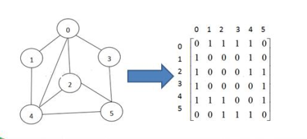
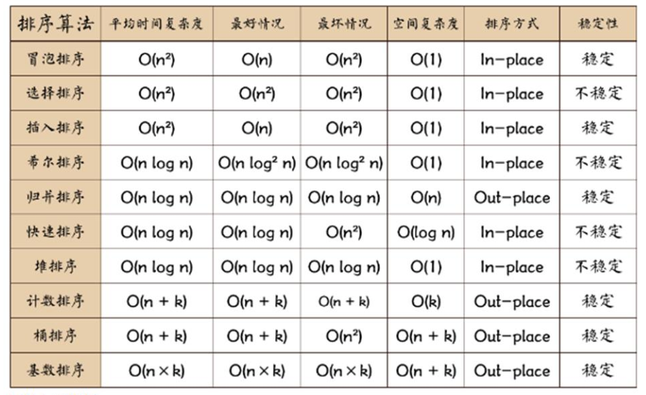
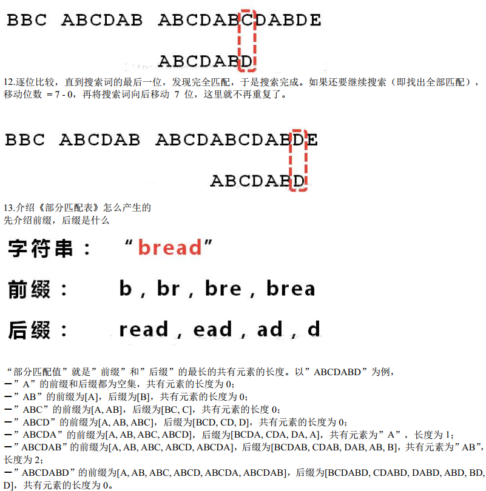

# 数据结构

学习方法：笔记为主，视频为辅，后期加以leetcode刷题。

## 概述

程序=数据结构+算法

### 数据结构包括： 线性结构和非线性结构

**线性结构**

\1) 线性结构作为最常用的数据结构， 其特点是数据元素之间存在一对一的线性关系
		\2) 线性结构有两种不同的存储结构， 即**顺序存储结构(数组)**和**链式存储结构(链表)**。 顺序存储的线性表称为顺序
表， 顺序表中的存储元素是连续的。----》指的是存储地址是否连续。
		\3) 链式存储的线性表称为链表， 链表中的存储元素不一定是连续的， 元素节点中存放数据元素以及相邻元素的地
址信息  

**非线性结构**

二维数组， 多维数组， 广义表， 树结构， 图结构  

## 稀疏 sparsearray 数组  

当一个数组中大部分元素为０，或者为同一个值的数组时， 可以使用稀疏数组来保存该数组 。

### 基本介绍


第一行记录，共有几行几列多少个原始数据。

### 代码细节

从稀疏数组恢复到原始数组。

```java
		//将稀疏数组 --》 恢复成 原始的二维数组
		/*
		 *  1. 先读取稀疏数组的第一行，根据第一行的数据，创建原始的二维数组，比如上面的  chessArr2 = int [11][11]
			2. 在读取稀疏数组后几行的数据，并赋给 原始的二维数组 即可.
		 */
		
		//1. 先读取稀疏数组的第一行，根据第一行的数据，创建原始的二维数组
		
		int chessArr2[][] = new int[sparseArr[0][0]][sparseArr[0][1]];
		
		//2. 在读取稀疏数组后几行的数据(从第二行开始)，并赋给 原始的二维数组 即可
		
		for(int i = 1; i < sparseArr.length; i++) {
			chessArr2[sparseArr[i][0]][sparseArr[i][1]] = sparseArr[i][2];
		}
```


## 队列

先入先出

队列是一个有序列表， 可以用数组或是链表来实现。  

### 基本介绍


### 代码实现

数组实现

队列为空时，不返回负一，因为无法判断是否为数据负一，故通过抛出异常来处理。

```java
class ArrayQueue {
	private int maxSize; // 表示数组的最大容量
	private int front; // 队列头
	private int rear; // 队列尾
	private int[] arr; // 该数据用于存放数据, 模拟队列

	// 创建队列的构造器
	public ArrayQueue(int arrMaxSize) {
		maxSize = arrMaxSize;
		arr = new int[maxSize];
		front = -1; // 指向队列头部，分析出front是指向队列头的前一个位置.
		rear = -1; // 指向队列尾，指向队列尾的数据(即就是队列最后一个数据)
	}

	// 判断队列是否满
	public boolean isFull() {
		return rear == maxSize - 1;
	}

	// 判断队列是否为空
	public boolean isEmpty() {
		return rear == front;
	}

	// 添加数据到队列
	public void addQueue(int n) {
		// 判断队列是否满
		if (isFull()) {
			System.out.println("队列满，不能加入数据~");
			return;
		}
		rear++; // 让rear 后移
		arr[rear] = n;
	}

	// 获取队列的数据, 出队列
	public int getQueue() {
		// 判断队列是否空
		if (isEmpty()) {
			// 通过抛出异常
			throw new RuntimeException("队列空，不能取数据");
		}
		front++; // front后移
		return arr[front];

	}

	// 显示队列的所有数据
	public void showQueue() {
		// 遍历
		if (isEmpty()) {
			System.out.println("队列空的，没有数据~~");
			return;
		}
		for (int i = 0; i < arr.length; i++) {
			System.out.printf("arr[%d]=%d\n", i, arr[i]);
		}
	}

	// 显示队列的头数据， 注意不是取出数据
	public int headQueue() {
		// 判断
		if (isEmpty()) {
			throw new RuntimeException("队列空的，没有数据~~");
		}
		return arr[front + 1];
	}
}

```

### 数组模拟环形队列

前面队列存在问题：不能实现真正的“取出”，实现空间复用


环形队列的关键是判断队列为空，还是为满。当tail追上head时，队列为满时，当head追上tail时，队列为空。但如何知道谁追上谁。还需要一些辅助的手段来判断.

  如何判断环形队列为空，为满有两种判断方法。

  **一.是附加一个标志位tag**

当head赶上tail，队列空，则令tag=0,

当tail赶上head，队列满，则令tag=1,

  **二.限制tail赶上head，即队尾结点与队首结点之间至少留有一个元素的空间。**

队列空：  head==tail

队列满：  (tail+1)% MAXN ==head


队列长度：（rear-front+Queuesize）% Queuesize

```java
public void addQueue(int n) {
// 判断队列是否满
	if (isFull()) {
	System.out.println("队列满， 不能加入数据~");
	return;
	} 
    //直接将数据加入
	arr[rear] = n;
	//将 rear 后移, 这里必须考虑取模
	rear = (rear + 1) % maxSize;
} 

```

## 链表

链表是有序的**列表**  

链表分带**头节点**的链表和没有头节点的链表， 根据实际的需求来确定  


### 单链表

```java
class HeroNode {
	public int no;
	public String name;
	public String nickname;
	public HeroNode next; //指向下一个节点，默认为null
	//构造器
	public HeroNode(int no, String name, String nickname) {
		this.no = no;
		this.name = name;
		this.nickname = nickname;
   		 //HeroNode next默认为null
	}
```

#### **单链表的应用实例**  

使用带 head 头的单向链表实现 – 水浒英雄排行榜管理完成对英雄人物的增删改查操作  

```java
public void addByOrder(HeroNode heroNode) {
//因为头节点不能动， 因此我们仍然通过一个辅助指针(变量)来帮助找到添加的位置
//因为单链表， 因为我们找的 temp 是位于 添加位置的前一个节点， 否则插入不了
	HeroNode temp = head;
	boolean flag = false; // flag 标志添加的编号是否存在， 默认为 false
	while(true) {
		if(temp.next == null) {//说明 temp 已经在链表的最后
		break; //
		} if(temp.next.no > heroNode.no) { //位置找到， 就在 temp 的后面插入
		break;
		} else if (temp.next.no == heroNode.no) {//说明希望添加的 heroNode 的编号已然存在
			flag = true; //说明编号存在
    		break;
		} 
        temp = temp.next; //后移， 遍历当前链表
	}
		if(flag) { //不能添加， 说明编号存在
			System.out.printf("准备插入的英雄的编号 %d 已经存在了, 不能加入\n", heroNode.no);
		} else {
		//插入到链表中, temp 的后面，很关键
			heroNode.next = temp.next;
			temp.next = heroNode;
		}
}

public void del(int no) {
    HeroNode temp = head;
	boolean flag = false; // 标志是否找到待删除节点的
	while(true) {
		if(temp.next == null) { //已经到链表的最后
		break;
		}
      	if(temp.next.no == no) {
		//找到的待删除节点的前一个节点 temp
		flag = true;
		break;
		} 
        temp = temp.next; //temp 后移， 遍历
		} 
    //判断 flag
	if(flag) { 
		temp.next = temp.next.next;//很关键
	}else {
	System.out.printf("要删除的 %d 节点不存在\n", no);
	}
}
```

#### **单链表面试题**

 **a 求单链表中有效节点的个数  ：**

​	遍历，注意考虑是空链表的情况。（只有header）

**b 查找单链表中的倒数第 k 个结点  ：**

​	编写一个方法， 接收 head 节点， 同时接收一个 index  ，先把链表从头到尾遍历， 得到链表的总的长度 getLength  ，得到 size 后， 我们从链表的第一个开始遍历 (size-index)个， 就可以得到  。

**c 单链表的反转**  

​	有点难，遍历原来的链表， 每遍历一个节点， 就将其取出， 并放在新的链表 reverseHead 的最前端  。


```java
while(cur != null) {
	next = cur.next;//先暂时保存当前节点的下一个节点， 因为后面需要使用
	cur.next = reverseHead.next;//将 cur 的下一个节点指向新的链表的最前端
	reverseHead.next = cur; //将 cur 连接到新的链表上
	cur = next;//让 cur 后移
}
```

​	**d 从尾到头打印单链表**   

 		按照前面一题方式先反转在遍历可以。也可以通过栈的先进后出特点实现。

```java
//可以利用栈这个数据结构， 将各个节点压入到栈中， 然后利用栈的先进后出的特点， 就实现了逆序打印的效果
public static void reversePrint(HeroNode head) {
	if(head.next == null) {
		return;//空链表， 不能打印
	}
	//创建要给一个栈， 将各个节点压入栈
	Stack<HeroNode> stack = new Stack<HeroNode>();
	HeroNode cur = head.next;
	//将链表的所有节点压入栈
	while(cur != null) {
		stack.push(cur);
		cur = cur.next; //cur 后移， 这样就可以压入下一个节点
	} 
	//将栈中的节点进行打印,pop 出栈
	while (stack.size() > 0) {
		System.out.println(stack.pop()); //stack 的特点是先进后出
	}
}
```

### 双向链表  

管理单向链表的缺点分析:
		\1) 单向链表， 查找的方向只能是一个方向， 而双向链表可以向前或者向后查找。
		\2) 单向链表不能自我删除， 需要靠辅助节点而双向链表则可以自我删除。前面我们单链表删除时节点，总是找到 temp,temp 是待删除节点的前一个节点(认真体会).

#### 双向链表的删除

本来：temp.pre.next=temp=temp.next.pre 

直接找到要删除的这个节点， 比如 temp
		temp.pre.next = temp.next
		temp.next.pre = temp.pre;  

```java
public void del(int no) {
	// 判断当前链表是否为空
	if (head.next == null) {// 空链表
	System.out.println("链表为空， 无法删除");
	return;
	}
	HeroNode2 temp = head.next; // 辅助变量(指针)
	boolean flag = false; // 标志是否找到待删除节点的
	while (true) {
		if (temp == null) { // 已经到链表的最后
			break;
		}
        if(temp.no == no) {// 找到的待删除节点
			flag = true;
			break;
		} 
        temp = temp.next; // temp 后移， 遍历
	}
    //判断 flag
	if (flag) { // 找到，可以删除
		// temp.next = temp.next.next;[单向链表]
		temp.pre.next = temp.next;
		// 如果是最后一个节点， 就不需要执行下面这句话， 否则出现空指针
		if (temp.next != null) {
			temp.next.pre = temp.pre;
		}
		} else {
			System.out.printf("要删除的 %d 节点不存在\n", no);
		}
	}
}
```

### 单向环形链表

Josephu (约瑟夫、 约瑟夫环) 问题  

设编号为 1， 2， … n 的 n 个人围坐一圈， 约定编号为 k（1<=k<=n） 的人从 1 开始报数， 数到m 的那个人出列， 它的下一位又从 1 开始报数， 数到 m 的那个人又出列， 依次类推， 直到所有人出列为止， 由此产生一个出队编号的序列。  

自己已经实现，视频里更加灵活鲁棒。


## 栈

栈的英文为(stack)

栈是一个先入后出(FILO-First In Last Out)的有序列表。

```java
Stack<String> stack=new Stack<String>();
stack.push(item);
stack.pop()
```


### 应用场景  

- 子程序的调用： 在跳往子程序前，会先将下个指令的地址存到堆栈中， 直到子程序执行完后再将地址取出，以回到原来的程序中。
- 处理递归调用： 和子程序的调用类似， 只是除了储存下一个指令的地址外， 也将参数、 区域变量等数据存入堆栈中。
- 表达式的转换[中缀表达式转后缀表达式]与求值(实际解决)。
- 二叉树的遍历。
- 图形的深度优先(depth 一 first)搜索法。

###  栈的快速入门  

用数组模拟栈的使用， 由于栈是一种有序列表， 当然可以使用数组的结构来储存栈的数据内容  

具体 略

### 栈实现综合计算器(中缀表达式)  


https://www.bilibili.com/video/BV1E4411H73v?p=33

 具体代码，略


**前缀表达式**：波兰表达式，运算符位于操作数之前


**中缀表达式**


后缀表达式：逆波兰表达式，最常用


### 逆波兰计算器  

输入一个逆波兰表达式(后缀表达式)， 使用栈(Stack), 计算其结果

支持小括号和多位数整数， 因为这里我们主要讲的是数据结构， 因此计算器进行简化， 只支持对整数的计算。

注意一下代码细节，涉及到：

1. list的使用
1. string和int之间的转换
1. throws exception的使用

```java
public class PolandNotation {
    public static void main(String[] args) {
        //(3+4)*5-6
        //逆波兰式可以解决括号
        String suffixExpression="3 4 + 5 * 6 -";
        List<String> rpnList=getListString(suffixExpression);
        System.out.println(rpnList);
        
        int res=calculate(rpnList);
        System.out.println("计算的结果：  "+res);
    }
    
    public static List<String> getListString(String suffixExpression){
        String[] split = suffixExpression.split(" ");
        List<String> list = new ArrayList<String>();
        //这里不能直接用数组，因为不知道长度。
        for (String ele:split){
            list.add(ele);
        }
        return list;
    }
    
    public static int calculate(List<String> ls){
        //只需要一个栈就可以
        Stack<String> stack=new Stack<String>();
        for (String item:ls){
            if (item.matches("\\d+")){
                stack.push(item);
            }
            else{
                int num2 =Integer.parseInt(stack.pop());
                int num1 =Integer.parseInt(stack.pop());
                int res=0;
                if (item.equals("+")){
                    res= num1+num2;
                }else if (item.equals("-")){
                    res= num1-num2;
                }else if (item.equals("*")){
                    res= num1*num2;
                }else if (item.equals("/")){
                    res= num1/num2;
                }else {
                    throw new RuntimeException("运算符有误");
                }
                stack.push(res+"");//整数转字符串
            }
        }
        return Integer.parseInt(stack.pop());
    }
}

```

### 中缀表达式转换为后缀表达式  

1. 初始化两个栈： 运算符栈 s1 和储存中间结果的栈 s2；

2. 从左至右扫描中缀表达式；

3. 处理符号
   遇到操作数时， 将其压 s2；

   遇到运算符时， 比较其与 s1 栈顶运算符（不包括 括号，如果栈顶是括号，直接入s1）的优先级：
   (1) 如果 s1 为空， 或栈顶运算符为左括号“(” ， 则直接将此运算符入栈；
   (2) 否则， 若优先级比栈顶运算符的高， 也将运算符压入 s1；
   (3) 否则， 将 s1 栈顶的运算符弹出并压入到 s2 中， 再次转到 3. 与 s1 中新的栈顶运算符相比较；

   遇到括号时：
   (1) 如果是左括号“(” ， 则直接压入 s1
   (2) 如果是右括号“)” ， 则依次弹出 s1 栈顶的运算符， 并压入 s2， 直到遇到左括号为止， 此时将这一对括号丢弃

4. 重复步骤 1 至 3， 直到表达式的最右边

5. 将 s1 中剩余的运算符依次弹出并压入 s2

6. 依次弹出 s2 中的元素并输出， 结果的**逆序**即为中缀表达式对应的后缀表达式


举例

​	将中缀表达式“1+((2+3)× 4)-5” 转换为后缀表达式的过程如下  


## 哈希表

### 基本介绍

散列表（Hash table， 也叫哈希表）是根据关键码值(Key value)而直接进行访问的数据结构。 也就是说， 它通过把关键码值映射到表中一个位置来访问记录， 以加快查找的速度。 这个映射函数叫做散列函数， 存放记录的数组叫做散列表。     

Hash表可以作为缓存层，将常用数据或者近期要用的数据先放在Hash表，遇到没有的的数据再去数据库找，这样就不用每次都去数据库找了，加快运行速度。


Hash表结构

下图是一个模16的Hash散列。


### 实现思路

数组+链表或 数组+二叉树 进行实现。

#### 数组+链表实现

Hash表是一个类，里面有一个数组是Emplinked链表对象组成的。里面有散列函数，决定ID对应到数组的第几个元素。

Emplinked链表存储相关雇员信息。


## 树

为什么需要有树这种结构？

**数组存储**方式的分析  

- 优点： 通过下标方式访问元素， 速度快。 对于有序数组， 还可使用二分查找提高检索速度。  
- 缺点： 如果要检索具体某个值， 或者插入值(按一定顺序)会整体移动，效率较低  

**链式存储**方式的分析  

- 优点： 在一定程度上对数组存储方式有优化(比如： 插入一个数值节点， 只需要将插入节点， 链接到链表中即可，删除效率也很好)。  
- 缺点： 在进行检索时， 效率仍然较低， 比如(检索某个值， 需要从头节点开始遍历)   

**树存储**方式的分析  

- 能提高数据存储， 读取的效率, 比如利用 二叉排序树(Binary Sort Tree)， 既可以保证数据的检索速度， 同时也可以保证数据的插入， 删除， 修改的速度。   

### 树的常用语


- 节点的权(节点值)  
- 路径(从 root 节点找到该节点的路线)  
- 树的高度(最大层数)  
- 森林 :多颗子树构成森林  
- 叶子节点：没有子节点的节点


### 二叉树

树有很多种， 每个节点最多只能有两个子节点的一种形式称为二叉树。  

如果该二叉树的所有叶子节点都在最后一层， 并且结点总数= 2^n -1 , n 为层数， 则我们称为**满二叉树**。    

如果该二叉树的所有叶子节点都在最后一层或者倒数第二层， 而且最后一层的叶子节点在左边连续， 倒数第二层的叶子节点在右边连续， 我们称为**完全二叉树**  


#### 二叉树遍历

使用前序， 中序和后序对下面的二叉树进行遍历。

- **前**序遍历: **先输出父节点**， 再遍历左子树和右子树  
  

  遍历的顺序为: ABDGHCEIF

- **中**序遍历: 先遍历左子树， **再输出父节点**， 再遍历右子树  

  

  （注意此处，对于每个子树，都是先左节点输出，所以直接从最左的节点开始输出，其实还是从root开始看起的）

  （**需要牢记**，遍历时遍历的子节点的递归方法，而不是子节点  **if (this.left!=null){this.left.infixOrder();}**，结束递归时，也是一个一个往上终止的。）

  遍历的顺序为: GDHBAEICF

- **后**序遍历: 先遍历左子树， 再遍历右子树， **最后输出父节点**  

  

  遍历的顺序为: GHDBIEFCA

#### 二叉树创建

每个树，先要有节点，再有树的管理。

```java
//先创建节点
class HeroNode{
    private int no;
    private String name;
    private HeroNode left;
    private HeroNode right;
    
    public HeroNode() {
    }
    
    public HeroNode(int no, String name) {
        this.no = no;
        this.name = name;
    }
    
    public int getNo() {
        return no;
    }
    
    public void setNo(int no) {
        this.no = no;
    }
    
    public String getName() {
        return name;
    }
    
    public void setName(String name) {
        this.name = name;
    }
    
    public HeroNode getLeft() {
        return left;
    }
    
    public void setLeft(HeroNode left) {
        this.left = left;
    }
    
    public HeroNode getRight() {
        return right;
    }
    
    public void setRight(HeroNode right) {
        this.right = right;
    }
    
    @Override
    public String toString() {
        return "HeroNode{" +
                "no=" + no +
                ", name='" + name + '\'' +
                '}';
    }
    
    public void preOrder(){
        System.out.println(this);//输出当前节点
        if (this.left!=null){this.left.preOrder();}
        if (this.right!=null){this.right.preOrder();}
    }
    public void infixOrder(){
        if (this.left!=null){this.left.infixOrder();}
        System.out.println(this);//输出当前节点
        if (this.right!=null){this.right.infixOrder();}
    }
    public void postOrder(){
        if (this.left!=null){this.left.postOrder();}
        if (this.right!=null){this.right.postOrder();}
        System.out.println(this);
    }
}
```

树的管理类

```java
public class BinaryTree {
    private HeroNode root;
    
    public BinaryTree() {
    }
    
    public void setRoot(HeroNode root) {
        this.root = root;
    }
    
    public void preOrder(){
        if (this.root!=null){this.root.preOrder();
        }else {
            System.out.println("empty tree");
        }
    }
    public void infixOrder(){
        if (this.root!=null){this.root.infixOrder();
        }else {
            System.out.println("empty tree");
        }
    }
    public void postOrder(){
        if (this.root!=null){this.root.postOrder();
        }else {
            System.out.println("empty tree");
        }
    }
    
}
```

#### 二叉树查找

查找HeroNO=5的节点

- 前序查找

  通过前序遍历查找

- 中序查找

- 后序查找

#### 二叉树删除节点


如果删除的节点是叶子节点， 则删除该节点

如果删除的节点是非叶子节点， 则删除该子树  

思路：判断当前结点的子结点是否需要删除结点 ，如果当前结点的左子结点不为空， 并且左子结点 就是要删除结点， 就将 this.left = null; 并且就返回(结束递归删除)  ，右子节点类似。

```java
//节点类中   
public void delNode(int no){
        if (this.left!=null&&this.left.no==no){
            System.out.println(this.left+"delete");
            this.left=null;
            return;
            //此处的return返回后，到上一层是 if (this.left!=null){this.left.delNode(no);}
            //然后执行上一层的if (this.right!=null){this.right.delNode(no);}
            //也就是说即使找到，也会将其他上层节点遍历一遍
        }
    
        if (this.right!=null&&this.right.no==no){
            System.out.println(this.right+"delete");
            this.right=null;
            return;
        }
        
        if (this.left!=null){
            this.left.delNode(no);
            System.out.println(this.left);
        }
        if (this.right!=null){
            this.right.delNode(no);
            System.out.println(this.right);
        }
    }
```

```java
//tree类中
//为什么要这样设计，再tree里和节点类中都有delNOde
//答：tree中给出一个入口（起始点），具体的删除在node中实现
    public void delNode(int no){
        if (root!=null){
            if (root.getNo()==no){
                root=null;
            }else {
                root.delNode(no);
            }
        }else {
            System.out.println("empty tree");
        }
    }
    
```

### 顺序存储二叉树  

数组可以转换成树， 树也可以转换成数组， 


节点0对应a[0]，节点n对应a[n],

特点：

- **顺序二叉树**通常只考虑**完全二叉树**
- **第 n 个元素的左子节点为 2n + 1**  
- **第 n 个元素的右子节点为 2n + 2**
- **第 n 个元素的父节点为 (n-1) / 2**  

根据以上特点，进行一个实例的代码实现

```java
public class ArrBinaryTree {
    private int[] arr;
    
    public ArrBinaryTree(int[] arr) {
        this.arr = arr;
    }
    
    public void setArr(int[] arr) {
        this.arr = arr;
    }
    
    //@param index 数组的下标
    public void preOrder(int index){
       if (arr==null||arr.length==0){
           System.out.println("empty arr");
       }
       //输出当前元素
        System.out.println(arr[index]);
       //向左递归遍历
        if (index*2+1<arr.length){
            preOrder(2*index+1);
        }
       //向右递归遍历
        if (index*2+1<arr.length){
            preOrder(2*index+2);
        }
        
    }
}
```

//测试

```java
        int[] arr={1,2,3,4,5,6,7};
        ArrBinaryTree arrBinaryTree = new ArrBinaryTree(arr);
        arrBinaryTree.preOrder(0);
```

其实并没有相关树的节点内容，内部的存储结构还是数组。而前面二叉树的存储结构是节点类。

### 线索化二叉树

将数列 {1, 3, 6, 8, 10, 14 } 构建成一颗二叉树 （完全二叉树）


6，8，10，14的左右指针没有利用上，利用二叉链表中的空指针域， 存放指向该结点在某种遍历次序下的前驱和后继结点的指针（这种附加的指针称为"线索"）  

这种加上了线索的二叉链表称为线索链表， 相应的二叉树称为线索二叉树(Threaded BinaryTree)。 根据线索性质的不同， 线索二叉树可分为前序线索二叉树、 中序线索二叉树和后序线索二叉树三种  

一个结点的前一个结点， 称为前驱结点（3的前驱8） ；一个结点的后一个结点， 称为后继结点 （3的后继10，6没有后继节点） 

#### 举例及实现

例如（中序线索二叉树）：


https://www.bilibili.com/video/BV1E4411H73v?p=103&spm_id_from=pageDriver

分析：

- left 指向的是左子树， 也可能是指向的前驱节点. 比如 ① 节点 left 指向的左子树, 而 ⑩ 节点的 left 指向的就是前驱节点。
- right 指向的是右子树， 也可能是指向后继节点， 比如 ① 节点 right 指向的是右子树， 而⑩ 节点的 right 指向的是后继节点。

实现时，通过两个属性来区分int leftType和rightType

此外，还需要增加一个变量，用于指向当前节点的前驱节点的指针，用于下个节点存储前驱节点。

以处理8节点为例，8的前驱为null，后继为3，此时左右节点都为null

处理8的pre时，在8这个节点进行处理

处理8的后继时，在节点3时判断，如果3.pre.getRight==null则将3写给8的右子树

#### 遍历线索化二叉树的实现

https://www.bilibili.com/video/BV1E4411H73v?p=106

线索化后，各个节点的指向有变化， 因此原来的遍历方式不能使用 ，需要使用新的方式遍历
线索化二叉树 。

各个节点可以通过线型方式遍历，无需使用递归方式， 这样也提高了遍历的效率。  


```java
//遍历（中序）线索化二叉树的方法
public void threadedList() {
//定义一个变量， 存储当前遍历的结点， 从 root 开始
	HeroNode node = root;
	while(node != null) {
        //循环的找到 leftType == 1 的结点，第一个找到的就是8结点（注意8的leftType==1但是前驱节点为null）
		//后面随着遍历而变化,因为当 leftType==1 时， 说明该结点是按照线索化处理后的有效结点
		while(node.getLeftType() == 0) {
			node = node.getLeft();
		}
        //打印当前这个结点
		System.out.println(node);
		//如果当前结点的右指针指向的是后继结点,就一直输出
		while(node.getRightType() == 1) {
			//获取到当前结点的后继结点
			node = node.getRight();
			System.out.println(node);
		}
        //替换这个遍历的结点
		node = node.getRight();
	}	
}
```

### 赫夫曼树

#### 基本介绍

给定 n 个权值作为 n 个叶子结点， 构造一棵二叉树， **若该树的带权路径长度(wpl)达到最小**， 称这样的二叉树为最优二叉树， 也称为哈夫曼树(Huffman Tree), 还有的书翻译为霍夫曼树。  

赫夫曼树是带权路径长度最短的树， 权值较大的结点离根较近。


路径长度：若规定根结点的层数为 1， 则从根结点到第 L 层结点的路径长度为 L-1。

**带权路径长度**： 从根结点到该结点之间的路径长度与该结点的权（值）的乘积 。

 树的带权路径长度： 树的带权路径长度规定为所有**叶子结点**的带权路径长度之和， 记为WPL(weighted path length) ,权值越大的结点离根结点越近的二叉树才是最优二叉树。 

最终每个数值都在叶子节点上。 

#### 赫夫曼树创建思路

霍夫曼编码的过程

1，3，6，7，8，13，29

取出1，3，记为权值4的节点

 


4，6，7，8，13，29

取出4，6，记为10


7，8，10，13，29

取出7，8，记为15


如此循环，直到


#### 代码实现

需要创建节点类


注此处实现了Comparable后就可以用ArrayList进行排序了

```java
List<Node> nodes = new ArrayList<Node>();
for(int value:arr){
  nodes.add(new Node(value));
}

Collections.sort(nodes)
```

再创建树的管理类

#### 赫夫曼编码  

**解**：


根据赫夫曼树， 给各个字符,规定编码 (前缀编码)， 向左的路径为 0 向右的路径为 1 ， 编码
如下:  

o: 1000 u: 10010 d: 100110 y: 100111 i: 101

a : 110 k: 1110 e: 1111 j: 0000 v: 0001

l: 001 : 01

总长度变为133

原来长度359，压缩了62.9%

#### 数据压缩

#### 数据解压

用前面的赫夫曼树解码

#### 文件解压缩


### 二叉排序树  

给你一个数列 (7, 3, 10, 12, 5, 1, 9)， 要求能够高效的完成对数据的查询和添加  

如果使用**数组**实现：

​	数组未排序，优点： 直接在数组尾添加， 速度快。 缺点： 查找速度慢  

​	数组排序，优点：可以使用二分查找查找速度快， 缺点： 为了保证数组有序， 在添加新数据时， 找到插入位置后， 后面的数据需整体移动， 速度慢。

使用**链表**：不管链表是否有序， 查找速度都慢， 添加数据速度比数组快， 不需要数据整体移动。

而**二叉排序树**就可以查的快，加的快。

#### 基本介绍

   二叉排序树： BST: (Binary Sort(Search) Tree),  对于二叉排序树的任何一个非叶子节点， 要求左子节点的值比当前节点的值**小**， 右子节点的值比当前节点的值**大**。  

特别说明： 如果有相同的值， 可以将该节点放在左子节点或右子节点


如果要插入2，就先看7，再看7的左子树3，再看3的左子树1，最后放到1的右子树，速度快。检索速度类似于二分，效率也很高，加入时是链式结构可以直接挂指针，所以既有数组的排序的查找速度，又有链式结构的插入速度。

#### 二叉排序树的创建、遍历及删除

创建

```java
public class BinarySortTree {
    private Node root;
    
    public void add(Node node){
        if (root==null){
            root=node;
        }else {
            root.add(node);
        }
    }
    
    public void infixOrder(){
        if (root!=null){
            root.infixOrder();
        }else {
            System.out.println("empty tree");
        }
    }

}

class Node{
    int value;
    Node left;
    Node right;
    
    public Node(int value) {
        this.value = value;
    }
    
    @Override
    public String toString() {
        return "Node{" +
                "value=" + value +
                '}';
    }
    
    //这里其实没有考虑相等的情况
    public void add(Node node){
        if (node==null){return;}
        if (node.value<this.value){
            if (this.left==null){
                this.left=node;
            } else {
                this.left.add(node);
            }
        }else {
            if (this.right==null){
                this.right=node;
            }else {
                this.right.add(node);
            }
        }
    }
    
    public void infixOrder(){
        if (this.left!=null){
            this.left.infixOrder();
        }
        System.out.println(this);
        if (this.right!=null){
            this.right.infixOrder();
        }
    }
}
```

二叉排序树的删除情况比较复杂， 有下面三种情况需要考虑  


1. 删除叶子节点 (比如： 2, 5, 9, 12)
   找到节点（确定要删除的节点存在），找到它的父节点然后直接删除

2. 删除只有一颗子树的节点 (比如： 1)  

   找到节点，找到它的父节点，确定是父节点的左子节点还是右子节点，确定它的子节点，然后父节点->子节点连接（不用比大小）

3. 删除有两颗子树的节点. (比如： 7, 3， 10 )  

   找到父节点，从targetNode的右子树找到最小的节点，将targetNode换为最小节点，原来的最小节点删除

   比如删除7：找到9，7换成9，原来的9删除（右边最小的，来自右边则比7的左边都大，满足；是右边最小，所以比7的右边都小，满足）


node类中添加

```java
    //先查找要删除的节点
    public Node search(int value){
        if (value==this.value){
            return this;
        }else if (value<this.value){
            if (this.left==null){return null;}
            return this.left.search(value);
            //注意此处的return，
            //如果不写return则最后不会有return输出到外面
            //直接执行完this.left.search(value)后内层的循环值返回后没有调用
        }else {
            if (this.right==null){return null;}
            return this.right.search(value);
        }
    }
    
    //查找要删除的节点的父节点
    public Node searchParent(int value){
        if ((this.left!=null&&this.left.value==value)||(this.right!=null&&this.right.value==value)){
            return this;
        }else if (value<this.value) {
            if (this.left == null) {
                return null;
            }
            return this.left.searchParent(value);
        }else {
            if (this.right==null){return null;}
            return this.right.searchParent(value);
        }
    }
```


树管理类中添加：

```java
    public Node search(int value){
        if (root==null){
            return null;
        }else {
            return root.search(value);
        }
    }
    
    public Node searchParent(int value){
        if (root==null){
            return null;
        }else {
            return root.searchParent(value);
        }
    }
    
    public int delRightTreeMin(Node node){
        //返回以node为根节点的二叉排序树的最小节点的值
        //并删除node为根节点的二叉排序树的最小节点
        //删除7，看以10为节点的delRightTreeMin(Node 10)
        Node target=node;
        while (target.left!=null){
            target=target.left;
        }
        delNode(target.value);
        return target.value;
    }
    
    
    public void delNode(int value){
        if (root==null){
            return;
        }else {
            Node targetNode=search(value);
            if (targetNode==null){
                return;
            }
            //如果树只有一个节点
            if (root.right==null&&root.left==null){
                root=null;
                return;
            }
            
            Node parent =searchParent(value);
            //如果删除的是叶子节点
            if (targetNode.left==null&&targetNode.right==null){
                if (parent.left==targetNode){
                    parent.left=null;
                }else if (parent.right==targetNode){
                    parent.right=null;
                }
            }else if (targetNode.left!=null&&targetNode.right!=null){
                //删除有两颗子树的节点
                int minVal=delRightTreeMin(targetNode.right);
                targetNode.value=minVal;
            }else {
                //删除有一颗子树的节点
                //略
            }
            
        }
    }
```

### 平衡二叉树

二叉排序树可能的问题

从一个数列{1，2，3，4，5，6}创建二叉排序树（BST）就会导致左边子树全部为空，更像是一个单链表，插入速度没有影响但是查询速度明显下降（需要依次比较）

解决方案：平衡二叉树

#### 基本介绍

平衡二叉树也叫平衡二叉搜索树（Self-balancing binary search tree） 又被称为 AVL 树， 可以保证查询效率较高。  

具有以下特点：它的左右两个子树的高度差的绝对值不超过 1， 并且左右两个子树都是一棵平衡二叉树。（平衡树Balance Tree，指的是，任意节点的子树的高度差都小于等于1。）

平衡二叉树的常用实现方法有红黑树、 AVL、 替罪羊树、 Treap、 伸展树等。  


#### 单旋转（左旋转）

给你一个数列， 创建出对应的平衡二叉树.数列 {4,3,6,5,7,8}  

只使用一种旋转：单旋转。除了左旋转还有右旋转，这部分是数据结构的难点。


左边是二叉排序树创建方法，创建好后左子树高度为1，右子树高度为3.这时候进行左旋转， 类似于拎着右边的节点让树垂下来。

此处，旋转后4，5会产生竞争而原来5是位于4的右子树的，因此可以将4仍作为6的左子树，而5作为4的右子树，这样5仍然能满足排序二叉树的要求。

代码略，实现思路：正常进行二叉排序树的添加，一个一个添加节点，当添加完一个节点后如果右子树的高度比左子树的高度高2以上，进行左旋转；

右旋转类似


#### 双旋转

右旋转后有可能导致右边高了


解决方法：当符合右旋转的条件时，如果它的左子树的右子树高度大于它的左子树的高度，先对当前这个结点的左节点进行左旋转，再对当前结点进行右旋转的操作即可。

## 多路查找树  

### 二叉树与B树

二叉树的操作效率较高， 但是也存在问题, 请看下面的二叉树  

​      

二叉树需要加载到内存的， 如果二叉树的节点少， 没有什么问题， 但是如果二叉树的节点很多(比如 1 亿)， 就存在如下问题:  

- 问题 1： 在构建二叉树时， 需要多次进行 i/o 操作(海量数据存在数据库或文件中)， 节点海量， 构建二叉树时，速度有影响  
- 问题 2： 节点海量， 也会造成二叉树的**高度**很大， 会降低操作速度.  

**多路查找树**，其每一个结点的孩子数可以**多于两个**而且每个结点处可以**存储多个元素**。

2-3树：其中的每一个结点都具有两个孩子( 我们称它为2结点)或三个孩子(我们称它为3结点)。一个**2结点**包含一个元素和两个孩子(或没有孩子)，且与二叉排序树类似，左子树包含的元素小于该元素，右子树包含的元素大于该元素。不过，与二叉排序树不同的是，这个2结点要么没有孩子，要有就有两个，不能只有一个孩子。一个**3结点**包含一小一大两个元素和三个孩子(或没有孩子)，一个3结点要么没有孩子，要么具有3个孩子。如果某个3结点有孩子的话，左子树包含小于较小元素的元素，右子树包含大于较大元素的元素，中间子树包含介于两元素之间的元素。

https://www.bilibili.com/video/BV1E4411H73v?p=143&spm_id_from=pageDriver


**2-3-4 树**其实就是2-3树的概念扩展，包括了4结点的使用。一个4结点包含小中大三个元素和四个孩子(或没有孩子)，一个4结点要么没有孩子，要么具有4个孩子。如果某个4结点有孩子的话，左子树包含小于最小元素的元素;第二子树包含大于最小元素，小于第二元素的元素;第三子树包含大于第二元素，小于最大元素的元素;右子树包含大于最大元素的元素。

#### B树的基本介绍

B-tree 树即 B 树，B即Balanced， 平衡的意思。 有人把 B-tree 翻译成 B-树， 容易让人产生误解。会以为 B-树是一种树，而B树又是另一种树。 实际上，B-tree就是指的B树。  B树的叶子节点都在同一层

2-3树和2-3-4树都是B树


- B树的阶：节点的最多子节点个数。 比如 2-3 树的阶是 3， 2-3-4 树的阶是 4  
- B-树的搜索， 从根结点开始， 对结点内的关键字（有序） 序列进行二分查找， 如果命中则结束， 否则进入查询关键字所属范围的儿子结点； 重复， 直到所对应的儿子指针为空， 或已经是叶子结点  
- 关键字集合分布在整颗树中, 即叶子节点和非叶子节点都存放数据

#### B+树的介绍  


B+树是应文件系统所需而出的一种B树的变形树，注意严格意义上讲，它其实已经不是前面定义的树了。在B树中，每一个元素在该树中只出现一次，有可能在叶子结点上，也有可能在分支结点上。而在B+树中，出现在分支结点中的元素会被当作它们在该分支结点位置的中序后继者(叶子结点)中再次列出。另外，每一个叶子结点都会保存一个指向后一叶子结点的指针。

上图理解：把一个有序链表分割成九段，用来快速查找。第一层先分割成三段，在第二层再将上面的分割成三段，最后将27个数据分成9段，每段三个并有索引能力，通过索引找到特定数据所在的段。

#### B*介绍

B*树是 B+树的变体， 在 B+树的非根和非叶子结点再增加指向兄弟的指针。  


## 图

前面我们学了线性表和树，线性表局限于一个直接前驱和一个直接后继的关系 ，树也只能有一个直接前驱也就是父节点，当我们需要表示多对多的关系时，这里我们就用到了图。

### 图的常用概念


顶点，边，路径，无向图，有向图，带权图

### 图的表示方式

图的表示方式有两种： 二维数组表示（邻接矩阵） ； 链表表示（邻接表） 。  

- 邻接矩阵：邻接矩阵是表示图形中顶点之间相邻关系的矩阵， 对于 n 个顶点的图而言， 矩阵的 row 和 col 表示的是 1....n个点 

  

- 邻接表  ：邻接表由数组+链表组成 ，只关心存在的边， 不关心不存在的边。和邻接矩阵相比没有空间浪费。  

  

### 代码实现图结构

思路分析：需要分别存储顶点和边


```java
public class Graph {
    private ArrayList<String> vertexList;//存储顶点集合
    private  int[][] edges;
    private int numOfEdges;
    
    public Graph(int n){
        edges=new int[n][n];
        vertexList=new ArrayList<String>(n);
        numOfEdges=0;
    }
    
    //插入节点
    public void insertVertex(String vertex){
        vertexList.add(vertex);
    }
    
    //添加边
    public void insertEdge(int v1,int v2,int weight){
        edges[v1][v2]=weight;
        edges[v2][v1]=weight;
        numOfEdges++;
    }
    
    public int getNumOfVertex(){
        return vertexList.size();
    }
    
    public int getNumOfEdges(){
        return numOfEdges;
    }
    
    //返回下标对应的数据，0-“A”
    public String getValueByIndex(int i){
        return  vertexList.get(i);
    }
    
    public int getWeight(int v1,int v2){
        return edges[v1][v2];
    }
    
    //显示图对应的矩阵
    public void showGraph(){
        for (int[]link :edges){
            System.out.println(Arrays.toString(link));
        }
    }
}

```

### 图的遍历

从图的某一顶点出发访遍图中其余顶点，且使每个顶点仅被访问一次，这一过程就叫做图的遍历。

一般有两种访问策略: (1)深度优先遍历 (2)广度优先遍历  

#### 深度优先遍历（DFS）

**基本思想**：从初始访问结点出发， 初始访问结点可能有多个邻接结点， 深度优先遍历的策略就是首先访问第一个邻接结点， 然后再以这个被访问的邻接结点作为初始结点， 访问它的第一个邻接结点， 可以这样理解：每次都在访问完当前结点后首先访问当前结点的第一个邻接结点。  

**算法步骤**：

1. 访问初始结点 v， 并标记结点 v 为已访问。  
2. 查找结点 v 的第一个邻接结点 w。  
3. 若 w存在，则继续执行4，如果w不存在，则回到第 1 步，从 v 的下一个结点继续。  
4. 若 w未被访问，对 w 进行深度优先遍历递归（即把 w 当做另一个 v， 然后进行步骤 123） 。  
5. 查找结点 v 的 w 邻接结点的下一个邻接结点，转到步骤 3。  

**代码实现**

```java
    //得到第一个邻接结点的下标w(由A得到B)
    //每次都是ABCDE这样一个顺序找
    public int getFirstNeighbor(int index){
        for (int j = 0; j < vertexList.size(); j++) {
            if (edges[index][j]>0){
                return j;
            }
        }
        return -1;
    }
    
    //根据前一个邻接结点的下标来获取下一个邻接结点（由A得到B后，发现B访问过了，再得到C）
    //每次都是ABCDE这样一个顺序找
    public int getNextNeighbor(int v1,int v2){
        for (int j = v2+1; j < vertexList.size(); j++) {
            if (edges[v1][j]>0){
                return j;
            }
        }
        return -1;
    }
    
    //深度优先遍历算法
    public void dfs(boolean[] isVisited,int i){
        System.out.print(getValueByIndex(i)+"->");
        isVisited[i]=true;
        int w=getFirstNeighbor(i);
        while (w!=-1){//当前结点往下探
            if (!isVisited[w]){
                dfs(isVisited,w);
            }
            w=getNextNeighbor(i,w);
        }
    }
    
    //考虑非连通图，如果第一个结点是孤立结点
    public void dfs(){
        for (int i = 0; i < getNumOfVertex(); i++) {
            if (!isVisited[i]){
                dfs(isVisited,i);
            }
        }
    }
```

#### 广度优先遍历（BFS）

广度优先遍历需要使用一个队列以保持访问过的结点的顺序， 以便按这个顺序来
访问这些结点的邻接结点。

如果说图的深度优先遍历类似树的前序遍历，那么图的广度优先遍历就类似于树
的层序遍历了。


算法步骤：

1. 访问初始结点 v 并标记结点 v 为已访问。  

2. 结点 v 入队列。  

3. 当队列非空时， 继续执行， 否则算法结束。  

4. 出队列， 取得队头结点 u。  

5. 查找结点 u 的第一个邻接结点 w。  

6. 若结点 u 的邻接结点 w 不存在， 则转到步骤 3； 否则循环执行以下三个步骤：  

   6.1 若结点 w 尚未被访问， 则访问结点 w 并标记为已访问。  

   6.2 结点 w 入队列。  

   6.3 查找结点 u 的继 w 邻接结点后的下一个邻接结点 w， 转到步骤 6。  

**代码略**


# 算法


## 递归

一个方法，自己调用自己。代码简洁

### 基本介绍

```java
//
阶乘问题
public static int factorial(int n) {
	if (n == 1) {
		return 1;
	} else {
		return factorial(n - 1) * n; // 1 * 2 * 3
	}
}
```

- 各种数学问题如: 8 皇后问题 , 汉诺塔, 阶乘问题, 迷宫问题, 球和篮子的问题(google 编程大赛)
- 各种算法中也会使用到递归， 比如快排， 归并排序， 二分查找，分治算法等.
- 将用栈解决的问题-->第归代码比较简洁  

### 递归的重要原则

- 执行一个方法时， 就创建一个新的受保护的独立空间(栈空间)
- 方法的局部变量是独立的，**不会相互影响**, 比如 n 变量
- 如果方法中使用的是引用类型变量(比如数组)， 就会**共享**该引用类型的数据.
- 递归必须向退出递归的条件逼近， 否则就是无限递归,出现 StackOverflowError
- 当一个方法执行完毕， 或者遇到 return， 就会返回， 遵守谁调用， 就将结果返回给谁， 同时当方法执行完毕或者返回时， 该方法也就执行完毕  

### 迷宫问题

走到一个特定的点

回溯的产生（此路不通，返回上一个点）


### 八皇后问题

面试笔试出现频率极高

回溯算法的典型案例  

在 8× 8 格的国际象棋上摆放八个皇后， 使其不能互相攻击， 即：任意两个皇后都不能处于同一行、同一列或同一斜线上，问有多少种摆法(92)。

理论上应该创建一个二维数组来表示棋盘，但是实际上可以通过算法，用**一个一维数组**即可解决问题. arr[8] ={0 , 4, 7, 5, 2, 6, 1, 3} //对应 arr 下标 表示第几行，即第几个皇后， arr[i] = val , val 表示第 i+1 个皇后， 放在第 i+1行的第 val+1 列

见代码


## 排序算法

### 排序的分类

内部排序：将需要处理的所有数据都加载到内部存储器(内存)中进行排序。

外部排序：数据量过大， 无法全部加载到内存中， 需要借助外部存储(文件等)进行排序。


### 算法的时间复杂度

一般情况下， 算法中的基本操作语句的重复执行次数是问题规模 n 的某个函数

常见的时间复杂度

- 常数阶 O(1)

- 对数阶 O(log2n)
  
- 线性阶 O(n)
- 线性对数阶 O(nlog2n)
- 平方阶 O(n^2)
- 立方阶 O(n^3)
- k 次方阶 O(n^k)
- 指数阶 O(2^n)

### 平均时间复杂度和最坏时间复杂度

一般讨论的时间复杂度均是最坏情况下的时间复杂度。 这样做的原因是： 最坏情况下的时间复杂度是算法在任何输入实例上运行时间的界限， 这就保证了算法的运行时间不会比最坏情况更长。


### 算法的空间复杂度

空间复杂度(Space Complexity)是对一个算法在运行过程中临时占用存储空间大小的量度。 有的算法需要占用的临时工作单元数与解决问题的规模n有关， 它随着n的增大而增大， 当n较大时， 将占用较多的存储单元， 例如快速排序和归并排序算法, 基数排序就属于这种情况。

在做算法分析时， 主要讨论的是时间复杂度。一些缓存产品(redis, memcache)和算法(基数排序)本质就是用空间换时间。

### 冒泡排序

冒泡排序（Bubble Sorting） 的基本思想是： 通过对待排序序列从前向后（从下标较小的元素开始） ,依次比较相邻元素的值， 若发现逆序则交换， 使值较大的元素逐渐从前移向后部， **就象水底下的气泡一样逐渐向上冒。**

**举例**


第一趟确定最大的数

第二趟确定第二大的数

**理解：冒泡--每次冒出最大的数**

#### 代码

```java
public class BubbleSort {
    public static void main(String[] args) {
        int arr[]={3,9,-1,10,-2};
        int temp=0;
        for (int i = 0; i < arr.length-1 ; i++) {
            for (int j = 0; j < arr.length-1-i; j++) {
                if (arr[j]>arr[j+1]){
                    temp=arr[j];
                    arr[j]=arr[j+1];
                    arr[j+1]=temp;
            
                }//前面的比后面的大，则交换。
            }
            System.out.println(Arrays.toString(arr));
        }

    }
}
```


### 选择排序

选择排序（select sorting） 也是一种简单的排序方法。 它的基本思想是： 第一次从 arr[0]~arr[n-1]中选取最小值，与 arr[0]交换， 第二次从 arr[1]~arr[n-1]中选取最小值， 与 arr[1]交换， 第三次从arr[2]~arr[n-1]中选取最小值， 与 arr[2]交换， …， 第 i 次从 arr[i-1]~arr[n-1]中选取最小值， 与 arr[i1]交换， …, 第 n-1 次从 arr[n-2]~arr[n-1]中选取最小值，与 arr[n-2]交换， 总共通过 n-1 次， 得到一个按排序码从小到大排列的有序序列。

**理解**：类似于冒泡，但是不交换，每次找最小的后才交换。

**代码实现**

```java
    void SelectSort(int [] arr){
        int minIndex=0;
        int min =arr[0];
        Date date1 = new Date();
        SimpleDateFormat simpleDateFormat = new SimpleDateFormat("yyyy-MM-dd HH:mm:ss");
        String dateStr1=simpleDateFormat.format(date1);
        System.out.println(("time before SelectSort " + dateStr1));
        for (int i = 0; i < arr.length-1 ; i++) {
            minIndex=i;
            min=arr[i];
            for (int j = i; j < arr.length; j++) {//此处为i+1会更好点，注意arr.length-1需要被取到
                if (min>arr[j]){
                    min=arr[j];
                    minIndex=j;
                }//记录最小值
            }
            //交换
            arr[minIndex]=arr[i];
            arr[i]=min;
        }
        Date date2 = new Date();
        String dateStr2=simpleDateFormat.format(date2);
        System.out.println(("time after SelectSort " + dateStr2));
        System.out.println(Arrays.toString(arr));
    
    }
```

实际执行远快于冒泡，因为省去了交换的时间。

### 插入排序

对于欲排序的元素以插入的方式找寻该元素的适当位置， 以达到排序的目的。

把 n 个待排序的元素看成为一个有序表和一个无序表， **开始时有序表中只包含一个元素， 无序表中包含有 n-1 个元素**， 排序过程中每次从无序表中取出第一个元素， 把它的排序码依次与有序表元素的排序码进行比较， 将它插入到有序表中的适当位置， 使之成为新的有序表。

**理解**：就像打牌一样

```java
    void InsertSort(int[] arr){
        Date date1 = new Date();
        SimpleDateFormat simpleDateFormat = new SimpleDateFormat("yyyy-MM-dd HH:mm:ss");
        String dateStr1=simpleDateFormat.format(date1);
        System.out.println(("time before InsertSort " + dateStr1));
        int insertVal=arr[1];//定义待插入的数
        int insertIndex=0;
        //从右往左比较
        for (int i = 0; i < arr.length-1; i++) {//排n-1次，注意这里i取不到arr.length-1
            // 前面的排序到最后第二个排完就全部排完了，这里需要对最后一个也进行操作
            insertVal=arr[i+1];//待插入的数
            insertIndex=i;//待插入的位置
            while(insertIndex>=0&&insertVal<arr[insertIndex]){
                //数组右移
                arr[insertIndex+1]=arr[insertIndex];
                insertIndex--;
            }
            //退出时，找到了要插入的位置insertIndex+1
            arr[insertIndex+1]=insertVal;
        }
        Date date2 = new Date();
        String dateStr2=simpleDateFormat.format(date2);
        System.out.println(("time after SelectSort " + dateStr2));
        System.out.println(Arrays.toString(arr));
    }
```

### 希尔排序  

希尔排序也是一种插入排序，也称为缩小增量排序。避免了插入排序最后一个很小的元素需要移动很多次。

#### 示意图


```java
    void ShellSort(int[] arr){
        //分为5组
        int temp=0;
        for (int gap = arr.length/2; gap >0; gap/=2) {
            //进行组内排序
            //插入时用的交换法，由于上一次分组都是有序的的，所以此处交换法就类似于插入排序
            for (int i = gap; i < arr.length; i++) {
                //遍历各组,初始时i前面把每一组的数各留一个，后面慢慢遍历过去。
                //交换
//                for (int j = i-gap; j >=0; j-=gap) {
//                    if(arr[j]>arr[j+gap]){
//                        temp=arr[j];
//                        arr[j]=arr[j+gap];
//                        arr[j+gap]=temp;
//                    }
//                }
                int j=i;//存储位置
                temp=arr[j];//存储值
                if (arr[j]<arr[j-gap]){
                    while (j-gap>=0&&temp<arr[j-gap]){//while循环找位置，一直找到比他小的一个后停止
                        arr[j]=arr[j-gap];
                        j-=gap;
                    }
                    arr[j]=temp;
                }
                //选择排序
                
            }
        }
        System.out.println(Arrays.toString(arr));
    }
```

### 快速排序

快速排序（Quicksort） 是对冒泡排序的一种改进。 

基本思想是： 通过一趟排序将要排序的数据分割成独立的两部分， 其中一部分的所有数据都比另外一部分的所有数据都要小， 然后再按此方法对这两部分数据分别进行快速排序， 整个排序过程可以**递归进行**， 以此达到整个数据变成有序序列。


```java
    void QuickSort(int[]arr,int left,int right){
        int l =left;
        int r=right;
        //piovt中轴
        int piovt=arr[(left+right)/2];
        int temp=0;
        //while让比pivot小的放到左边，大的放到右边
        while (l<r){
            while (arr[l]<piovt){
                l+=1;
            }
            while (arr[r]>piovt){
                r-=1;
            }
            //找到一对可以交换的
            if(l>=r){
                break;
            }
            temp=arr[l];
            arr[l]=arr[r];
            arr[r]=temp;
            //避免下次再次进行交换
            if (arr[l]==piovt){
                //arr[l]==piovt则是刚刚右边的等于pivot
                r-=1;
            }
            if (arr[r]==piovt){
                l+=1;
            }
        }
        if(l==r){
            l+=1;
            r-=1;
        }
        if (left<r){QuickSort(arr, left, r);}
        if (right>l){QuickSort(arr, l, right);}
        
    }
```

### 归并排序

分治策略：分治法将问题分(divide)成一些小的问题然后递归求解， 而治(conquer)的阶段则将分的阶段得到的各答案"修补"在一起， 即分而治之


和的时候的细节（分是为了治，提供一个递归的方法）


和的代码：

```java
    public static void merge(int[]arr,int left,int mid,int right,int[] temp ){
        int i =left;//i表示左边有序序列的初始索引
        int j =mid+1;//右边索引的初始索引
        int t=0;//temp数组的当前索引
        
        //处理左右两边直到有一边处理完毕
        while (i<=mid&&j<=right){
            if (arr[i]<=arr[j]){
                temp[t]=arr[i];
                t+=1;
                i+=1;
            }else{
                temp[t]=arr[j];
                t+=1;
                j+=1;
            }
        }
        //剩余数据一次性全部填充
        while(i<=mid){
            temp[t]=arr[i];
            t+=1;
            i+=1;
        }
        while(j<=right){
            temp[t]=arr[j];
            t+=1;
            j+=1;
        }
        //将temp数组的元素拷贝到arr
        t=0;
        int tempLeft=left;
        while (tempLeft<=right){
            arr[tempLeft]=temp[t];
            t+=1;
            tempLeft+=1;
        }
    }
```

递归代码：

```java
    void mergeSort(int[] arr,int left,int right,int[]temp){
        if(left<right){
            int mid=(left+right)/2;
            mergeSort(arr,left,mid,temp);
            mergeSort(arr,mid+1,right,temp);
            merge(arr,left,mid,right,temp);
        }
    }
```


### 基数排序

桶排序的扩展，又称桶子法。空间换时间的经典算法。

思想：将所有待比较数值统一为同样的数位长度， 数位较短的数前面补零。 然后， 从最低位开始， 依次进行一次排序。这样从最低位排序一直到最高位排序完成以后, 数列就变成一个有序序列。


从左到右，从上到下取出，得到最后有序的数组。

下面代码给出了正整数的排序方法：

```java
    void radixSort(int[] arr){
        //先得到第一大的数为几位数
        int max=arr[0];//假设第一数就是最大数
        for (int i = 0; i < arr.length; i++) {
            if (arr[i]>max){
                max=arr[i];
            }
        }
        int maxLength=(max+"").length();
        
        //定义桶，每个一维数组(桶)， 大小定为 arr.length（空间换时间的经典算法）
        int[][]bucket=new int[10][arr.length];
        int[] bucketElementsCounts=new int[10];//记录每个桶中的数据个数
        for(int i=0,n=1;i<maxLength;i++,n*=10){
            for (int j = 0; j < arr.length; j++) {
                //取个位数值,取十位，先除n再模
                int digitOfElement=arr[j]/n%10;
                //放入对应桶中并对应桶计数加一
                bucket[digitOfElement][bucketElementsCounts[digitOfElement]]=arr[j];
                bucketElementsCounts[digitOfElement]++;
            }
            //从左到右从上到下取出数据放回原数组
            int index=0;
            for (int k = 0; k < bucketElementsCounts.length; k++) {
                if (bucketElementsCounts[k]!=0){
                    for (int l = 0; l < bucketElementsCounts[k]; l++) {
                        arr[index]=bucket[k][l];
                        index++;
                    }
                }
                bucketElementsCounts[k]=0;
            }
        }
    }
```

### 堆排序

#### 基本介绍

我们前面讲到简单选择排序，它在待排序的n个记录中选择一个最小的记录需要比较n-1次。本来这也可以理解，查找第一一个数据需要比较这么多次是正常的，否则如何知道它是最小的记录。可惜的是，这样的操作并没有把每一趟的比较结果保存下来，在后一趟的比较中，有许多比较在前一-趟已经做过了，但由于前一趟排序时未保存这些比较结果，所以后一趟排序时又重复执行了这些比较操作，因而记录的比较次数较多。

如果可以做到每次在选择到最小记录的同时，并根据比较结果对其他记录做出相应的调整，那样排序的总体效率就会非常高了。而堆排序(Heap Sort)， 就是对简单选择排序进行的一种改进，这种改进的效果是非常明显的。

树结构的实际应用  

堆排序是利用堆这种数据结构而设计的一种排序算法， 堆排序是一种选择排序， 它的最坏， 最好， 平均时间复杂度均为 O(nlogn)， 它也是不稳定排序 。

堆是具有以下性质的**完全二叉树**： 每个结点的值都大于或等于其左右孩子结点的值， 称为**大顶堆,** （注意 : 没有要求结点的左孩子的值和右孩子的值的大小关系。）每个结点的值都小于或等于其左右孩子结点的值，称为小顶堆。  

举例：

大顶堆


一般升序采用大顶堆，降序采用小顶堆。

#### 基本思想

升序采用大顶堆

1. 将待排序序列构造成一个大顶堆  
2. 此时， 整个序列的最大值就是堆顶的根节点  
3. 将其与末尾元素进行交换， 此时末尾就为最大值。  
4. 然后将剩余 n-1 个元素重新构造成一个堆， 这样会得到 n 个元素的次小值。 如此反复执行， 便能得到一个有序序列了 。 

#### 代码实现

```java
    void heapSort(int[] arr){
        int temp=0;
        //先构成大顶堆
        for (int i = arr.length/2-1; i >=0 ; i--) {
            //对于一个从0开始的完全二叉树，0到arr.length/2-1是有孩子的节点
            adjustHeap(arr,i,arr.length);
        }
        //每次循环取最大，长度减一
        for (int j = arr.length-1; j >0; j--) {
            temp=arr[j];
            arr[j]=arr[0];//arr[0]最大
            arr[0]=temp;
            adjustHeap(arr,0,j);
        }
    }
    
    
    //完成将一个数组（二叉树）调整成一个大顶堆时的一步
    // ----调整以某个节点为中心组成的树
    public void adjustHeap(int[] arr,int i,int length){
        // i 表示非叶子结点在数组中索引
        // lenght 表示对多少个元素进行调整
        int temp=arr[i];
        
        for (int k=i*2+1;k<length;k=k*2+1){
            //k = i * 2 + 1 ,k 是 i 结点的左子结点
            if (k+1<length&&arr[k]<arr[k+1]){
                k++;//此处的k++将影响到for循环k=k*2+1的计算
            }
            //现在k指向左右节点中最大的
            if (arr[k]>temp){
                arr[i]=arr[k];
                i=k;
                //再调整i后面的，满足为大顶堆
            }else {
                break;
                //第一遍构造时，顺序为从下到上，从左到右，这个节点ok则下面的也ok
            }
        }
        arr[i]=temp;
        
    }
```


### 排序算法总结和对比



In-place: 不占用额外内存

Out-place: 占用额外内存


## 查找算法

顺序(线性)查找 ，二分查找/折半查找，插值查找  ，斐波那契查找 

### 线性查找算法  

简单遍历

### 二分查找

对一个**有序数组**进行二分查找


代码实现

```java
    int binarSearch(int[] arr,int left,int right,int findVal){
        if(left>right){return -1;}//对于没找到的情况
        int mid=(left+right)/2;
        int midVal=arr[mid];
        
        if (findVal>midVal){
            //六个，则0-5，mid=2，（3，5）（0，2）
            //七个，则0-6，mid=3，（4，6）（0，2）
            //两个，0-1，mid=0，（1，1）（0，0）
            //三个，0-2，mid=1，（2，2）（0，0）
            return binarSearch(arr,mid+1,right,findVal);
        }else if (findVal<midVal){
            return binarSearch(arr,left,mid-1,findVal);
        }else {return mid;}
        
    }
```

问题：{1,8, 10, 89, 1000, 1000， 1234} 当一个有序数组中，有多个相同的数值时， 如何将所有的数值都查找到， 比如这里的1000

解决办法：在找到 mid 索引值， 不要马上返回，向 mid 索引值的左边扫描， 将所有满足 1000， 的元素的下标， 加入到集合 ArrayList  ；向 mid 索引值的右边扫描， 将所有满足 1000， 的元素的下标， 加入到集合 ArrayList  ；将 Arraylist 返回  

### 插值查找算法  

插值查找算法类似于二分查找， 不同的是插值查找每次从自适应 mid 处开始查找。  


low 表示左边索引 left, high 表示右边索引 right.
		key 为前面我们讲的 findVal  

#### 注意事项：

- 对于数据量较大， 关键字分布比较均匀的查找表来说， 采用插值查找, 速度较快  
- 关键字分布不均匀的情况下， 该方法不一定比折半查找要好  

### 斐波那契(黄金分割法)查找算法  

与前两种相似， 仅仅改变了中间结点（mid） 的位置， mid 不再是中间或插值得到，而是位于黄金分割点附近， 即 mid=low+F(k-1)-1（F 代表斐波那契数列），如下图所示  


对 F(k-1)-1 的理解：

- 由斐波那契数列 F[k]=F[k-1]+F[k-2] 的性质，可以得到（F[k]-1）=（F[k-1]-1） +（F[k-2]-1）+1。该式说明：只要顺序表的长度为 F[k]-1， 则可以将该表分成长度为 F[k-1]-1 和 F[k-2]-1 的两段， 即如上图所示。 从而中间位置为 mid=low+F(k-1)-1
- 类似的，每一子段也可以用相同的方式分割 
- 但顺序表长度 n 不一定刚好等于 F[k]-1， 所以需要**将原来的顺序表长度 n 增加至 F[k]-1**。这里的 k 值只要能使得 F[k]-1 恰好大于或等于 n 即可， 由以下代码得到,顺序表长度增加后，新增的位置（从 n+1 到 F[k]-1 位置），都赋为 n 位置的值即可。  
- 总之一句话：凑成斐波那契数列对应长度然后开始分，找

#### 生成斐波那契数列

```java
    public static int[] fib(){
        int maxSize=20;
        int[] f=new int [maxSize];
        f[0]=1;
        f[1]=1;
        for (int i = 2; i < maxSize; i++) {
            f[i]=f[i-1]+f[i-2];
        }
        return f;
    }
```

#### 斐波那契查找

```Java
    int fibSearch(int[]arr,int key){
        int low=0;
        int high=arr.length-1;
        int k=0;
        int mid=0;
        int f[]=fib();
        while (high>f[k]-1){k++;}//获取到分割数值的下标
        int[] temp= Arrays.copyOf(arr,f[k]);
        //此时的ｆ[k]是大于high的，将arr不足的用0填充，例如
        //temp = {1,8, 10, 89, 1000, 1234, 0, 0}
        //将0换成a的最后一个数值
        for (int i = high+1; i < temp.length; i++) {
            temp[i]=arr[high];
        }
        while (low<=high){
            mid=low+f[k-1]-1;
            if (key<temp[mid]){
                high=mid-1;
                k--;//分成了k-1和k-2两个数组，取前面的
            }else if (key>temp[mid]){
                low=mid+1;
                k-=2;//分成了k-1和k-2两个数组，取后面的
            }else {
                if (mid<=high){return mid;}
                else {return high;}
            }
        }
        return -1;
        
```


## 常用 10 种算法  

### 二分查找算法(非递归)  

前面我们讲过了二分查找算法， 是使用递归的方式， 下面我们讲解二分查找算法的非递归方式  

二分查找法只适用于从**有序的数列**中进行查找(比如数字和字母等)， 将数列排序后再进行查找  

二分查找法的运行时间为对数时间 O(㏒₂ n) ， 即查找到需要的目标位置最多只需要㏒₂ n 步， 假设从[0,99]的队列(100 个数， 即 n=100)中寻到目标数 30， 则需要查找步数为㏒₂ 100 , 即最多需要查找 7 次( 2^6 < 100 < 2^7)  

#### 代码实现

数组 {1,3, 8, 10, 11, 67, 100}, 编程实现二分查找， 要求使用**非递归**的方式完成.  

```java
    public static int binarySearch(int[] arr,int target){
        int left=0;
        int right=arr.length-1;
        while (left<=right){//此处必须要有等号，因为可能出现left=right的情况
            int mid=(left+right)/2;//自己编的时候想象2个或者3个数字的情况
            if (arr[mid]==target){
                return mid;
            }else if (arr[mid]>target){
                right=mid-1;
            }else {
                left=mid+1;
            }
        }
        return -1;
    }
```

### 分治算法(Divide-and-Conquer)    

字面上的解释是“分而治之”   

分治算法可以求解的一些经典问题：二分搜索，大整数乘法，棋盘覆盖，合并排序，快速排序，线性时间选择，最接近点对问题，循环赛日程表，汉诺塔

难点在于：如何巧妙的分

#### 分治算法最佳实践-汉诺塔  

大梵天创造世界的时候做了三根金刚石柱子， 在一根柱子按照上小下大顺序摞着 64 片黄金圆盘。 大梵天命令婆罗门把圆盘从下面开始按照上小下大顺序摆放在另一根柱子上。 并且规定， 在**小圆盘上不能放大圆盘**， 在三根柱子之间一次只能移动一个圆盘。  


无论A塔有几个盘子，我们总是可以看做是两个盘 1.最下边的盘 2. 上面的盘 。然后分三步处理：

1. 先把上面的盘 A->B  
2. 把最下边的盘 A->C
3. 把 B 塔的所有盘 从 B->C  

代码实现：

```java
public class DacHannuoTower {
    public static void main(String[] args) {
        hanoiTower(2,'A','B','C');
    }

    static int step=0;
    
    public static void hanoiTower(int num,char a,char b,char c){
        if (num==1){
            step++;
            System.out.println("step"+step+"第1个盘"+a+"->"+c);
        }else {
            //第一步：上面所有盘a到b，移动过程中会用到c
            hanoiTower(num-1,a,c,b);
            //第二步：最下面的a到c
            step++;
            System.out.println("step"+step+"第"+num+"个盘"+a+"->"+c);
            //第三步：把b的移动到c,移动过程中会用到a
            hanoiTower(num-1,b,a,c);
        }
    }
}
```

理解：

- 此处hanoiTower(int num,char a,char b,char c)是自带移动方向含义的方法，方向为第二个变量a到第四个变量c，中间用到b，实际使用时，第一个变量a可以赋值C，第四个赋值为A，则实现了C到A的移动。
- 分为三步，第二步虽然是打印，实际执行时是真正意义上的一步。

### 动态规划算法  (Dynamic Programming)  

动态规划算法与分治算法类似， 其基本思想也是将待求解问题分解成若干个子问题， 先求解子问题， 然后从这些子问题的解得到原问题的解。  

与分治法**不同**的是， 适合于用动态规划求解的问题， 经分解得到子问题往往不是互相独立的。 ( 即下一个子阶段的求解是建立在上一个子阶段的解的基础上， 进行进一步的求解 )

动态规划可以通过填表的方式来逐步推进， 得到最优解  

以下内容来自知乎：

按照定义，动态规划是把一个大问题拆解成一堆小问题，这个本身没啥问题，但是我觉得的这个不是动态规划的核心思想，或者说，一个”大问题"之所以能用”动态规划“解决，并不是因为它能拆解成一堆小问题，事实上啥大问题都能拆解成小问题...

**取决于该问题是否能用动态规划解决的是这些”小问题"会不会被被重复调用。**


#### 应用场景-背包问题  


- 要求达到的目标为装入的背包的总价值最大， 并且重量不超出
- 要求装入的物品不能重复  

分 01 背包和完全背包(完全背包指的是： 每种物品都有无限件可用) 。这里的问题属于 01 背包， 即每个物品最多放一个。 而无限背包可以转化为 01 背包。   


右边的表：

- 第一行代表只有吉他，第二行代表有吉他和音响，第三行以此类推。
- 第一列代表背包最大重量为0磅，第二列代表背包最大重量为1磅，后面的以此类推。
- 第m行第n列代表：背包重量为n-1，共考虑m个物品的最大值。


https://www.bilibili.com/video/BV1E4411H73v?p=158&spm_id_from=pageDriver

代码实现：

```java
public class DynamicProgramming {
    //以背包问题为例
    public static void main(String[] args) {
        int[] w={1,4,3,10};
        int[] val={1500,3000,2000,20};
        int m=5;//背包的容量
        int n=val.length;
        int[][] v=new int[n+1][m+1];//有一行0和有一列0
        //v[i][j]表示前i个物品中能够装入容量weij的背包中的最大价值
        int[][] path=new int[n+1][m+1];
        //记录存储情况
        
        for (int i = 0; i < v.length; i++) {
            v[i][0]=0;
        }
        for (int i = 0; i < v[0].length; i++) {
            v[0][i]=0;
        }
        //注意，没有用到递归
        for (int i = 1; i < v.length; i++) {
            for (int j = 1; j < v[0].length; j++) {
                if (w[i-1]>j){//注意此处下标减一是因为w的第i个物品下标为i-1，v同理
                    v[i][j]=v[i-1][j];
                }else {
//                    v[i][j]=Math.max(v[i-1][j],val[i-1]+v[i-1][j-w[i-1]]);
                    //为了记录存放情况，不能直接使用上面的公式。需要使用if-else体现公式
                    if (v[i-1][j]<val[i-1]+v[i-1][j-w[i-1]]){
                        v[i][j]=val[i-1]+v[i-1][j-w[i-1]];
                        path[i][j]=1;
                    }else {
                        v[i][j]=v[i-1][j];
                    }
                }
            }
        }
    
        for (int i = 0; i < v.length; i++) {
            for (int j = 0; j < v[i].length; j++) {
                System.out.print(v[i][j]+" ");
            }
            System.out.println();
        }
    
        for (int i = 0; i < path.length; i++) {
            for (int j = 0; j < path[i].length; j++) {
                System.out.print(path[i][j]+" ");
            }
            System.out.println();
        }
        //输出最后放入了哪些商品
        int i=path.length-1;
        int j=path[0].length-1;
        while (i>0&&j>0){
            if (path[i][j]==1){
                System.out.println("第"+i+"个商品放入背包");
                j-=w[i-1];//去掉重量，再找放的
                //一次找到肯定是最后一行的，因为重量是背包重量
                //PS：放的时候是先行后列找的
            }
            i--;
        }
    }
}
```

### KMP 算法  

KMP 是一个解决模式串在文本串是否出现过， 如果出现过， 最早出现的位置的经典算法  

这个算法由 Donald Knuth、 Vaughan Pratt、 James H. Morris 三人于 1977 年联合发表， 故取这 3 人的姓氏命名此算法.  

#### 应用场景-字符串匹配问题  

字符串匹配问题：有一个字符串 str1= ""硅硅谷 尚硅谷你尚硅 尚硅谷你尚硅谷你尚硅你好""， 和一个子串 str2="尚硅谷你尚硅你"，现在要判断 str1 是否含有 str2, 如果存在，就返回第一次出现的位置, 如果没有，则返回-1  

**如果用暴力匹配**

假设现在 str1 匹配到 i 位置， 子串 str2 匹配到 j 位置， 则有:  

- 如果当前字符匹配成功（即 str1[i] == str2[j]） ， 则 i++， j++， 继续匹配下一个字符  
- 如果失配（即 str1[i]! = str2[j]） ， **令 i = i - (j - 1)**， j = 0。 相当于每次匹配失败时， i 回溯， j 被置为 0。  
- 用暴力方法解决的话就会有大量的回溯， 每次只移动一位， 若是不匹配， 移动到下一位接着判断， 浪费了大量的时间。 (不可行!)  

**KMP 算法**  

KMP 方法算法就利用之前判断过信息， 通过一个 next 数组， 保存模式串中前后最长公共子序列的长度， 每次回溯时， 通过 next 数组找到， 前面匹配过的位置， 省去了大量的计算时间。

举例：

​	字符串匹配问题：一个字符串 str1= "BBC ABCDAB ABCDABCDABDE"， 和一个子串 str2="ABCDABD"  




” 部分匹配” 的**实质**是，有时候，字符串头部和尾部会有重复。比如，” ABCDAB” 之中有两个” AB” ， 那么它的” 部分匹配值” 就是 2（” AB” 的长度） 。 搜索词移动的时候， 第一个” AB” 向后移动 4 位（字符串长度-部分匹配值），就可以来到第二个” AB” 的位置。 

理解：保证移动n个位置不会错过，如果不能移动n，少移动  部分匹配值 个。


上面需要主义的几点：

- 移动位数=已匹配的字符数-对应的部分匹配值。例如：第七个不匹配，则看第六个的部分匹配值。
- 部分匹配表的长度和要匹配的字符长度一样，第0项代表匹配了0个（没有匹配到），第一项代表匹配了一个。

#### 代码实现

代码理解（韩老师：同学们，背会就行了。。。）https://blog.csdn.net/qq_45631689/article/details/109604832

```java
public class KMPAlgorithm {
    public static void main(String[] args) {
        String str1= "BBC ABCDAB ABCDABCDABDE";
        String str2 = "ABCDABD";
        int[] next=kmpNext("ABCDABD");
//        int[] next=kmpNext("ABABCABABA");
        System.out.println(Arrays.toString(next));
        int index=kmpSearch(str1,str2,next);
        System.out.println(index);
    
    }
    
    public static int kmpSearch(String str1,String str2,int[] next){
        for (int i = 0,j=0; i < str1.length(); i++) {
            //遍历一遍
            //j为累计匹配到的长度
            while (j>0&&str1.charAt(i)!=str2.charAt(j)){
                j=next[j-1];
            }
            if (str1.charAt(i)==str2.charAt(j)){
                j++;
            }
            
            if (j==str2.length()){
                //此时j比i小一，j++了i还没加
                return i-j+1;
            }
        }
        return -1;
    }
    
    //获取部分匹配值
    public static int[] kmpNext(String dest){
        //创建数组保存部分匹配值
        int[] next=new int[dest.length()];
        next[0]=0;//如果字符串长度为1，部分匹配值就是0
        //例：0000120，“ABCDABD”到最后一个D时，不相等，移动6-2=4个
        // 需注意每一个next[i]都是i长度时的部分匹配值,j是部分匹配值
        //https://blog.csdn.net/qq_45631689/article/details/109604832
        //上面链接中自己的思考：next[j-1]代表j向前移一位的部分匹配值（以最后一个为例，四个字符aaab和aaaa不对了，那我回退一下看看两个串的前三个字符aaa和aaa能不能匹配上）
        for (int j=0,i=1; i <dest.length() ; i++) {//i指向正在匹配字符，j表示最大公共前后缀
            while (j>0&&dest.charAt(i)!=dest.charAt(j)){
                j=next[j-1];
                //填D（第六个）时，是D已经匹配上了，假如第七个没有匹配上，少移动几位
                //while会一直取，直到取到一样的或者j=0
            }
            if (dest.charAt(i)==dest.charAt(j)){//相等时，部分匹配值加一（动态规划）
                j++;
            }
            next[i]=j;
        }
        return next;
        
    }
}
```

### 贪心算法

贪婪算法(贪心算法)是指在对问题进行求解时， 在每一步选择中都采取**最好**或者**最优**(即最有利)的选择， 从而希望能够导致结果是最好或者最优的算法  

#### 应用场景-集合覆盖问题

假设存在下面需要付费的广播台， 以及广播台信号可以覆盖的地区。 如何选择最少的广播台， 让所有的地区都可以接收到信号  


如何找出覆盖所有地区的广播台的集合呢

- 使用穷举法实现,列出每个可能的广播台的集合， 这被称为幂集。 假设总的有 n 个广播台， 则广播台的组合总共有2ⁿ -1 个,假设每秒可以计算 10 个子集

  

- 使用贪婪算法  

  遍历所有的广播电台, 找到一个覆盖了最多未覆盖的地区的电台，将这个电台加入到一个集合中(比如 ArrayList), 想办法把该电台覆盖的地区在下次比较时去掉。重复直到覆盖了全部的地区  

  

  代码略，需要注意此处HashMap，HashSet，ArrayList的使用

  ```java
  public class GreedyAlgorithm {
      public static <newArrayList> void main(String[] args) {
          //创建广播电台，放入到Map
          HashMap<String, HashSet<String>> broadcasts = new HashMap<>();
          
          HashSet<String> hashset1 = new HashSet<>();
          hashset1.add("北京");
          hashset1.add("上海");
          hashset1.add("天津");
          HashSet<String> hashset2 = new HashSet<>();
          hashset2.add("广州");
          hashset2.add("北京");
          hashset2.add("深圳");
          HashSet<String> hashset3 = new HashSet<>();
          hashset3.add("成都");
          hashset3.add("上海");
          hashset3.add("杭州");
          HashSet<String> hashset4 = new HashSet<>();
          hashset4.add("上海");
          hashset4.add("天津");
          HashSet<String> hashset5 = new HashSet<>();
          hashset5.add("杭州");
          hashset5.add("大连");
          
          broadcasts.put("K1",hashset1);
          broadcasts.put("K2",hashset2);
          broadcasts.put("K3",hashset3);
          broadcasts.put("K4",hashset4);
          broadcasts.put("K5",hashset5);
      
          HashSet<String> allAreas = new HashSet<>();
          allAreas.add("北京");
          allAreas.add("上海");
          allAreas.add("天津");
          allAreas.add("广州");
          allAreas.add("深圳");
          allAreas.add("成都");
          allAreas.add("杭州");
          allAreas.add("大连");
      
          //存放选的电台，此处用list不用数组是因为不能确定大小
          ArrayList<String> selects = new ArrayList<>();
      
          HashSet<String> temp = new HashSet<>();
  
      }
  }
  
  ```


### 普里姆算法  

#### 基本介绍

普利姆(Prim)算法求最小生成树， 也就是在包含 n 个顶点的连通图中， 找出只有(n-1)条边包含所有 n 个顶点的连通子图， 也就是所谓的极小连通子图  

**最小生成树** ：简称 MST。给定一个带权的无向连通图,如何选取一棵生成树,使树上所有边上权的总和为最小,这叫最小生成树   

1. N 个顶点， 一定有 N-1 条边  
2. 包含全部顶点，N-1 条边都在图中   

求最小生成树的算法主要是**普里姆算法**和**克鲁斯卡尔算法**  


**普利姆(Prim)算法**

设 G=(V,E)是连通网， T=(U,D)是最小生成树， V,U 是顶点集合， E,D 是边的集合  

1. 若从顶点 u 开始构造最小生成树， 则从集合 V 中取出顶点 u 放入集合 U 中， 标记顶点 v 的 visited[u]=1  
2. 若集合 U 中顶点 ui 与集合 V-U 中的顶点 vj 之间存在边， 则寻找这些边中权值最小的边， 但**不能构成回路**， 将顶点 vj 加入集合 U 中， 将边（ui,vj） 加入集合 D 中， 标记 visited[vj]=1
3.   重复步骤1， 直到 U 与 V 相等， 即所有顶点都被标记为访问过， 此时 D 中有 n-1 条边  

图解普里姆算法  


#### 普里姆算法最佳实践(修路问题)  

代码实现

注意学习：图的创建与遍历，生成最小生成树的过程中，每个子图如何遍历

```java
public class PrimAlgorithm {
    public static void main(String[] args) {
        char[] data=new char[]{'A','B','C','D','E','F','G'};
        int verxs=data.length;
        int[][] weight=new int[][]{
                {10000,5,7,10000,10000,10000,2},
                {5,10000,10000,9,10000,10000,3},
                {7,10000,10000,10000,8,10000,10000},
                {10000,9,10000,10000,10000,4,10000},
                {10000,10000,8,10000,10000,5,4},
                {10000,10000,10000,4,5,10000,6},
                {2,3,10000,10000,4,6,10000}
        };
        MGraph mGraph = new MGraph(verxs);
        Mintree mintree = new Mintree();
        mintree.createGraph(mGraph,verxs,data,weight);
        mintree.prim(mGraph,0);
    }
}


//创建最小生成树
class Mintree{
    public void createGraph(MGraph graph,int verxs,char[] data,int[][] weight){
        int i,j;
        for (i = 0; i < verxs; i++) {
            graph.data[i]=data[i];
            for (j = 0; j <verxs ; j++) {
                graph.weight[i][j]=weight[i][j];
            }
        }
    }
    
    public void showGraph(MGraph graph){
        for (int[] link: graph.weight) {
            System.out.println(Arrays.toString(link));
        }
    }
    
    public void prim(MGraph graph,int v){
        int visited[]=new int[graph.verxs];
        visited[v]=1;
        //h1,h2记录两个顶点的下标
        int h1=-1;
        int h2=-1;
        int minWeight=10000;
        for (int k = 1; k < graph.verxs; k++) {//graph.verxs-1条边
            //确定每一次生成的子图 ， 和哪个结点的距离最近
            for (int i = 0; i < graph.verxs; i++) {
                for (int j = 0; j <graph.verxs; j++) {
                    //寻找已经访问过的结点和未访问过的结点间的权值最小的边
                    //同时避免了回路的出现
                    if (visited[i]==1&&visited[j]==0&&graph.weight[i][j]<minWeight){
                        minWeight=graph.weight[i][j];
                        h1=i;
                        h2=j;
                    }
                }
            }
            System.out.println("边<"+graph.data[h1]+","+graph.data[h2]+">权值"+minWeight);
            visited[h2]=1;
            minWeight=10000;
            
        }
    }
}

//注意学习如何创建一个图
class MGraph{
    int verxs;//节点个数
    char[] data;//存放节点数据
    int[][] weight;//存放权值（邻接矩阵）
    
    public MGraph(int verxs){
        this.verxs=verxs;
        data=new char[verxs];
        weight=new int[verxs][verxs];
    }
}

```


### 克鲁斯卡尔算法  

用来求加权连通图的最小生成树的算法。  

基本思想： 按照权值从小到大的顺序选择 n-1 条边， 并保证这 n-1 条边不构成回路。

具体做法： 首先构造一个只含 n 个顶点的森林， 然后依权值从小到大从连通网中**选择边**加入到森林中， 并使森林中不产生回路， 直至森林变成一棵树为止。  

思考：与Prim不同，这里从边开始，而前面的从点开始。

#### 应用场景-公交站问题  


某城市新增 7 个站点(A, B, C, D, E, F, G) ， 现在需要修路把 7 个站点连通  

各个站点的距离用边线表示(权) ， 比如 A – B 距离 12 公里  

问： 如何修路保证各个站点都能连通， 并且总的修建公路总里程最短?  

（公交站和修路是一回事）

图解：


代码实现：

- **如何避免回路**：记录顶点在"最小生成树"中的终点， 顶点的终点是"在最小生成树中与它连通的最大顶点"。然后每次需要将一条边添加到最小生存树时， 判断该边的两个顶点的终点是否重合， 重合的话则会构成回路。  

  

  将所有顶点按照从小到大的顺序排列好之后； 某个顶点的终点就是"与它连通的最大顶点"。

  接下来， 虽然<C,E>是权值最小的边。 但是 C 和 E 的终点都是 F， 即它们的终点相同， 因此， 将<C,E>加入最小生成树的话， 会形成回路。 这就是判断回路的方式。 也就是说， **我们加入的边的两个顶点不能都指向同一个终点， 否则将构成回路。**(注意理解这里面的终点，指的是都能到达的点，如果A能到F，E能到F则A到E之间必有一条路，此时再连接AE中的任何一部分，都会形成回路。见代码中自己给的测试，debug)    

  注意：不能通过判断两个顶点是否访问过来避免回路，这样会导致DE边连接不上。

```java
public class Kruska {
    private int edgeNum;//边的个数
    private char[] vertexs;//顶点数组
    private int[][] matrix;//邻接数组
    private EData[] edges;
    private static final int INF=Integer.MAX_VALUE;
    
    public static void main(String[] args) {
//        char[] vertexs={'A','B','C','D','E','F','G'};
//
//        int matrix[][]={
//                {0,12,INF,INF,INF,16,14},
//                {12,0,10,INF,INF,7,INF},
//                {INF,10,0,3,5,6,INF},
//                {INF,INF,3,0,4,INF,INF},
//                {INF,INF,5,4,0,2,8},
//                {16,7,6,INF,2,0,9},
//                {14,INF,INF,INF,8,9,0}
//        };
        char[] vertexs={'A','B','C','D','E','F'};
        int matrix[][]={
            {0,1,INF,INF,4,INF},
            {1,0,2,INF,5,INF},
            {INF,2,0,3,INF,INF},
            {INF,INF,3,0,INF,INF},
            {4,5,INF,INF,0,6},
            {INF,INF,INF,INF,6,0},
        };
        Kruska kruska = new Kruska(vertexs, matrix);
//        kruska.print();
//        System.out.println("No sort");
//        System.out.println(Arrays.toString(kruska.getEdges()));
//
//        EData[] EDGES=kruska.getEdges();
//        kruska.sortEdges(EDGES);
////        kruska.sortEdges(kruska.getEdges());
//        System.out.println("sort");
//        System.out.println(Arrays.toString(EDGES));
//        System.out.println(Arrays.toString(kruska.getEdges()));
//
//        System.out.println(EDGES);
//        System.out.println(kruska.getEdges());//为什么地址一样，打印出来的不一样？？
        
        kruska.kruskalAlgorithm();
    }
    
    public  Kruska(char[] vertexs,int[][] matrix){
//        this.vertexs=vertexs;
//        this.matrix=matrix;
//         不建议直接这样做，为了数据隔离，引用类型传的是地址
        
        int vlen=vertexs.length;
        this.vertexs=new char[vlen];
        for (int i = 0; i < vertexs.length; i++) {
            this.vertexs[i]=vertexs[i];
        }
        
        this.matrix=new int[vlen][vlen];
        for (int i = 0; i < vlen; i++) {
            for (int j = i+1; j < vlen; j++) {
                this.matrix[i][j]=matrix[i][j];
            if (this.matrix[i][j]!=INF){
                edgeNum++;
            }
            }
        }
        this.edges= new EData[edgeNum];
    }
    
    //输入'A'返回对应的下标，如果找不到返回负一
    private int getPosition(char ch){
        for (int i = 0; i < vertexs.length; i++) {
            if (vertexs[i]==ch){
                return i;
            }
        }
        return -1;
    }
    
    //获取图中的边，放入EDate数组中
    //EDate数组在后面的方法中用来排序
    private EData[] getEdges(){
        int index=0;
        for (int i = 0; i < vertexs.length ; i++) {
            for (int j = i+1; j < vertexs.length; j++) {
                if (matrix[i][j]!=INF){
                    //这样创建j一定大于i，则A一定是start，F一定是end，具有一定顺序
                    this.edges[index++]=new EData(vertexs[i],vertexs[j],matrix[i][j]);
                }
            }
        }
        return this.edges;
    }
    
    //获取下标为i顶点的终点，用于判断两个顶点的终点是否相同
    //ends[]记录了各个顶点对应的终点是哪个
    private int getEnd(int[]ends,int i){
        while (ends[i]!=0){//while循环找终点
            i=ends[i];
        }
        return i;//等于0时返回的还是i
    }
    
    //对边进行排序，来获最轻的边。采用冒泡排序
    private void sortEdges(EData[] edges){
        for (int i = 0; i < edges.length - 1; i++) {
            for (int j = 0; j < edges.length-1-i; j++) {
                if (edges[j].weight>edges[j+1].weight){
                    EData tmp=edges[j];
                    edges[j]=edges[j+1];
                    edges[j+1]=tmp;
                }
            }
        }
    }
    
    public void kruskalAlgorithm(){
        int index=0;
        int[] ends=new int[edgeNum];//每个顶点的终点
        EData[] rets=new EData[edgeNum];//用于保存最后的最小生成树
        
        EData[] edges=getEdges();//获取图中所有的边
    
        //遍历数组，找最小的且不会生成回路的边
        sortEdges(edges);
        for (int i = 0; i < edgeNum; i++) {
            int p1=getPosition(edges[i].start);
            int p2=getPosition(edges[i].end);
            
            int m=getEnd(ends,p1);//获取p1的终点
            int n=getEnd(ends,p2);//获取p2的终点
            
            if (m!=n){
                ends[m]=n;
                rets[index++]=edges[i];
            }
        }
        System.out.println(Arrays.toString(rets));
        System.out.println(rets.length);
        
    }
    
    public void print(){
        System.out.println("邻接矩阵：");
        for (int i = 0; i < vertexs.length; i++) {
            for (int j = 0; j < vertexs.length; j++) {
                //为了输出好看进行占位
                System.out.printf("%12d",matrix[i][j]);
            }
            System.out.println();
        }
    }
}

//表示边
class EData{
    char start;//边的一端
    char end;//边的另一端
    int weight;
    
    public EData(char start, char end, int weight) {
        this.start = start;
        this.end = end;
        this.weight = weight;
    }
    
    @Override
    public String toString() {
        return "EData{" +
                "start=" + start +
                ", end=" + end +
                ", weight=" + weight +
                '}';
    }
}
```


代码中用的是这个图，当判断BE是否加入时，ends数组为：ends :[ 1,2,3,4,0,0],n=4,m=4，（认为B能到E，E能到E）不添加BE


### 迪杰斯特拉算法  

迪杰斯特拉(Dijkstra)算法是典型最短路径算法， 用于计算一个结点到其他结点的最短路径。 它的主要特点是以起始点为中心向外层层扩展(**广度优先搜索思想**)， 直到扩展到终点为止。  

算法过程图解：https://www.cnblogs.com/littlewrong/p/9196060.html

#### 应用场景-最短路径问题  


战争时期，胜利乡有 7 个村庄(A, B, C, D, E, F, G) ， 现在有六个邮差，从G点出发，需要分别把邮件分别送到A, B, C , D, E, F 六个村庄。各个村庄的距离用边线表示(权) ，比如A– B距离5公里，问：如何计算出 G 村庄到 其它各个村庄的最短距离?  如果从其它点出发到各个点的最短距离又是多少?  

代码实现先略过。


### 弗洛伊德算法  

和 Dijkstra 算法一样， 弗洛伊德(Floyd)算法也是一种用于寻找给定的加权图中顶点间最短路径的算法。 该算法名称以创始人之一、 1978 年图灵奖获得者、 斯坦福大学计算机科学系教授罗伯特· 弗洛伊德命名。  

弗洛伊德算法(Floyd)计算图中**各个顶点之间**的最短路径而迪杰斯特拉算法用于计算图中**某一个顶点到其他顶点**的最短路径。  

弗洛伊德算法 VS 迪杰斯特拉算法： 迪杰斯特拉算法通过选定的被访问顶点， 求出从出发访问顶点到其他顶点的最短路径； 弗洛伊德算法中每一个顶点都是出发访问点， 所以需要将每一个顶点看做被访问顶点， 求出从每一个顶点到其他顶点的最短路径。  

算法很巧妙。代码也好写但是时间复杂度较高。

图解分析：

维护两张表，距离表和前驱关系表

**初始**：


**第一轮**：


​		问题：如何把A作为中间顶点的所有情况进行遍历？

​		答：进行三层for循环


代码实现：


```java
public class FloydAlgorithm {
    public static void main(String[] args) {
        char[] vertex={'A','B','C','D','E','F','G'};
        int[][] matrix=new int[vertex.length][vertex.length];
        final int N=65536;
        matrix[0]=new int[]{0,5,7,N,N,N,2};
        matrix[1]=new int[]{5,0,N,9,N,N,3};
        matrix[2]=new int[]{7,N,0,N,8,N,N};
        matrix[3]=new int[]{N,9,N,0,N,4,N};
        matrix[4]=new int[]{N,N,8,N,0,5,4};
        matrix[5]=new int[]{N,N,N,4,5,0,6};
        matrix[6]=new int[]{2,3,N,N,4,6,0};
        Graph graph = new Graph(vertex.length, matrix, vertex);
        graph.show();
        graph.floyd();
        graph.show();

    }

}

class Graph{
    private char[] vertex;//存放顶点的数组
    private int[][] dis;//保存距离
    private int[][] pre;//到达目标顶点的前驱顶点
    
    /**
     *
     * @param length 大小(顶点个数)
     * @param matrix 邻接矩阵
     * @param vertex 顶点数组
     */
    public Graph(int length,int[][] matrix,char[] vertex){
        this.vertex=vertex;
        this.dis=matrix;
        this.pre=new int[length][length];
        //pre初始化，存放前驱顶点的下标
        for (int i = 0; i < length; i++) {
            Arrays.fill(pre[i],i);
        }
    }
    
    public void show(){
        System.out.println("前驱");
        for (int k = 0; k < dis.length; k++) {
            for (int i = 0; i < dis.length; i++) {
                System.out.print(vertex[pre[k][i]]+" ");
            }
            System.out.println();
        }
        System.out.println("距离");
        for (int k = 0; k < dis.length; k++) {
            for (int i = 0; i < dis.length; i++) {
                System.out.print(dis[k][i]+" ");
            }
            System.out.println();
        }
    }
    
    public void floyd(){
        int len=0;
        //中间顶点
        for (int k = 0; k < dis.length; k++) {
            //出发顶点
            for (int i = 0; i < dis.length; i++) {
                //终点
                for (int j = 0; j < dis.length; j++) {
                    len=dis[i][k]+dis[k][j];//i到j等于i到k加k到j
                    if (len<dis[i][j]){
                        dis[i][j]=len;
                        pre[i][j]=pre[k][j];
                        //pre[i][j]代表要从i走到j时，j的前一步
                        // 不能用k是因为 pre[k][j]不一定等于k 它等于从k到j的j的前一步 k到j中间可能经过了其他节点
                    }
                }
            }
        }
    }
}

```

问题：

（1）多跳的怎么办？C到D？

答：充分理解前驱节点表的意义。

（2）A为中间顶点，从C到F，C到A+A到F，此时若A到F距离为无穷大（未计算），实际上这条路是最短的？

答：若A到F距离为无穷大则肯定有一个中间节点，后续加入那个中间节点时就会考虑到，因此不会错过。

所有未考虑到的路径，都会在后面某个中间节点的加入时考虑到。

https://zhuanlan.zhihu.com/p/139112162


### 马踏棋盘  

也被称为骑士周游问题

将马随机放在国际象棋的 8× 8 棋盘 的某个方格中， 马按走棋规则(马走日字)进行移动。 要求每个方格只进入一次， 走遍棋盘上全部 64 个方格 （不一定绝对有解）。

马踏棋盘问题(骑士周游问题)实际上是图的深度优先搜索(DFS)的应用 。

深度优先搜索=回溯

如果使用回溯（就是深度优先搜索） 来解决， 假如马儿踏了 53 个点，， 发现已经走到尽头， 没办法， 那就只能回退了， 查看其他的路径， 就在棋盘上不停的回溯……   

**优化**：

1.我们获取当前位置，可以走的下一个位置的集合ps
		2.我们需要对ps中所有的Point的下一步的所有 集合的教目进行非递减排序

每次走下一步走下一步时选择较少的情况，这样回溯的较少，加快算法速度。

代码略
