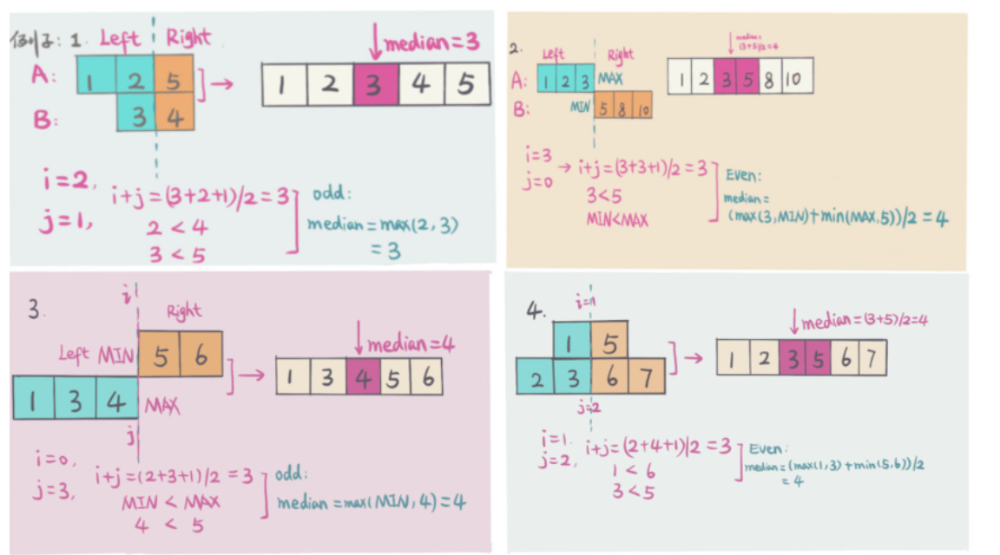
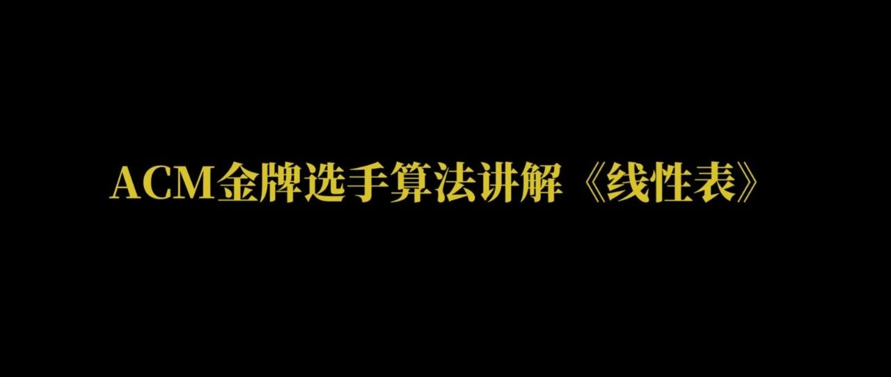

其他参考资料书籍：

​	https://programmercarl.com/%E6%95%B0%E7%BB%84%E6%80%BB%E7%BB%93%E7%AF%87.html

# **数据结构**

## **数组&双指针**

### [LeetCode 1. 两数之和](https://link.zhihu.com/?target=https%3A//leetcode-cn.com/problems/two-sum/)

```c++
给定一个整数数组 nums 和一个整数目标值 target，请你在该数组中找出 和为目标值 target 的那 两个 整数，并返回它们的数组下标。
 你可以假设每种输入只会对应一个答案。但是，数组中同一个元素在答案里不能重复出现。
 你可以按任意顺序返回答案。 

示例 1：
输入：nums = [2,7,11,15], target = 9
输出：[0,1]
解释：因为 nums[0] + nums[1] == 9 ，返回 [0, 1] 。
 

 示例 2：
输入：nums = [3,2,4], target = 6
输出：[1,2]
 

 示例 3：
输入：nums = [3,3], target = 6
输出：[0,1]

 提示：
 2 <= nums.length <= 10⁴ 
 -10⁹ <= nums[i] <= 10⁹ 
 -10⁹ <= target <= 10⁹ 
 只会存在一个有效答案 
```

- c++与c#的区别

- map的使用：利用map的二分查找快速找到结果


### [LeetCode 4. 寻找两个正序数组的中位数](https://link.zhihu.com/?target=https%3A//leetcode-cn.com/problems/median-of-two-sorted-arrays/)

```c++
Given two sorted arrays nums1 and nums2 of size m and n respectively, return 
the median of the two sorted arrays.  

Example 1: 
Input: nums1 = [1,3], nums2 = [2]
Output: 2.00000
Explanation: merged array = [1,2,3] and median is 2.
 

 Example 2: 
Input: nums1 = [1,2], nums2 = [3,4]
Output: 2.50000
Explanation: merged array = [1,2,3,4] and median is (2 + 3) / 2 = 2.5.
```

- 实现时考虑数组的极端情况：为空，为1个值


- 有序数组容易想到二分查找




https://github.com/azl397985856/leetcode/blob/master/problems/4.median-of-two-sorted-arrays.md


### [LeetCode 15. 三数之和](https://link.zhihu.com/?target=https%3A//leetcode-cn.com/problems/3sum/)

```c++
Given an integer array nums, return all the triplets [nums[i], nums[j], nums[k]]
 such that i != j, i != k, and j != k, and nums[i] + nums[j] + nums[k] == 0. 
 Notice that the solution set must not contain duplicate triplets. 

Example 1: 
 Input: nums = [-1,0,1,2,-1,-4]
Output: [[-1,-1,2],[-1,0,1]]

 Example 2: 
 Input: nums = []
Output: []

 Example 3: 
 Input: nums = [0]
Output: []
```

两种方法，哈希法和双指针法， 两者时间复杂度可以做到$O(n^2)$，但哈希法编写起来还是比较费时的，因为不好做剪枝操作。实际不好完成。

**建议双指针法**

- 要常思考排序是否能够简单化问题
- stl中的set的灵活使用

哈希法:

用到的剪枝技巧：首先set元素不会重复，然后将数组排序，则可利用逻辑使得本题在添加时就避免了再新建一个方法专门用于查重的过程

```C++
class Solution {//哈希法，不建议，但是值得学习
public:
    vector<vector<int>> threeSum(vector<int>& nums) {
        vector<vector<int>> result;
        sort(nums.begin(), nums.end());
        // 找出a + b + c = 0
        // a = nums[i], b = nums[j], c = -(a + b)
        for (int i = 0; i < nums.size(); i++) {
            // 排序之后如果第一个元素已经大于零，那么不可能凑成三元组
            if (nums[i] > 0) {
                break;
            }
            if (i > 0 && nums[i] == nums[i - 1]) { //三元组元素a去重,  前一个
                continue;
            }
            unordered_set<int> set;
            for (int j = i + 1; j < nums.size(); j++) {
                if (j > i + 2
                    && nums[j] == nums[j-1]
                    && nums[j-1] == nums[j-2]) { // 三元组元素b去重，  前两个
                    continue;
                }
                int c = 0 - (nums[i] + nums[j]);
                if (set.find(c) != set.end()) {//set中找到了c
                    result.push_back({nums[i], nums[j], c});
                    set.erase(c);// 三元组元素c去重
                } else {//没找到
                    set.insert(nums[j]);
                }
            }
        }
        return result;
    }
};
```

### [LeetCode 75. 颜色分类](https://link.zhihu.com/?target=https%3A//leetcode-cn.com/problems/sort-colors/)

```c++
Given an array nums with n objects colored red, white, or blue, sort them in-
place so that objects of the same color are adjacent, with the colors in the order 
red, white, and blue. 

 We will use the integers 0, 1, and 2 to represent the color red, white, and 
blue, respectively. 

 You must solve this problem without using the library's sort function. 

 
 Example 1: 
Input: nums = [2,0,2,1,1,0]
Output: [0,0,1,1,2,2]
 
 Example 2: 
Input: nums = [2,0,1]
Output: [0,1,2]
 
 
 Constraints: 
 n == nums.length 
 1 <= n <= 300 
 nums[i] is either 0, 1, or 2. 
```

### [LeetCode 76. 最小覆盖子串](https://link.zhihu.com/?target=https%3A//leetcode-cn.com/problems/minimum-window-substring/)

### [LeetCode 142. 环形链表 II](https://link.zhihu.com/?target=https%3A//leetcode-cn.com/problems/linked-list-cycle-ii/)

### [LeetCode 234. 回文链表](https://link.zhihu.com/?target=https%3A//leetcode-cn.com/problems/palindrome-linked-list/)

### [LeetCode 283. 移动零](https://link.zhihu.com/?target=https%3A//leetcode-cn.com/problems/move-zeroes/)

## **链表**

[LeetCode 19. 删除链表的倒数第 N 个结点](https://link.zhihu.com/?target=https%3A//leetcode-cn.com/problems/remove-nth-node-from-end-of-list/)

[LeetCode 148. 排序链表](https://link.zhihu.com/?target=https%3A//leetcode-cn.com/problems/sort-list/)

[LeetCode 160. 相交链表](https://link.zhihu.com/?target=https%3A//leetcode-cn.com/problems/intersection-of-two-linked-lists/)

[LeetCode 206. 反转链表](https://link.zhihu.com/?target=https%3A//leetcode-cn.com/problems/reverse-linked-list/)

## 《线性表》核心教程

[ACM金牌选手算法讲解《线性表》mp.weixin.qq.com/s/qwaYOFIksFVqZtA_nisl6g](https://link.zhihu.com/?target=https%3A//mp.weixin.qq.com/s/qwaYOFIksFVqZtA_nisl6g)

### **队列&栈**

[LeetCode 20. 有效的括号](https://link.zhihu.com/?target=https%3A//leetcode-cn.com/problems/valid-parentheses/)

[LeetCode 21. 合并两个有序链表](https://link.zhihu.com/?target=https%3A//leetcode-cn.com/problems/merge-two-sorted-lists/)

[LeetCode 84. 柱状图中最大的矩形](https://link.zhihu.com/?target=https%3A//leetcode-cn.com/problems/largest-rectangle-in-histogram/)

[LeetCode 85. 最大矩形](https://link.zhihu.com/?target=https%3A//leetcode-cn.com/problems/maximal-rectangle/)

[LeetCode 155. 最小栈](https://link.zhihu.com/?target=https%3A//leetcode-cn.com/problems/min-stack/)

[LeetCode 239. 滑动窗口最大值](https://link.zhihu.com/?target=https%3A//leetcode-cn.com/problems/sliding-window-maximum/)

[LeetCode 394. 字符串解码](https://link.zhihu.com/?target=https%3A//leetcode-cn.com/problems/decode-string/)

[LeetCode 739. 每日温度](https://link.zhihu.com/?target=https%3A//leetcode-cn.com/problems/daily-temperatures/)

[LeetCode 3. 无重复字符的最长子串](https://link.zhihu.com/?target=https%3A//leetcode-cn.com/problems/longest-substring-without-repeating-characters/)

## 《单调栈和滑动窗口》核心教程

[ACM金牌选手讲解LeetCode算法《栈和队列的高级应用》mp.weixin.qq.com/s/I3DQOUmABmWav4nrAiI3Fg](https://link.zhihu.com/?target=https%3A//mp.weixin.qq.com/s/I3DQOUmABmWav4nrAiI3Fg)

### **哈希表**

[LeetCode 49. 字母异位词分组](https://link.zhihu.com/?target=https%3A//leetcode-cn.com/problems/group-anagrams/)

[128. 最长连续序列](https://link.zhihu.com/?target=https%3A//leetcode-cn.com/problems/longest-consecutive-sequence/)

[LeetCode 141. 环形链表](https://link.zhihu.com/?target=https%3A//leetcode-cn.com/problems/linked-list-cycle/)

[LeetCode 146. LRU 缓存机制](https://link.zhihu.com/?target=https%3A//leetcode-cn.com/problems/lru-cache/)

[LeetCode 560. 和为K的子数组](https://link.zhihu.com/?target=https%3A//leetcode-cn.com/problems/subarray-sum-equals-k/)

### **二叉树**

[LeetCode 94. 二叉树的中序遍历](https://link.zhihu.com/?target=https%3A//leetcode-cn.com/problems/binary-tree-inorder-traversal/)

[101. 对称二叉树](https://link.zhihu.com/?target=https%3A//leetcode-cn.com/problems/symmetric-tree/)

[102. 二叉树的层序遍历](https://link.zhihu.com/?target=https%3A//leetcode-cn.com/problems/binary-tree-level-order-traversal/)

[LeetCode 104. 二叉树的最大深度](https://link.zhihu.com/?target=https%3A//leetcode-cn.com/problems/maximum-depth-of-binary-tree/)

[LeetCode 105. 从前序与中序遍历序列构造二叉树](https://link.zhihu.com/?target=https%3A//leetcode-cn.com/problems/construct-binary-tree-from-preorder-and-inorder-traversal/)

[LeetCode 114. 二叉树展开为链表](https://link.zhihu.com/?target=https%3A//leetcode-cn.com/problems/flatten-binary-tree-to-linked-list/)

[LeetCode 543. 二叉树的直径](https://link.zhihu.com/?target=https%3A//leetcode-cn.com/problems/diameter-of-binary-tree/)

### **二叉搜索树**

[LeetCode 96. 不同的二叉搜索树](https://link.zhihu.com/?target=https%3A//leetcode-cn.com/problems/unique-binary-search-trees/)

[LeetCode 98. 验证二叉搜索树](https://link.zhihu.com/?target=https%3A//leetcode-cn.com/problems/validate-binary-search-tree/)

# **算法**

## **模拟**

[LeetCode 48. 旋转图像](https://link.zhihu.com/?target=https%3A//leetcode-cn.com/problems/rotate-image/)

## **贪心**

1. [LeetCode 11. 盛最多水的容器](https://link.zhihu.com/?target=https%3A//leetcode-cn.com/problems/container-with-most-water/)
2. [LeetCode 714. 买卖股票的最佳时机含手续费](https://link.zhihu.com/?target=https%3A//leetcode-cn.com/problems/best-time-to-buy-and-sell-stock-with-transaction-fee/)
3. [LeetCode 122. 买卖股票的最佳时机 II](https://link.zhihu.com/?target=https%3A//leetcode-cn.com/problems/best-time-to-buy-and-sell-stock-ii/)
4. [LeetCode 55. 跳跃游戏](https://link.zhihu.com/?target=https%3A//leetcode-cn.com/problems/jump-game/)
5. [LeetCode 309. 最佳买卖股票时机含冷冻期](https://link.zhihu.com/?target=https%3A//leetcode-cn.com/problems/best-time-to-buy-and-sell-stock-with-cooldown/)
6. [LeetCode 406. 根据身高重建队列](https://link.zhihu.com/?target=https%3A//leetcode-cn.com/problems/queue-reconstruction-by-height/)

## **二分**

1. [LeetCode 33. 搜索旋转排序数组](https://link.zhihu.com/?target=https%3A//leetcode-cn.com/problems/search-in-rotated-sorted-array/)
2. [LeetCode 34. 在排序数组中查找元素的第一个和最后一个位置](https://link.zhihu.com/?target=https%3A//leetcode-cn.com/problems/find-first-and-last-position-of-element-in-sorted-array/)

## **递归&回溯**

1. [LeetCode 17. 电话号码的字母组合](https://link.zhihu.com/?target=https%3A//leetcode-cn.com/problems/letter-combinations-of-a-phone-number/)
2. [LeetCode 22. 括号生成](https://link.zhihu.com/?target=https%3A//leetcode-cn.com/problems/generate-parentheses/)
3. [LeetCode 39. 组合总和](https://link.zhihu.com/?target=https%3A//leetcode-cn.com/problems/combination-sum/)
4. [LeetCode 46. 全排列](https://link.zhihu.com/?target=https%3A//leetcode-cn.com/problems/permutations/)
5. [LeetCode 78. 子集](https://link.zhihu.com/?target=https%3A//leetcode-cn.com/problems/subsets/)
6. [LeetCode 79. 单词搜索](https://link.zhihu.com/?target=https%3A//leetcode-cn.com/problems/word-search/)
7. [LeetCode 226. 翻转二叉树](https://link.zhihu.com/?target=https%3A//leetcode-cn.com/problems/invert-binary-tree/)

## **深度优先搜索DFS**

1. [LeetCode 236. 二叉树的最近公共祖先](https://link.zhihu.com/?target=https%3A//leetcode-cn.com/problems/lowest-common-ancestor-of-a-binary-tree/)
2. [LeetCode 301. 删除无效的括号](https://link.zhihu.com/?target=https%3A//leetcode-cn.com/problems/remove-invalid-parentheses/)

## **宽度优先搜索BFS**

1. [LeetCode 200. 岛屿数量](https://link.zhihu.com/?target=https%3A//leetcode-cn.com/problems/number-of-islands/)
2. [LeetCode 617. 合并二叉树](https://link.zhihu.com/?target=https%3A//leetcode-cn.com/problems/merge-two-binary-trees/)

## **分治**

1. [LeetCode 53. 最大子序和](https://link.zhihu.com/?target=https%3A//leetcode-cn.com/problems/maximum-subarray/)

## **排序算法**

1. [LeetCode 56. 合并区间](https://link.zhihu.com/?target=https%3A//leetcode-cn.com/problems/merge-intervals/)
2. [LeetCode 215. 数组中的第K个最大元素](https://link.zhihu.com/?target=https%3A//leetcode-cn.com/problems/kth-largest-element-in-an-array/)
3. [LeetCode 347. 前 K 个高频元素](https://link.zhihu.com/?target=https%3A//leetcode-cn.com/problems/top-k-frequent-elements/)

## **Manacher算法**

1. [LeetCode 5. 最长回文子串](https://link.zhihu.com/?target=https%3A//leetcode-cn.com/problems/longest-palindromic-substring/)
2. [LeetCode 647. 回文子串](https://link.zhihu.com/?target=https%3A//leetcode-cn.com/problems/palindromic-substrings/)

## **字典树Trie**

1. [LeetCode 139. 单词拆分](https://link.zhihu.com/?target=https%3A//leetcode-cn.com/problems/word-break/)
2. [LeetCode 208. 实现 Trie (前缀树)](https://link.zhihu.com/?target=https%3A//leetcode-cn.com/problems/implement-trie-prefix-tree/)

## **动态规划**

1. [LeetCode 10. 正则表达式匹配](https://link.zhihu.com/?target=https%3A//leetcode-cn.com/problems/regular-expression-matching/)
2. [LeetCode 32. 最长有效括号](https://link.zhihu.com/?target=https%3A//leetcode-cn.com/problems/longest-valid-parentheses/)
3. [LeetCode 42. 接雨水](https://link.zhihu.com/?target=https%3A//leetcode-cn.com/problems/trapping-rain-water/)
4. [LeetCode 62. 不同路径](https://link.zhihu.com/?target=https%3A//leetcode-cn.com/problems/unique-paths/)
5. [LeetCode 64. 最小路径和](https://link.zhihu.com/?target=https%3A//leetcode-cn.com/problems/minimum-path-sum/)
6. [LeetCode 70. 爬楼梯](https://link.zhihu.com/?target=https%3A//leetcode-cn.com/problems/climbing-stairs/)
7. [LeetCode 72. 编辑距离](https://link.zhihu.com/?target=https%3A//leetcode-cn.com/problems/edit-distance/)
8. [LeetCode 139. 单词拆分](https://link.zhihu.com/?target=https%3A//leetcode-cn.com/problems/word-break/)
9. [LeetCode 152. 乘积最大子数组](https://link.zhihu.com/?target=https%3A//leetcode-cn.com/problems/maximum-product-subarray/)
10. [LeetCode 198. 打家劫舍](https://link.zhihu.com/?target=https%3A//leetcode-cn.com/problems/house-robber/)
11. [LeetCode 221. 最大正方形](https://link.zhihu.com/?target=https%3A//leetcode-cn.com/problems/maximal-square/)
12. [LeetCode 300. 最长递增子序列](https://link.zhihu.com/?target=https%3A//leetcode-cn.com/problems/longest-increasing-subsequence/)
13. [LeetCode 337. 打家劫舍 III](https://link.zhihu.com/?target=https%3A//leetcode-cn.com/problems/house-robber-iii/)
14. [LeetCode 416. 分割等和子集](https://link.zhihu.com/?target=https%3A//leetcode-cn.com/problems/partition-equal-subset-sum/)
15. [LeetCode 494. 目标和](https://link.zhihu.com/?target=https%3A//leetcode-cn.com/problems/target-sum/)

## **最短路算法**

1. [LeetCode 743. 网络延迟时间](https://link.zhihu.com/?target=https%3A//leetcode-cn.com/problems/network-delay-time/)

## **最小生成树**

1. [1584. 连接所有点的最小费用](https://link.zhihu.com/?target=https%3A//leetcode-cn.com/problems/min-cost-to-connect-all-points/)

## **拓扑排序**

1. [LeetCode 207. 课程表](https://link.zhihu.com/?target=https%3A//leetcode-cn.com/problems/course-schedule/)

## **并查集**

1. [LeetCode 399. 除法求值](https://link.zhihu.com/?target=https%3A//leetcode-cn.com/problems/evaluate-division/)