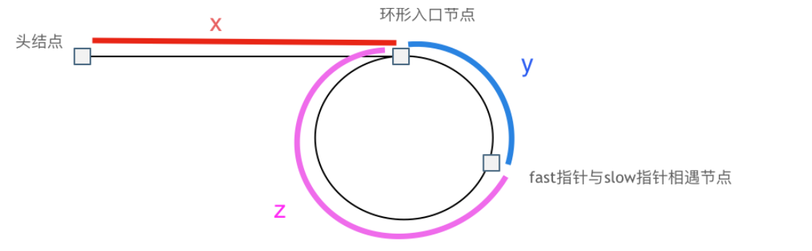
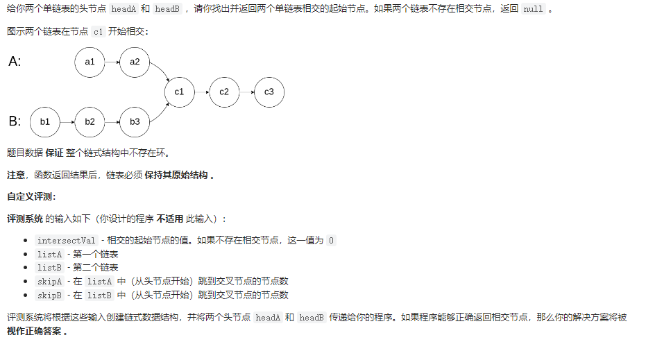
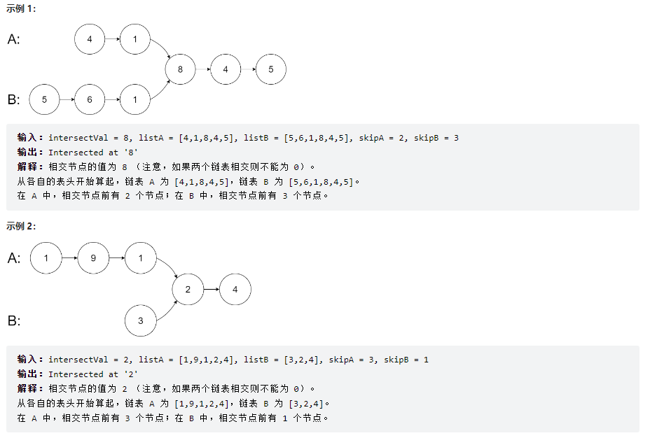
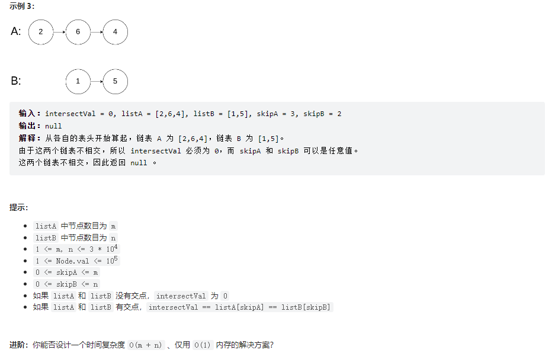
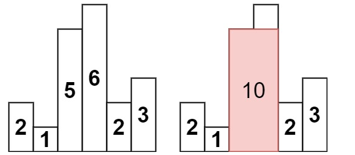
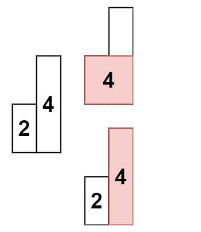
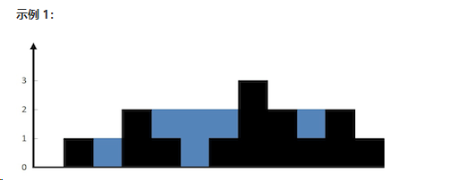

# 进度记录

https://leetcode.cn/u/mihtop-alemin/

## 2022.06.01


## 2022.07.10

上个月做oppo项目没有时间看，暑假再抓紧时间刷一刷


# **数据结构**

## **数组&双指针**

### [LeetCode 1. 两数之和](https://link.zhihu.com/?target=https%3A//leetcode-cn.com/problems/two-sum/)

```c++
给定一个整数数组 nums 和一个整数目标值 target，请你在该数组中找出 和为目标值 target 的那 两个 整数，并返回它们的数组下标。
 你可以假设每种输入只会对应一个答案。但是，数组中同一个元素在答案里不能重复出现。
 你可以按任意顺序返回答案。 

示例 1：
输入：nums = [2,7,11,15], target = 9
输出：[0,1]
解释：因为 nums[0] + nums[1] == 9 ，返回 [0, 1] 。
 

 示例 2：
输入：nums = [3,2,4], target = 6
输出：[1,2]
 

 示例 3：
输入：nums = [3,3], target = 6
输出：[0,1]

 提示：
 2 <= nums.length <= 10⁴ 
 -10⁹ <= nums[i] <= 10⁹ 
 -10⁹ <= target <= 10⁹ 
 只会存在一个有效答案 
```

- c++与c#的区别

- map的使用：利用map的二分查找快速找到结果


### [LeetCode 4. 寻找两个正序数组的中位数](https://link.zhihu.com/?target=https%3A//leetcode-cn.com/problems/median-of-two-sorted-arrays/)

```c++
Given two sorted arrays nums1 and nums2 of size m and n respectively, return 
the median of the two sorted arrays.  

Example 1: 
Input: nums1 = [1,3], nums2 = [2]
Output: 2.00000
Explanation: merged array = [1,2,3] and median is 2.
 

 Example 2: 
Input: nums1 = [1,2], nums2 = [3,4]
Output: 2.50000
Explanation: merged array = [1,2,3,4] and median is (2 + 3) / 2 = 2.5.
```

- 实现时考虑数组的极端情况：为空，为1个值


- 有序数组容易想到二分查找


https://github.com/azl397985856/leetcode/blob/master/problems/4.median-of-two-sorted-arrays.md


### [LeetCode 15. 三数之和](https://link.zhihu.com/?target=https%3A//leetcode-cn.com/problems/3sum/)

```c++
Given an integer array nums, return all the triplets [nums[i], nums[j], nums[k]]
 such that i != j, i != k, and j != k, and nums[i] + nums[j] + nums[k] == 0. 
 Notice that the solution set must not contain duplicate triplets. 

Example 1: 
 Input: nums = [-1,0,1,2,-1,-4]
Output: [[-1,-1,2],[-1,0,1]]

 Example 2: 
 Input: nums = []
Output: []

 Example 3: 
 Input: nums = [0]
Output: []
```

两种方法，哈希法和双指针法， 两者时间复杂度可以做到$O(n^2)$，但哈希法编写起来还是比较费时的，因为不好做剪枝操作。实际不好完成。

**建议双指针法**

- 要常思考排序是否能够简单化问题
- stl中的set的灵活使用

哈希法:

用到的剪枝技巧：首先set元素不会重复，然后将数组排序，则可利用逻辑使得本题在添加时就避免了再新建一个方法专门用于查重的过程

```C++
class Solution {//哈希法，不建议，但是值得学习
public:
    vector<vector<int>> threeSum(vector<int>& nums) {
        vector<vector<int>> result;
        sort(nums.begin(), nums.end());
        // 找出a + b + c = 0
        // a = nums[i], b = nums[j], c = -(a + b)
        for (int i = 0; i < nums.size(); i++) {
            // 排序之后如果第一个元素已经大于零，那么不可能凑成三元组
            if (nums[i] > 0) {
                break;
            }
            if (i > 0 && nums[i] == nums[i - 1]) { //三元组元素a去重,  前一个
                continue;
            }
            unordered_set<int> set;
            for (int j = i + 1; j < nums.size(); j++) {
                if (j > i + 2
                    && nums[j] == nums[j-1]
                    && nums[j-1] == nums[j-2]) { // 三元组元素b去重，  前两个
                    continue;
                }
                int c = 0 - (nums[i] + nums[j]);
                if (set.find(c) != set.end()) {//set中找到了c
                    result.push_back({nums[i], nums[j], c});
                    set.erase(c);// 三元组元素c去重
                } else {//没找到
                    set.insert(nums[j]);
                }
            }
        }
        return result;
    }
};
```

### [LeetCode 75. 颜色分类](https://link.zhihu.com/?target=https%3A//leetcode-cn.com/problems/sort-colors/)

```c++
Given an array nums with n objects colored red, white, or blue, sort them in-
place so that objects of the same color are adjacent, with the colors in the order 
red, white, and blue. 

 We will use the integers 0, 1, and 2 to represent the color red, white, and 
blue, respectively. 

 You must solve this problem without using the library's sort function. 

 
 Example 1: 
Input: nums = [2,0,2,1,1,0]
Output: [0,0,1,1,2,2]
 
 Example 2: 
Input: nums = [2,0,1]
Output: [0,1,2]
 
 
 Constraints: 
 n == nums.length 
 1 <= n <= 300 
 nums[i] is either 0, 1, or 2. 
```

 挡板法:两个挡板，前面的挡板不允许右边有0，后面的不允许左边有2

 指针不仅可以用来指向数组，还可以用来当做挡板。实现时，挡板本质上是交换+移位


### [LeetCode 76. 最小覆盖子串](https://link.zhihu.com/?target=https%3A//leetcode-cn.com/problems/minimum-window-substring/)

```
Given two strings s and t of lengths m and n respectively, return the minimum 
window substring of s such that every character in t (including duplicates) is 
included in the window. If there is no such substring, return the empty string "". 
 The testcases will be generated such that the answer is unique. 
 A substring is a contiguous sequence of characters within the string. 

 Example 1: 
Input: s = "ADOBECODEBANC", t = "ABC"
Output: "BANC"
Explanation: The minimum window substring "BANC" includes 'A', 'B', and 'C' 
from string t.
 
 Example 2: 
Input: s = "a", t = "a"
Output: "a"
Explanation: The entire string s is the minimum window.
 
 Example 3: 
Input: s = "a", t = "aa"
Output: ""
Explanation: Both 'a's from t must be included in the window.
Since the largest window of s only has one 'a', return empty string.
 

 
 Constraints: 
 m == s.length 
 n == t.length 
 1 <= m, n <= 10⁵ 
 s and t consist of uppercase and lowercase English letters. 
```

滑动窗口

三目运算符比较耗费内存。

```
if (minLen>(i-left+1)){
    minLen=i-left+1;
    res=s.substr(left,minLen);
}
```

```
minLen=minLen<(i-left+1)? minLen:(i-left+1);
res=minLen<(i-left+1)? res:s.substr(left,minLen);
```

一些情况下，上面进行了一次重复的判断而且多两次赋值？（minLen=minLen，res=res）

### [LeetCode 142. 环形链表 II](https://link.zhihu.com/?target=https%3A//leetcode-cn.com/problems/linked-list-cycle-ii/)

```
给定一个链表的头节点 head ，返回链表开始入环的第一个节点。 如果链表无环，则返回 null。
 如果链表中有某个节点，可以通过连续跟踪 next 指针再次到达，则链表中存在环。 为了表示给定链表中的环，评测系统内部使用整数 pos 来表示链表尾连接到链表
中的位置（索引从 0 开始）。如果 pos 是 -1，则在该链表中没有环。注意：pos 不作为参数进行传递，仅仅是为了标识链表的实际情况。
 不允许修改 链表。 


 示例 1：
输入：head = [3,2,0,-4], pos = 1
输出：返回索引为 1 的链表节点
解释：链表中有一个环，其尾部连接到第二个节点。
 

 示例 2： 输入：head = [1,2], pos = 0
输出：返回索引为 0 的链表节点
解释：链表中有一个环，其尾部连接到第一个节点。
 

 示例 3： 
输入：head = [1], pos = -1
输出：返回 null
解释：链表中没有环。

 提示：
 链表中节点的数目范围在范围 [0, 10⁴] 内 
 -10⁵ <= Node.val <= 10⁵ 
 pos 的值为 -1 或者链表中的一个有效索引 

 进阶：你是否可以使用 O(1) 空间解决此题？ 
 Related Topics 哈希表 链表 双指针 👍 1573 👎 0
```

快慢指针

因为fast指针是一步走两个节点，slow指针一步走一个节点， 所以 fast指针走过的节点数 = slow指针走过的节点数 * 2：

```
(x + y) * 2 = x + y + n (y + z)
```

两边消掉一个（x+y）: `x + y = n (y + z)`

因为要找环形的入口，那么要求的是x，因为x表示 头结点到 环形入口节点的的距离。

所以要求x ，将x单独放在左面：`x = n (y + z) - y` ,

再从n(y+z)中提出一个 （y+z）来，整理公式之后为如下公式：`x = (n - 1) (y + z) + z `注意这里n一定是大于等于1的，因为 fast指针至少要多走一圈才能相遇slow指针。



相遇后fast置为原点，并且每次步数为1，slow接着在圈里转，根据公式，当slow和fast再次相遇时，fast所处的位置就是所要的答案。


一个关键点是，开始时fast的速度是slow的两倍。

### [LeetCode 234. 回文链表](https://link.zhihu.com/?target=https%3A//leetcode-cn.com/problems/palindrome-linked-list/)

```c++
给你一个单链表的头节点 head ，请你判断该链表是否为回文链表。如果是，返回 true ；否则，返回 false 。 

 示例 1： 
输入：head = [1,2,2,1]
输出：true
 
 示例 2： 
输入：head = [1,2]
输出：false
 

 

 提示： 
 链表中节点数目在范围[1, 10⁵] 内 
 0 <= Node.val <= 9 

 进阶：你能否用 O(n) 时间复杂度和 O(1) 空间复杂度解决此题？ 
 Related Topics 栈 递归 链表 双指针 👍 1387 👎 0
```

此题，有效锻炼了链表相关的代码能力。详细见代码注释

```c++
class Solution {
public:
    bool isPalindrome(ListNode* head) {
        if (head==NULL){
            return false;
        }
        if (head->next==NULL){
            return true;
        }
//        ListNode slowNode=head;
        //理解：为什么链表声明需要用到指针
        //不用指针初始化的时候就出问题辣，指针允许指向空，而且指针本身是莫得特定的初始化行为的（你可以把他当一个整型数值来看），它只是指向了一个内存区域，并被标记了该内存数据的“样板”（也就是类型，把类型看作一种模具）；
        //但是如果他不是指针而是常规变量呢，他需要初始化（无论他初始化成0还是初始化成随机值，他都得初始化）。然后初始化的时候发现，哦，自己体内还有一个跟自己一样的类型；再然后初始化这个成员，发现，哦，这个成员里面还有一个跟自己一样的类型（然后无限套娃...），最后他就炸了。

        ListNode* slowNode=head;
        ListNode* fastNode=slowNode->next;
        int cnt=2;
        while (fastNode->next!=NULL&&fastNode->next->next!=NULL){//先fastNode->next，再fastNode->next->next，不然会出现空指针异常
            slowNode=slowNode->next;
            fastNode=fastNode->next->next;
            cnt+=2;
        }
        if (fastNode->next!=NULL){//实际为奇数，cnt少加了
            cnt++;//这时如果总共是7个节点，slow为3，fast6；如果6，则slow3，fast6
        }
//        cout<<cnt<<endl;

        fastNode=head;//fast指向头
//        ListNode* reverseHeader= ListNode(); 注意链表的新建方法，有指针就有new. 区别于类
        ListNode* reverseHeader = new ListNode();
        ListNode* tempNode= nullptr;
        slowNode=slowNode->next;//将slow移到后半段
        while(slowNode!=NULL){//反转slowNode
            tempNode=slowNode->next;
            slowNode->next=reverseHeader->next;
            reverseHeader->next=slowNode;
            slowNode=tempNode;
        }
        slowNode=reverseHeader->next;
//        cout<<"here"<<endl;
        for (int i = 0; i <= cnt / 2-1; i++) {
            if (slowNode->val!=fastNode->val){
                return false;
            }
            slowNode=slowNode->next;
            fastNode=fastNode->next;
        }

        return true;

    }
};
```


### [LeetCode 283. 移动零](https://link.zhihu.com/?target=https%3A//leetcode-cn.com/problems/move-zeroes/)

```
/**
给定一个数组 nums，编写一个函数将所有 0 移动到数组的末尾，同时保持非零元素的相对顺序。 

 请注意 ，必须在不复制数组的情况下原地对数组进行操作。 


 示例 1:
输入: nums = [0,1,0,3,12]
输出: [1,3,12,0,0]
 

 示例 2:
输入: nums = [0]
输出: [0] 

 
 提示:
 1 <= nums.length <= 10⁴ 
 -2³¹ <= nums[i] <= 2³¹ - 1 

 进阶：你能尽量减少完成的操作次数吗？ 
 Related Topics 数组 双指针 👍 1596 👎 0

*/
```

有for循环时，考虑快慢指针

当写了三次else if都不行或者感觉逻辑有点混乱时，就要考虑是不是该换个思路

```c++
/**
         Solution0
         执行耗时:24 ms,击败了36.10% 的C++用户
         内存消耗:19.1 MB,击败了5.15% 的C++用户
         
            Solution
         执行耗时:16 ms,击败了87.31% 的C++用户
         内存消耗:18.7 MB,击败了68.33% 的C++用户
*/

//leetcode submit region begin(Prohibit modification and deletion)
class Solution0 {
public:
    void moveZeroes(vector<int>& nums) {
        int cntAll=0;
        vector<int> zeroPos={};
        for(auto it=nums.begin();it!=nums.end();it++){
            if (*it==0){
                zeroPos.push_back(cntAll);
            }
            cntAll++;
        }

//        for (int i = 0; i <= zeroPos.size()-1; i++) {
//            cout<<zeroPos[i]<<" ";
//        }
//        cout<<endl;

        int zeroIt = 0;
        int zeroItMax = zeroPos.size()-1;
        if (nums.size()>1&&zeroPos.size()>0){
            for (int i = 0; i <= nums.size()-1; i++) {
//                if (nums[i]!=0&&zeroIt<zeroItMax&&i>zeroPos[zeroIt]&&i<zeroPos[zeroIt+1]){
//                    cout<<"here 1"<<endl;
//                    nums[i-(zeroIt+1)]=nums[i];
//                }else if(nums[i]!=0&&zeroIt<zeroItMax&&i>zeroPos[zeroIt+1]){
//                    cout<<"here 2"<<endl;
//                    zeroIt++;
//                    nums[i-(zeroIt+1)]=nums[i];
//                }else if(nums[i]!=0&&zeroIt==zeroItMax&&i>zeroPos[zeroIt]){
//                    cout<<"here 3"<<endl;
//                    nums[i-(zeroIt+1)]=nums[i];
//                }else if (i>=zeroPos[zeroIt]){
//                    cout<<"here 4"<<endl;
//                    zeroIt++;
//                }
//当三次else if都不行或者感觉逻辑有点混乱时，就要考虑是不是该换个思路
                if(i>zeroPos[zeroIt]){
                    nums[i-zeroIt-1]=nums[i];
                }
                if(zeroIt!=zeroItMax&&i==zeroPos[zeroIt+1]){//i==zeroPos[zeroIt+1]&&zeroIt!=zeroItMax不要写反了，不然会报错
                    zeroIt++;
                }
            }

            for (int k = 0; k <= nums.size() - 1; k++) {
                cout<<nums[k]<<" ";
            }
            cout<<endl;

            for (int j = nums.size()- zeroPos.size(); j <= nums.size()-1; j++) {
                nums[j]=0;
            }

        }

    }
};

//快慢指针一遍过
class Solution {
public:
    void moveZeroes(vector<int>& nums) {
        int fastIt=0;
        int slowIt=0;
        int cnt=0;
        for (int i = 0; i <= nums.size() - 1; i++) {
            if(nums[i]==0){
                fastIt++;
            }else{
                nums[slowIt]=nums[fastIt];
                fastIt++;
                slowIt++;
            }
        }
        for (int j = slowIt; j <= nums.size() - 1; j++) {
            nums[j]=0;
        }
    }
};
//leetcode submit region end(Prohibit modification and deletion)
```


## **链表**

### [LeetCode 19. 删除链表的倒数第 N 个结点](https://link.zhihu.com/?target=https%3A//leetcode-cn.com/problems/remove-nth-node-from-end-of-list/)

```
/**
给你一个链表，删除链表的倒数第 n 个结点，并且返回链表的头结点。 

 示例 1： 
输入：head = [1,2,3,4,5], n = 2
输出：[1,2,3,5]
 
 示例 2： 
输入：head = [1], n = 1
输出：[]
 
 示例 3： 
输入：head = [1,2], n = 1
输出：[1]
 

 提示： 
 链表中结点的数目为 sz 
 1 <= sz <= 30 
 0 <= Node.val <= 100 
 1 <= n <= sz 
 
 进阶：你能尝试使用一趟扫描实现吗？ 
 Related Topics 链表 双指针 👍 2055 👎 0

*/
```

**可以设置一个虚拟头结点**，这样原链表的所有节点就都可以按照统一的方式进行移除了。return 头结点的时候，别忘了 `return dummyNode->next;`， 这才是新的头结点。

代码（自己未用虚拟头节点）

```c++
/**
			执行耗时:4 ms,击败了77.59% 的C++用户
			内存消耗:10.3 MB,击败了73.82% 的C++用户
*/

class Solution {
public:
    ListNode* removeNthFromEnd(ListNode* head, int n) {
        ListNode* leftNode=head;
        ListNode* rightNode=head;
        for (int i = 0; i <= n-1; i++) {
            if(rightNode->next!=NULL){
                rightNode=rightNode->next;
            }else{//n=size
                return head->next;
            }
        }
        while (rightNode->next!=NULL){
            leftNode=leftNode->next;
            rightNode=rightNode->next;
        }
        //leftnode at 倒数n+1
        leftNode->next=leftNode->next->next;
        return head;
    }
};
```

### [LeetCode 148. 排序链表](https://link.zhihu.com/?target=https%3A//leetcode-cn.com/problems/sort-list/)

```
/**
给你链表的头结点 head ，请将其按 升序 排列并返回 排序后的链表 。 

 示例 1：
输入：head = [4,2,1,3]
输出：[1,2,3,4]
 
 示例 2：
输入：head = [-1,5,3,4,0]
输出：[-1,0,3,4,5]
 
 示例 3：
输入：head = []
输出：[]


 提示：
 链表中节点的数目在范围 [0, 5 * 10⁴] 内 
 -10⁵ <= Node.val <= 10⁵ 

 进阶：你可以在 O(n log n) 时间复杂度和常数级空间复杂度下，对链表进行排序吗？ 
 Related Topics 链表 双指针 分治 排序 归并排序 👍 1623 👎 0

*/
```

 题目限定了时间必须为O(nlgn)，符合要求只有快速排序，归并排序，堆排序，而根据单链表的特点，最适于用归并排序。为啥呢？这是由于链表自身的特点决定的(因为是链表，所以不可以运用到随机访问的特性，所以使用归并排序)。

可以使用归并排序但是需要递归，这样空间就不是常数级空间复杂度了。常数级空间复杂度可以使用，自底向上的方法。教程见：

- https://leetcode.cn/problems/sort-list/solution/148-pai-xu-lian-biao-bottom-to-up-o1-kong-jian-by-/
- https://leetcode.cn/problems/sort-list/solution/pai-xu-lian-biao-by-leetcode-solution/
- 另，关于空间复杂度的思考：应该是指为了实现这个功能额外需要使用的开销，本身已有链表的存储开销不算在内？

此题中关于解题及程序的收获

- 快慢指针找中点
- 链表的排序（之前都是数组的）
- 关于链表的编程规范（初始化，判断，遍历，截断，合并）

递归法：

```c++
class Solution1 {
public:
    ListNode *sortList(ListNode *head) {
        if (!head || !head->next) {
            return head;
        }
        ListNode *slow = head;
        ListNode *fast = head;
        ListNode *pre = head;
        while (fast && fast->next) {//如此遍历得到的结果，奇数时（例如5），fast停在5，slow停在3，偶数时是奇数+1的情况
            pre = slow;
            slow = slow->next;
            fast = fast->next->next;
        }
        pre->next = NULL;//以slow为分界截断

        return merge(sortList(head), sortList(slow));//递归需要很多的空间来存储每一层的结果

    }

    ListNode *merge(ListNode *l1, ListNode *l2) {
        ListNode *dummy = new ListNode(-1);//临时头
        ListNode *cur = dummy;
        while (l1 && l2) {
            if (l1->val < l2->val) {
                cur->next = l1;
                l1 = l1->next;
            } else {
                cur->next = l2;
                l2 = l2->next;
            }
            cur = cur->next;
        }
        if (l1) {
            cur->next = l1;
        }
        if (l2) {
            cur->next = l2;
        }
        return dummy->next;
    }
};
```

迭代法（自底向上）

```c++
class Solution {
public:
    ListNode* sortList(ListNode* head) {
        ListNode dummyHead(0);
        dummyHead.next = head;
        auto p = head;
        int length = 0;
        while (p) {
            ++length;
            p = p->next;
        }

        for (int size = 1; size < length; size <<= 1) {//迭代，常数级的开销
            auto cur = dummyHead.next;
            auto tail = &dummyHead;

            while (cur) {
                auto left = cur;
                auto right = cut(left, size); // left->@->@ right->@->@->@...
                cur = cut(right, size); // left->@->@ right->@->@  cur->@->...

                tail->next = merge(left, right);
                while (tail->next) {
                    tail = tail->next;
                }
            }
        }
        return dummyHead.next;
    }

    ListNode* cut(ListNode* head, int n) {
        auto p = head;
        while (--n && p) {
            p = p->next;
        }

        if (!p) return nullptr;

        auto next = p->next;
        p->next = nullptr;
        return next;
    }

    ListNode* merge(ListNode* l1, ListNode* l2) {
        ListNode dummyHead(0);//链表初始化，ListNode dummyHead(0); 或者ListNode* dummyHead = new ListNode（0）
        auto p = &dummyHead;
        while (l1 && l2) {
            if (l1->val < l2->val) {
                p->next = l1;
                p = l1;
                l1 = l1->next;
            } else {
                p->next = l2;
                p = l2;
                l2 = l2->next;
            }
        }
        p->next = l1 ? l1 : l2;
        return dummyHead.next;
    }
};
```

### [LeetCode 160. 相交链表](https://link.zhihu.com/?target=https%3A//leetcode-cn.com/problems/intersection-of-two-linked-lists/)








多种解法

- 求出两个链表的长度，并求出两个链表长度的差值，然后让curA移动到，和curB 末尾对齐的位置（本人使用）

  

- 双指针：例如使用 a, b 两个指针分别指向 A, B 这两条链表, 两个指针相同的速度向后移动,当 a 到达链表的尾部时,重定位到链表 B 的头结点，当 b 到达链表的尾部时,重定位到链表 A 的头结点。a, b 指针相遇的点为相交的起始节点，否则没有相交点

  

  


### [LeetCode 206. 反转链表](https://link.zhihu.com/?target=https%3A//leetcode-cn.com/problems/reverse-linked-list/)

基本功

```
/**
给你单链表的头节点 head ，请你反转链表，并返回反转后的链表。

 示例 1：  
输入：head = [1,2,3,4,5]
输出：[5,4,3,2,1]
 
 示例 2： 
输入：head = [1,2]
输出：[2,1]
 
 示例 3： 
输入：head = []
输出：[]
 

 提示： 
 
 链表中节点的数目范围是 [0, 5000] 
 -5000 <= Node.val <= 5000 
 
 进阶：链表可以选用迭代或递归方式完成反转。你能否用两种方法解决这道题？ 
 
 Related Topics 递归 链表 👍 2546 👎 0

*/
```

```c++
/**
 *
            Solution1(迭代法)
			执行耗时:4 ms,击败了96.21% 的C++用户
			内存消耗:8 MB,击败了94.28% 的C++用户

			Solution（递归法）
			执行耗时:8 ms,击败了49.51% 的C++用户
			内存消耗:7.9 MB,击败了96.83% 的C++用户

*/

class Solution1 {
public:
    ListNode* reverseList(ListNode* head) {
        auto dummyHead = new ListNode(-1);
        auto temp = head;
        auto cur = head;
        while (cur){
            temp=cur->next;
            cur->next=dummyHead->next;
            dummyHead->next=cur;
            cur=temp;
        }
        return dummyHead->next;
    }
};

class Solution {
public:
    ListNode* reverse(ListNode* pre,ListNode* cur){
        if(cur == NULL) return pre;
        ListNode* temp = cur->next;
        cur->next = pre;
        // 可以和双指针法的代码进行对比，如下递归的写法，其实就是做了这两步
        // pre = cur;
        // cur = temp;
        return reverse(cur,temp);
    }
    ListNode* reverseList(ListNode* head) {
        // 和双指针法初始化是一样的逻辑
        // ListNode* cur = head;
        // ListNode* pre = NULL;
        return reverse(NULL, head);
    }

};
```


## 线性表

[ACM金牌选手算法讲解《线性表》mp.weixin.qq.com/s/qwaYOFIksFVqZtA_nisl6g](https://link.zhihu.com/?target=https%3A//mp.weixin.qq.com/s/qwaYOFIksFVqZtA_nisl6g)

LeetCode刷题过程中，常常用到的线性表主要包括以下四个重要的数据结构: 数组、链表、栈、队列。

**线性:** 这里的线性是逻辑上的连续，而非物理存储的连续。

除了线性表以外，还会有非线性表，像堆、图、二叉树等都是非线性表。（逻辑上不连续，没有唯一的尾或者头）

## **队列&栈**

### [LeetCode 20. 有效的括号](https://link.zhihu.com/?target=https%3A//leetcode-cn.com/problems/valid-parentheses/)

```
给定一个只包括 '('，')'，'{'，'}'，'['，']' 的字符串 s ，判断字符串是否有效。 

 有效字符串需满足： 
 左括号必须用相同类型的右括号闭合。 
 左括号必须以正确的顺序闭合。 
 

 示例 1： 
输入：s = "()"
输出：true
 

 示例 2：  
输入：s = "()[]{}"
输出：true
 

 示例 3： 
输入：s = "(]"
输出：false
 

 示例 4： 
输入：s = "([)]"
输出：false
 

 示例 5： 
输入：s = "{[]}"
输出：true 

 

 提示： 
 1 <= s.length <= 10⁴ 
 s 仅由括号 '()[]{}' 组成 
 
 Related Topics 栈 字符串 👍 3283 👎 0
```

通过本题，**学习栈的用法。**（获取栈顶元素，增加，删除，等）

由于栈结构的特殊性，非常适合做对称匹配类的题目。

string底层保存的还是char


```c++
class Solution {
public:
    bool isValid(string s) {
        stack<char> stack1;

        for (int i = 0; i <= s.size() - 1; i++) {
            if (s[i]=='('){//此处用单引号是因为string底层保存的还是char
                stack1.push(')');
            }else if (s[i]=='{'){
                stack1.push('}');
            }else if (s[i]=='['){
                stack1.push(']');
            } else if (stack1.empty()){
                return false;
            }else if (s[i]==stack1.top()){
                stack1.pop();
            } else if (s[i]!=stack1.top()){
                return false;
            }
        }

        return stack1.empty();
    }
};
```


### [LeetCode 21. 合并两个有序链表](https://link.zhihu.com/?target=https%3A//leetcode-cn.com/problems/merge-two-sorted-lists/)

思路很简单。

注意合并的是链表不是数组，有迭代和递归两种方法。

```c++
class Solution {
public:
    ListNode* mergeTwoLists(ListNode* a, ListNode* b) {
        ListNode head, *tail = &head;
        while (a && b) {
            if (a->val <= b->val) {
                tail->next = a;
                a = a->next;
            } else {
                tail->next = b;
                b = b->next;
            }
            tail = tail->next;
        }
        tail->next = a ? a : b;//后面的不用排了，直接连接
        return head.next;
    }
};
```


### [LeetCode 84. 柱状图中最大的矩形](https://link.zhihu.com/?target=https%3A//leetcode-cn.com/problems/largest-rectangle-in-histogram/)

给定 *n* 个非负整数，用来表示柱状图中各个柱子的高度。每个柱子彼此相邻，且宽度为 1 。

求在该柱状图中，能够勾勒出来的矩形的最大面积。

**示例 1:**



```
输入：heights = [2,1,5,6,2,3]
输出：10
解释：最大的矩形为图中红色区域，面积为 10
```

**示例 2：**



```
输入： heights = [2,4]
输出： 4
```

**提示：**

- `1 <= heights.length <=105`
- `0 <= heights[i] <= 104`


动态规划法

对于每一个 i，我们计算出其左边第一个高度小于它的索引 p，同样地，计算出右边第一个高度小于它的索引 q。那么以 i 为最低点能够构成的面积就是`(q - p - 1) * heights[i]`。 这种算法毫无疑问也是正确的。 我们证明一下，假设 f(i) 表示求以 i 为最低点的情况下，所能形成的最大矩阵面积。那么原问题转化为`max(f(0), f(1), f(2), ..., f(n - 1))`。

高度一直增，怎么办？答：rightSmallIt[size-1]=size;计算时，heights[k]*(rightSmallIt[k]-leftSmallIt[k]-1);

```c++
    int largestRectangleAreaDynamic(vector<int>& heights) {
        //动态规划写法
        /**
        	执行耗时:120 ms,击败了86.66% 的C++用户
			内存消耗:83.6 MB,击败了4.99% 的C++用户
        */
        vector<int> leftSmallIt;
        vector<int> rightSmallIt(heights.size());
        int smallTemp=0;
        int res=0;
        int size=heights.size();
        leftSmallIt.push_back(-1);
        for (int i = 1; i <= size- 1; i++) {
            if (heights[i]>heights[i-1]){
                leftSmallIt.push_back(i-1);
            } else if(heights[i]==heights[i-1]){
                leftSmallIt.push_back(leftSmallIt[i-1]);
            } else{
                //why so wawawawawawwawawwwwwwwwwawaawawawawawawawawawawawawawawaw
                smallTemp=i-1;
                //while (heights[i]<=heights[smallTemp]&&smallTemp>=0){//每当要判断&条件时就要注意前后顺序，不然会出现bug
                while (smallTemp>=0&&heights[i]<=heights[smallTemp]){
                    smallTemp=leftSmallIt[smallTemp];
                }
                leftSmallIt.push_back(smallTemp);//这样子理解会好一点：只要前面的while推出了就是height大于的第一个，所以push迭代结束后的smalltemp
            }
        }


        rightSmallIt[size-1]=size;//设置成size，用于计算最后一块砖
        for (int j = size-2; j >=0 ; j--) {
            if (heights[j]>heights[j+1]){
                rightSmallIt[j]=j+1;
            }else if (heights[j]==heights[j+1]){
                rightSmallIt[j]=rightSmallIt[j+1];
            }else{
                smallTemp=j+1;
                while (smallTemp<size&&heights[j]<=heights[smallTemp]){
                    smallTemp=rightSmallIt[smallTemp];
                }
                rightSmallIt[j]=smallTemp;
            }
        }

//        for (int i = 0; i <= size - 1; i++) {
//            cout<<leftSmallIt[i]<<" ";
//        }
//        cout<<endl;
//        for (int i = 0; i <= size - 1; i++) {
//            cout<<rightSmallIt[i]<<" ";
//        }
//        cout<<endl;

        for (int k = 0; k <= size - 1; k++) {
            smallTemp=heights[k]*(rightSmallIt[k]-leftSmallIt[k]-1);
            if (res<smallTemp){
                res=smallTemp;
            }
        }
        return res;

    }
```


单调栈

看到这种需要打一个弧线的要先想到单调栈。核心思想还是计算以 i 为最低点的情况下，所能形成的最大矩阵面积。栈始终保持从小到大排列。

高度一直增，怎么办？答：前后补零，用于计算第一个为最低点和最后一个为最低点的情况。

```c++
    int largestRectangleArea(vector<int>& heights) {
        //单调栈写法
        /**
        	执行耗时:108 ms,击败了95.95% 的C++用户
			内存消耗:73.4 MB,击败了98.32% 的C++用户
        */
        stack<int> st;
        st.push(0);
        heights.insert(heights.begin(), 0); // 数组头部加入元素0
        heights.push_back(0); // 数组尾部加入元素0
        int tempRes=0;
        int res=0;
        int popIt=0;

        for (int i = 1;i<= heights.size()-1; i++) {//包括最后补的0但是包括最前面补的0
            //考虑序列1，2，3，4，5，1，1，1，6，2；最后计算补的0时才算以1为最低的面积
            if (heights[i]>heights[st.top()]){
                st.push(i);
            } else if (heights[i]==heights[st.top()]){
                st.pop();//当然也可以不pop
                //此处只留右边的可以的原因和接雨水42题不同，接雨水是计算最长的宽，而此处只保留右边的，此位置做参考时，用的是右边的；做最低点计算时，同样用右边的。
                st.push(i);
            }else{
                while (st.size()>1&&heights[i]<heights[st.top()]){
                    popIt=st.top();
                    st.pop();
                    tempRes=heights[popIt]*(i-st.top()-1);
                    if (res<tempRes){
                        res=tempRes;
                    }
                }

                st.push(i);//while结束后就是前面的两种情况了。

            }
        }

        return res;

    }
```


### [LeetCode 85. 最大矩形](https://link.zhihu.com/?target=https%3A//leetcode-cn.com/problems/maximal-rectangle/)

可以利用84的代码算每一次的面积

```c++
//注意行列的获取方式
//注意二维vector声明并初始化仍然可以像二维数组［］［］一样
//注意char到int的转换
```

```c++
class Solution {
    /**
			执行耗时:36 ms,击败了84.66% 的C++用户
			内存消耗:15 MB,击败了34.85% 的C++用户
    */
public:
//    int getMaxSquare(vector<char> &height){
    int getMaxSquare(vector<int> height){
        int res=0;
        int temp=0;
        int midIt=0;


        height.insert(height.begin(),0);
        height.push_back(0);
        stack<int> st;
        st.push(0);

        for (int i = 1; i <= height.size() - 1; i++) {
            if (height[i]>height[st.top()]){
                st.push(i);
            }else if (height[i]==height[st.top()]){
                st.pop();
                st.push(i);
            } else{
                while (st.size()>1&&height[i]<height[st.top()]){
                    midIt=st.top();
                    st.pop();
                    temp=(height[midIt])*(i-st.top()-1);
                    if (temp>res){
                        res=temp;
                    }
                }
                st.push(i);
            }
        }

        return res;
    }

    int maximalRectangle(vector<vector<char>>& matrix) {
        int rows=matrix.size();//行
        int cols=matrix[0].size();//列
        vector<int> heights(matrix[0].size(),0);
        int res=0;
        int tempRes=0;
        res=getMaxSquare(heights);
//        cout<<res<<endl;
        for (int i = 0; i <= rows - 1; i++) {
            for (int j = 0; j <= cols - 1; j++) {
                if (matrix[i][j]=='1'){
                    heights[j]+=1;
                } else{
                    heights[j]=0;
                }
//                cout<<heights[j]<<' ';
            }
//            cout<<endl;
            tempRes= getMaxSquare(heights);
            if (tempRes>res){
                res=tempRes;
            }
        }

        return res;
    }


};
```


### [LeetCode 155. 最小栈](https://link.zhihu.com/?target=https%3A//leetcode-cn.com/problems/min-stack/)

设计一个支持 `push` ，`pop` ，`top` 操作，并能在常数时间内检索到最小元素的栈。

实现 `MinStack` 类:

- MinStack() 初始化堆栈对象。

- void push(int val) 将元素val推入堆栈。
- void pop() 删除堆栈顶部的元素。
- int top() 获取堆栈顶部的元素。
- int getMin() 获取堆栈中的最小元素。

```c++
输入：
["MinStack","push","push","push","getMin","pop","top","getMin"]
[[],[-2],[0],[-3],[],[],[],[]]

输出：
[null,null,null,null,-3,null,0,-2]

解释：
MinStack minStack = new MinStack();
minStack.push(-2);
minStack.push(0);
minStack.push(-3);
minStack.getMin();   --> 返回 -3.
minStack.pop();
minStack.top();      --> 返回 0.
minStack.getMin();   --> 返回 -2.
```

单调栈的简单应用

```c++
/**
			执行耗时:20 ms,击败了71.44% 的C++用户
			内存消耗:15.8 MB,击败了93.94% 的C++用户
*/
//leetcode submit region begin(Prohibit modification and deletion)
class MinStack {
public:
    stack<int> min;
    stack<int> allData;

    MinStack() {

    }
    
    void push(int val) {
        if (allData.size()==0){
            min.push(val);
        }else{
            if (val<=min.top()){//若遇到相同的最小值，则都入栈；防止pop完一个后，min栈没有该最小值的情况
                min.push(val);
            }
        }
        allData.push(val);
    }
    
    void pop() {
        if (allData.top()==min.top()){
            allData.pop();
            min.pop();
        }else{
            allData.pop();
        }
    }
    
    int top() {
        return allData.top();
    }
    
    int getMin() {
        return min.top();
    }
};

```

### [LeetCode 239. 滑动窗口最大值](https://link.zhihu.com/?target=https%3A//leetcode-cn.com/problems/sliding-window-maximum/)

```
/**
给你一个整数数组 nums，有一个大小为 k 的滑动窗口从数组的最左侧移动到数组的最右侧。你只可以看到在滑动窗口内的 k 个数字。滑动窗口每次只向右移动一位。
 返回 滑动窗口中的最大值 。

 示例 1： 
输入：nums = [1,3,-1,-3,5,3,6,7], k = 3
输出：[3,3,5,5,6,7]
解释：
滑动窗口的位置                最大值
---------------               -----
[1  3  -1] -3  5  3  6  7       3
 1 [3  -1  -3] 5  3  6  7       3
 1  3 [-1  -3  5] 3  6  7       5
 1  3  -1 [-3  5  3] 6  7       5
 1  3  -1  -3 [5  3  6] 7       6
 1  3  -1  -3  5 [3  6  7]      7
 

 示例 2： 
输入：nums = [1], k = 1
输出：[1]

 提示： 

 
 1 <= nums.length <= 10⁵ 
 -10⁴ <= nums[i] <= 10⁴ 
 1 <= k <= nums.length 
 
 Related Topics 队列 数组 滑动窗口 单调队列 堆（优先队列） 👍 1737 👎 0

*/
```

思考

- 如何遍历：数组下标、队列
- 如何求最大：简单的三个三个求复杂度n\*k、使用单调双向队列复杂度小于n\*K
- 单调队列，为什么不用单调栈？ 此处是双向的deque，需要头、尾都能弹出元素
- 从大到小维护两个元素就够了？ 不是两个，窗口是几就最多维护几个

注意：

- 双向队列的用法
- 类中的私有类
- 下面代码中有许多细节，建议看一看


代码实现

```c++
class Solution {
    /**
         执行耗时:204 ms,击败了88.30% 的C++用户
         内存消耗:131.5 MB,击败了46.32% 的C++用户
    */
private:
    class MQueue{
        deque<int> myQueue;
        public://C++中，类的默认访问权限是private，结构体的默认访问权限是public。
            void pop(int num){
                if (myQueue.front()==num){
                    myQueue.pop_front();
                }
            }

            int front(){
                return myQueue.front();
            }

            void push(int num){
                while (myQueue.size()!=0&&num>myQueue.back()){//注意此处是从back（队列尾部，尾部最后出）进行判断；这样写代码更加简洁
                    myQueue.pop_back();
                }
                myQueue.push_back(num);
            }
    };

public:
    vector<int> maxSlidingWindow(vector<int>& nums, int k) {
        MQueue myQueue;
        vector<int> res;
        for (int i = 0; i <= k - 1; i++) {
            myQueue.push(nums[i]);
        }
        res.push_back(myQueue.front());
        for (int j = k; j <= nums.size() - 1; j++) {
            myQueue.pop(nums[j-k]);
            myQueue.push(nums[j]);
            res.push_back(myQueue.front());
        }

        return res;
    }


};
```

### [LeetCode 394. 字符串解码](https://link.zhihu.com/?target=https%3A//leetcode-cn.com/problems/decode-string/)

给定一个经过编码的字符串，返回它解码后的字符串。

编码规则为: k[encoded_string]，表示其中方括号内部的 encoded_string 正好重复 k 次。注意 k 保证为正整数。

你可以认为输入字符串总是有效的；输入字符串中没有额外的空格，且输入的方括号总是符合格式要求的。

此外，你可以认为原始数据不包含数字，所有的数字只表示重复的次数 k ，例如不会出现像 3a 或 2[4] 的输入。

```c++
输入：s = "3[a]2[bc]"
输出："aaabcbc"
```

提示：

- 1 <= s.length <= 30
- s 由小写英文字母、数字和方括号 '[]' 组成
- s 保证是一个 有效 的输入。
- s 中所有整数的取值范围为 [1, 300] 


涛的思路，看见对称性的，尤其是这种括号，就要想到栈

利用规则，最小单元中，括号里的是数字，“[”左边是字母进行两段迭代

```c++
class Solution {
    /**
    		执行耗时:4 ms,击败了9.44% 的C++用户
			内存消耗:6.5 MB,击败了28.63% 的C++用户
    */
public:
    string decodeString(string s) {
        stack<char> theStack;
        int sSize=s.size();
        string tempS="";
        string tempN="";
        string res="";

        for (int i = 0; i <= sSize - 1; i++) {
            if (s[i]!=']'){
                theStack.push(s[i]);
            } else{
                while (!theStack.empty()&&theStack.top()!='['){//get all words
//                    tempS+=theStack.top();
                    tempS.insert(tempS.begin(),theStack.top());
                    theStack.pop();
                }
                theStack.pop();//pop '['
                while (!theStack.empty()&&theStack.top()>='0'&&theStack.top()<='9'){//get all nums
//                    tempN+=theStack.top();
                    tempN.insert(tempN.begin(),theStack.top());
                    theStack.pop();
                }
                int tempNum= atoi(tempN.c_str());
                string tempSAll="";
                for (int j = 0; j <= tempNum-1; j++) {
                    tempSAll+=tempS;
                }
                tempS="";
                tempN="";
                for (int k = 0; k <= tempSAll.length() - 1; k++) {
                    theStack.push(tempSAll[k]);
                }


            }
        }

//        for (int l = 0; l <= theStack.size()-1; l++) {
//            res+=theStack.top();
//            cout<<theStack.top()<<endl;
//            theStack.pop();
//        }
//不可以这样打印，theStack size会在每次迭代时改变
        while (!theStack.empty()){
//            res+=theStack.top();
            res.insert(res.begin(),theStack.top());
            theStack.pop();
        }
        return res;
    }
};
```

其实可以更快，把取数字的过程简单化；用string栈而不是char栈减少入栈次数

```c++
//执行用时：0 ms, 在所有 C++ 提交中击败了100.00%的用户
//内存消耗：6.4 MB, 在所有 C++ 提交中击败了52.08%的用户
class Solution {
public:
    string decodeString(string s) {
        string t = "";
        stack<int> s_num;
        stack<string> s_str;
        int cnt = 0;
        for (int i = 0; i < s.size(); ++i) {
            if (s[i] >= '0' && s[i] <= '9') {
                cnt = 10 * cnt + s[i] - '0';
            } else if (s[i] == '[') {
                s_num.push(cnt);
                s_str.push(t);
                cnt = 0; t.clear();
            } else if (s[i] == ']') {
                int k = s_num.top(); s_num.pop();
                for (int j = 0; j < k; ++j) s_str.top() += t;
                t = s_str.top(); s_str.pop();
            } else {
                t += s[i];
            }
        }
        return s_str.empty() ? t : s_str.top();
    }
};
```


### [LeetCode 739. 每日温度](https://link.zhihu.com/?target=https%3A//leetcode-cn.com/problems/daily-temperatures/)

给定一个整数数组 temperatures ，表示每天的温度，返回一个数组 answer ，其中 answer[i] 是指对于第 i 天，下一个更高温度出现在几天后。如果气温在这之后都不会升高，请在该位置用 0 来代替。

```
输入: temperatures = [73,74,75,71,69,72,76,73]
输出: [1,1,4,2,1,1,0,0]
```

```
输入: temperatures = [30,40,50,60]
输出: [1,1,1,0]
```

思路

- 维持单调递减的单调栈，每当遇到不递减的情况就更新answer
- 通常是一维数组，要寻找任一个元素的右边或者左边第一个比自己大或者小的元素的位置，此时我们就要想到可以用单调栈了。
- 这种下标间隔的，一般栈里都放坐标


```c++
class Solution {
    /**
          执行耗时:136 ms,击败了66.73% 的C++用户
         内存消耗:86.8 MB,击败了50.24% 的C++用户
    */
public:
    vector<int> dailyTemperatures(vector<int>& temperatures) {
        int size = temperatures.size();
        stack<int> myStack;
        vector<int> answer(size);
        myStack.push(0);
        for (int i = 1; i <= size - 1; i++) {
//            cout<<"here"<<endl;
            if (temperatures[i]<=temperatures[myStack.top()]){
                myStack.push(i);
//                answer[i-1]=1;
            }else{
                while (!myStack.empty()&&temperatures[i]>temperatures[myStack.top()]){
                    answer[myStack.top()]=i-myStack.top();
                    myStack.pop();
                }
                myStack.push(i);
            }
        }
        int remain = myStack.size();
        for (int j = remain-1; j >=0 ; j-- ){//定义result数组的时候，就应该直接初始化为0，如果result没有更新，说明这个元素右面没有更大的了，也就是为0。
            answer[myStack.top()]=0;
            myStack.pop();
        }
        return answer;

    }
};
```


### [LeetCode 3. 无重复字符的最长子串](https://link.zhihu.com/?target=https%3A//leetcode-cn.com/problems/longest-substring-without-repeating-characters/)

给定一个字符串 `s` ，请你找出其中不含有重复字符的 **最长子串** 的长度。

```
输入: s = "abcabcbb"
输出: 3 
解释: 因为无重复字符的最长子串是 "abc"，所以其长度为 3。
```

```
输入: s = "bbbbb"
输出: 1
解释: 因为无重复字符的最长子串是 "b"，所以其长度为 1。
```

思考

//暴力法时间复杂度太高,考虑使用滑动窗口(双端队列)但是滑动窗口不好检测重复，故使用map

//通过此题，学习map容器相关方法

// mp[alpha] = i;记录下标，再start = max(start,myMap[alpha]+1); 避开了双端队列的使用，这是需要一定灵感的。有时候不一定想的到

```c++
//leetcode submit region begin(Prohibit modification and deletion)
class Solution {
    /**
    		执行耗时:8 ms,击败了88.05% 的C++用户
			内存消耗:8.2 MB,击败了58.29% 的C++用户
    */
public:
    int lengthOfLongestSubstring(string s) {
        map<char,int> myMap;
        int res = 0;
        int sLen = s.size();
//        cout<< sLen <<endl;
        int start = 0;
        if (sLen<=1){
            return sLen;
        }
        for (int i = 0; i <= sLen - 1; i++) {
            char alpha = s[i];
            if (myMap.count(alpha)){//myMap.find((s[i]))!=myMap.end() 也可
                res = max(res,i-start);
                start = max(start,myMap[alpha]+1);//精髓，对于"abca" "abcc" "abba"三种情况都适用
            }
            myMap[alpha] = i;
        }
        res = max(res,sLen-start);
        return  res;
    }
};
```


## 哈希表、二叉树

### **哈希表**

[LeetCode 49. 字母异位词分组](https://link.zhihu.com/?target=https%3A//leetcode-cn.com/problems/group-anagrams/)

[128. 最长连续序列](https://link.zhihu.com/?target=https%3A//leetcode-cn.com/problems/longest-consecutive-sequence/)

[LeetCode 141. 环形链表](https://link.zhihu.com/?target=https%3A//leetcode-cn.com/problems/linked-list-cycle/)

[LeetCode 146. LRU 缓存机制](https://link.zhihu.com/?target=https%3A//leetcode-cn.com/problems/lru-cache/)

[LeetCode 560. 和为K的子数组](https://link.zhihu.com/?target=https%3A//leetcode-cn.com/problems/subarray-sum-equals-k/)

### **二叉树**

[LeetCode 94. 二叉树的中序遍历](https://link.zhihu.com/?target=https%3A//leetcode-cn.com/problems/binary-tree-inorder-traversal/)

[101. 对称二叉树](https://link.zhihu.com/?target=https%3A//leetcode-cn.com/problems/symmetric-tree/)

[102. 二叉树的层序遍历](https://link.zhihu.com/?target=https%3A//leetcode-cn.com/problems/binary-tree-level-order-traversal/)

[LeetCode 104. 二叉树的最大深度](https://link.zhihu.com/?target=https%3A//leetcode-cn.com/problems/maximum-depth-of-binary-tree/)

[LeetCode 105. 从前序与中序遍历序列构造二叉树](https://link.zhihu.com/?target=https%3A//leetcode-cn.com/problems/construct-binary-tree-from-preorder-and-inorder-traversal/)

[LeetCode 114. 二叉树展开为链表](https://link.zhihu.com/?target=https%3A//leetcode-cn.com/problems/flatten-binary-tree-to-linked-list/)

[LeetCode 543. 二叉树的直径](https://link.zhihu.com/?target=https%3A//leetcode-cn.com/problems/diameter-of-binary-tree/)

### **二叉搜索树**

[LeetCode 96. 不同的二叉搜索树](https://link.zhihu.com/?target=https%3A//leetcode-cn.com/problems/unique-binary-search-trees/)

[LeetCode 98. 验证二叉搜索树](https://link.zhihu.com/?target=https%3A//leetcode-cn.com/problems/validate-binary-search-tree/)

# **算法**

## **模拟**

[LeetCode 48. 旋转图像](https://link.zhihu.com/?target=https%3A//leetcode-cn.com/problems/rotate-image/)

## **贪心**

1. [LeetCode 11. 盛最多水的容器](https://link.zhihu.com/?target=https%3A//leetcode-cn.com/problems/container-with-most-water/)
2. [LeetCode 714. 买卖股票的最佳时机含手续费](https://link.zhihu.com/?target=https%3A//leetcode-cn.com/problems/best-time-to-buy-and-sell-stock-with-transaction-fee/)
3. [LeetCode 122. 买卖股票的最佳时机 II](https://link.zhihu.com/?target=https%3A//leetcode-cn.com/problems/best-time-to-buy-and-sell-stock-ii/)
4. [LeetCode 55. 跳跃游戏](https://link.zhihu.com/?target=https%3A//leetcode-cn.com/problems/jump-game/)
5. [LeetCode 309. 最佳买卖股票时机含冷冻期](https://link.zhihu.com/?target=https%3A//leetcode-cn.com/problems/best-time-to-buy-and-sell-stock-with-cooldown/)
6. [LeetCode 406. 根据身高重建队列](https://link.zhihu.com/?target=https%3A//leetcode-cn.com/problems/queue-reconstruction-by-height/)

## **二分**

1. [LeetCode 33. 搜索旋转排序数组](https://link.zhihu.com/?target=https%3A//leetcode-cn.com/problems/search-in-rotated-sorted-array/)
2. [LeetCode 34. 在排序数组中查找元素的第一个和最后一个位置](https://link.zhihu.com/?target=https%3A//leetcode-cn.com/problems/find-first-and-last-position-of-element-in-sorted-array/)

## **递归&回溯**

1. [LeetCode 17. 电话号码的字母组合](https://link.zhihu.com/?target=https%3A//leetcode-cn.com/problems/letter-combinations-of-a-phone-number/)
2. [LeetCode 22. 括号生成](https://link.zhihu.com/?target=https%3A//leetcode-cn.com/problems/generate-parentheses/)
3. [LeetCode 39. 组合总和](https://link.zhihu.com/?target=https%3A//leetcode-cn.com/problems/combination-sum/)
4. [LeetCode 46. 全排列](https://link.zhihu.com/?target=https%3A//leetcode-cn.com/problems/permutations/)
5. [LeetCode 78. 子集](https://link.zhihu.com/?target=https%3A//leetcode-cn.com/problems/subsets/)
6. [LeetCode 79. 单词搜索](https://link.zhihu.com/?target=https%3A//leetcode-cn.com/problems/word-search/)
7. [LeetCode 226. 翻转二叉树](https://link.zhihu.com/?target=https%3A//leetcode-cn.com/problems/invert-binary-tree/)

## **深度优先搜索DFS**

1. [LeetCode 236. 二叉树的最近公共祖先](https://link.zhihu.com/?target=https%3A//leetcode-cn.com/problems/lowest-common-ancestor-of-a-binary-tree/)
2. [LeetCode 301. 删除无效的括号](https://link.zhihu.com/?target=https%3A//leetcode-cn.com/problems/remove-invalid-parentheses/)

## **宽度优先搜索BFS**

1. [LeetCode 200. 岛屿数量](https://link.zhihu.com/?target=https%3A//leetcode-cn.com/problems/number-of-islands/)
2. [LeetCode 617. 合并二叉树](https://link.zhihu.com/?target=https%3A//leetcode-cn.com/problems/merge-two-binary-trees/)

## **分治**

1. [LeetCode 53. 最大子序和](https://link.zhihu.com/?target=https%3A//leetcode-cn.com/problems/maximum-subarray/)

## **排序算法**

1. [LeetCode 56. 合并区间](https://link.zhihu.com/?target=https%3A//leetcode-cn.com/problems/merge-intervals/)
2. [LeetCode 215. 数组中的第K个最大元素](https://link.zhihu.com/?target=https%3A//leetcode-cn.com/problems/kth-largest-element-in-an-array/)
3. [LeetCode 347. 前 K 个高频元素](https://link.zhihu.com/?target=https%3A//leetcode-cn.com/problems/top-k-frequent-elements/)

## **Manacher算法**

1. [LeetCode 5. 最长回文子串](https://link.zhihu.com/?target=https%3A//leetcode-cn.com/problems/longest-palindromic-substring/)
2. [LeetCode 647. 回文子串](https://link.zhihu.com/?target=https%3A//leetcode-cn.com/problems/palindromic-substrings/)

## **字典树Trie**

1. [LeetCode 139. 单词拆分](https://link.zhihu.com/?target=https%3A//leetcode-cn.com/problems/word-break/)
2. [LeetCode 208. 实现 Trie (前缀树)](https://link.zhihu.com/?target=https%3A//leetcode-cn.com/problems/implement-trie-prefix-tree/)

## **动态规划**

### [LeetCode 10. 正则表达式匹配](https://link.zhihu.com/?target=https%3A//leetcode-cn.com/problems/regular-expression-matching/)

### [LeetCode 32. 最长有效括号](https://link.zhihu.com/?target=https%3A//leetcode-cn.com/problems/longest-valid-parentheses/)

### [LeetCode 42. 接雨水](https://link.zhihu.com/?target=https%3A//leetcode-cn.com/problems/trapping-rain-water/)

给定 `n` 个非负整数表示每个宽度为 `1` 的柱子的高度图，计算按此排列的柱子，下雨之后能接多少雨水。



输入：height = [0,1,0,2,1,0,1,3,2,1,2,1]
		输出：6
		解释：上面是由数组 [0,1,0,2,1,0,1,3,2,1,2,1] 表示的高度图，在这种情况下，可以接 6 个单位的雨水（蓝色部分表示雨水）。

**提示：**

- `n == height.length`
- `1 <= n <= 2 * 104`
- `0 <= height[i] <= 105`


动态规划：求解问题的下一步用到前一步的结果。

单调栈：单调的栈

stl栈：st.pop()	st.push()	st.top()	st.empty() 这几个关键函数的掌握。

单调栈解法：

```c++
/**
         执行耗时:20 ms,击败了11.55% 的C++用户
         内存消耗:19.7 MB,击败了13.87% 的C++用户
*/
//leetcode submit region begin(Prohibit modification and deletion)
class Solution {
public:
    int trap(vector<int>& height) {
        stack<int> st;
        int midHeight=0;
        int res=0;
        int wall=0;
//        int mid=0;
        if (height.size()<=2){
            return 0;
        }

        for (int i = 0; i <= height.size()-1; i++) {
            if (st.empty()){
                st.push(i);
            }else{
                if (height[i]<height[st.top()]){
                    st.push(i);
                } else if (height[i]==height[st.top()]){
                    st.pop();
                    st.push(i);
                }else{
                    while (!st.empty()&&height[st.top()]<=height[i]){
//                    mid=height[st.top()];
                        midHeight=height[st.top()];
                        st.pop();
                        if (st.empty()){
                            break;//当stack里只有一个的情况
                        }
                        wall=min(height[st.top()],height[i]);
                        res+=(i-st.top()-1)*(wall-midHeight);
                    }

                    st.push(i);
                }

            }
        }
        return res;
    }
};
```

动态规划解法：

​	找数组中每个i的左右最大值，从左到右累加得到最后的res。

​	找最大值时，左边的最高高度是前一个位置的左边最高高度和本高度的最大值。

​	即从左向右遍历：maxLeft[i] = max(height[i], maxLeft[i - 1]);

​	从右向左遍历：maxRight[i] = max(height[i], maxRight[i + 1]);

```c++
class Solution {
public:
    int trap(vector<int>& height) {
        if (height.size() <= 2) return 0;
        vector<int> maxLeft(height.size(), 0);
        vector<int> maxRight(height.size(), 0);
        int size = maxRight.size();

        // 记录每个柱子左边柱子最大高度
        maxLeft[0] = height[0];
        for (int i = 1; i < size; i++) {
            maxLeft[i] = max(height[i], maxLeft[i - 1]);
        }
        // 记录每个柱子右边柱子最大高度
        maxRight[size - 1] = height[size - 1];
        for (int i = size - 2; i >= 0; i--) {
            maxRight[i] = max(height[i], maxRight[i + 1]);
        }
        // 求和
        int sum = 0;
        for (int i = 0; i < size; i++) {
            int count = min(maxLeft[i], maxRight[i]) - height[i];
            if (count > 0) sum += count;
        }
        return sum;
    }
};
```


### https://link.zhihu.com/?target=https%3A//leetcode-cn.com/problems/unique-paths/)

### [LeetCode 64. 最小路径和](https://link.zhihu.com/?target=https%3A//leetcode-cn.com/problems/minimum-path-sum/)

### [LeetCode 70. 爬楼梯](https://link.zhihu.com/?target=https%3A//leetcode-cn.com/problems/climbing-stairs/)

### [LeetCode 72. 编辑距离](https://link.zhihu.com/?target=https%3A//leetcode-cn.com/problems/edit-distance/)

### [LeetCode 139. 单词拆分](https://link.zhihu.com/?target=https%3A//leetcode-cn.com/problems/word-break/)

### [LeetCode 152. 乘积最大子数组](https://link.zhihu.com/?target=https%3A//leetcode-cn.com/problems/maximum-product-subarray/)

### [LeetCode 198. 打家劫舍](https://link.zhihu.com/?target=https%3A//leetcode-cn.com/problems/house-robber/)

### [LeetCode 221. 最大正方形](https://link.zhihu.com/?target=https%3A//leetcode-cn.com/problems/maximal-square/)

### [LeetCode 300. 最长递增子序列](https://link.zhihu.com/?target=https%3A//leetcode-cn.com/problems/longest-increasing-subsequence/)

### [LeetCode 337. 打家劫舍 III](https://link.zhihu.com/?target=https%3A//leetcode-cn.com/problems/house-robber-iii/)

### [LeetCode 416. 分割等和子集](https://link.zhihu.com/?target=https%3A//leetcode-cn.com/problems/partition-equal-subset-sum/)

### [LeetCode 494. 目标和](https://link.zhihu.com/?target=https%3A//leetcode-cn.com/problems/target-sum/)

## **最短路算法**

1. [LeetCode 743. 网络延迟时间](https://link.zhihu.com/?target=https%3A//leetcode-cn.com/problems/network-delay-time/)

## **最小生成树**

1. [1584. 连接所有点的最小费用](https://link.zhihu.com/?target=https%3A//leetcode-cn.com/problems/min-cost-to-connect-all-points/)

## **拓扑排序**

1. [LeetCode 207. 课程表](https://link.zhihu.com/?target=https%3A//leetcode-cn.com/problems/course-schedule/)

## **并查集**

1. [LeetCode 399. 除法求值](https://link.zhihu.com/?target=https%3A//leetcode-cn.com/problems/evaluate-division/)