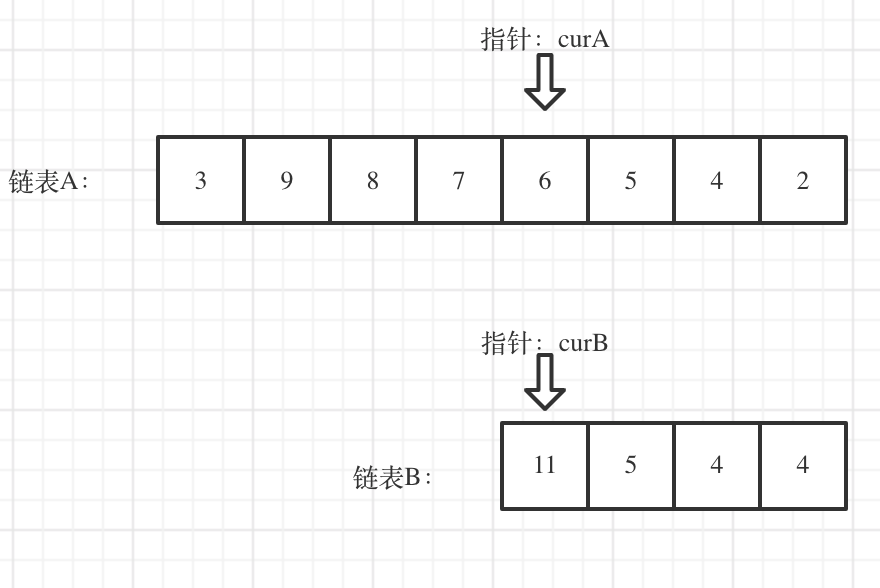
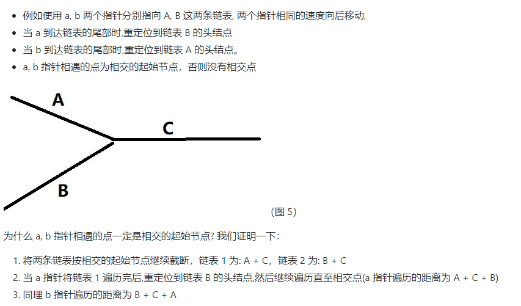
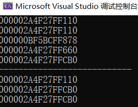
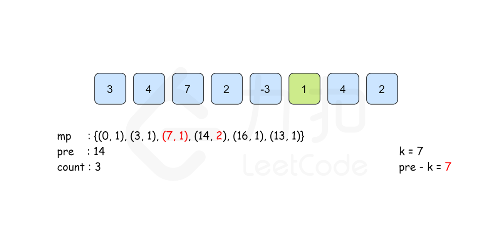
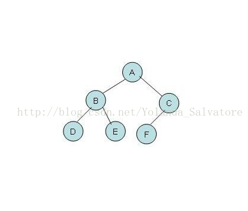

# 进度记录及计划

https://leetcode.cn/u/mihtop-alemin/

按照类型刷题，每做一种新的类型，先看看总结。

等刷了一定量的题后，需要回头看看做过的题。

## 2022.06.01


## 2022.07.10

上个月做oppo项目没有时间看，暑假再抓紧时间刷一刷


## 2022.08.11

sikai一袋米


## 2022.08.23

又要走了，😔

加油💪 为了那些值得的东西


# **数据结构**

## **数组&双指针**

### [LeetCode 1. 两数之和](https://link.zhihu.com/?target=https%3A//leetcode-cn.com/problems/two-sum/)

```c++
给定一个整数数组 nums 和一个整数目标值 target，请你在该数组中找出 和为目标值 target 的那 两个 整数，并返回它们的数组下标。
 你可以假设每种输入只会对应一个答案。但是，数组中同一个元素在答案里不能重复出现。
 你可以按任意顺序返回答案。 

示例 1：
输入：nums = [2,7,11,15], target = 9
输出：[0,1]
解释：因为 nums[0] + nums[1] == 9 ，返回 [0, 1] 。
 

 示例 2：
输入：nums = [3,2,4], target = 6
输出：[1,2]
 

 示例 3：
输入：nums = [3,3], target = 6
输出：[0,1]

 提示：
 2 <= nums.length <= 10⁴ 
 -10⁹ <= nums[i] <= 10⁹ 
 -10⁹ <= target <= 10⁹ 
 只会存在一个有效答案 
```

- c++与c#的区别

- map的使用：利用map的二分查找快速找到结果


### [LeetCode 4. 寻找两个正序数组的中位数](https://link.zhihu.com/?target=https%3A//leetcode-cn.com/problems/median-of-two-sorted-arrays/)

```c++
Given two sorted arrays nums1 and nums2 of size m and n respectively, return 
the median of the two sorted arrays.  

Example 1: 
Input: nums1 = [1,3], nums2 = [2]
Output: 2.00000
Explanation: merged array = [1,2,3] and median is 2.
 

 Example 2: 
Input: nums1 = [1,2], nums2 = [3,4]
Output: 2.50000
Explanation: merged array = [1,2,3,4] and median is (2 + 3) / 2 = 2.5.
```

- 实现时考虑数组的极端情况：为空，为1个值


- 有序数组容易想到二分查找


https://github.com/azl397985856/leetcode/blob/master/problems/4.median-of-two-sorted-arrays.md


### [LeetCode 15. 三数之和](https://link.zhihu.com/?target=https%3A//leetcode-cn.com/problems/3sum/)

```c++
Given an integer array nums, return all the triplets [nums[i], nums[j], nums[k]]
 such that i != j, i != k, and j != k, and nums[i] + nums[j] + nums[k] == 0. 
 Notice that the solution set must not contain duplicate triplets. 

Example 1: 
 Input: nums = [-1,0,1,2,-1,-4]
Output: [[-1,-1,2],[-1,0,1]]

 Example 2: 
 Input: nums = []
Output: []

 Example 3: 
 Input: nums = [0]
Output: []
```

两种方法，哈希法和双指针法， 两者时间复杂度可以做到$O(n^2)$，但哈希法编写起来还是比较费时的，因为不好做剪枝操作。实际不好完成。

**建议双指针法**

- 要常思考排序是否能够简单化问题
- stl中的set的灵活使用

哈希法:

用到的剪枝技巧：首先set元素不会重复，然后将数组排序，则可利用逻辑使得本题在添加时就避免了再新建一个方法专门用于查重的过程

```C++
class Solution {//哈希法，不建议，但是值得学习
public:
    vector<vector<int>> threeSum(vector<int>& nums) {
        vector<vector<int>> result;
        sort(nums.begin(), nums.end());
        // 找出a + b + c = 0
        // a = nums[i], b = nums[j], c = -(a + b)
        for (int i = 0; i < nums.size(); i++) {
            // 排序之后如果第一个元素已经大于零，那么不可能凑成三元组
            if (nums[i] > 0) {
                break;
            }
            if (i > 0 && nums[i] == nums[i - 1]) { //三元组元素a去重,  前一个
                continue;
            }
            unordered_set<int> set;
            for (int j = i + 1; j < nums.size(); j++) {
                if (j > i + 2
                    && nums[j] == nums[j-1]
                    && nums[j-1] == nums[j-2]) { // 三元组元素b去重，  前两个
                    continue;
                }
                int c = 0 - (nums[i] + nums[j]);
                if (set.find(c) != set.end()) {//set中找到了c
                    result.push_back({nums[i], nums[j], c});
                    set.erase(c);// 三元组元素c去重
                } else {//没找到
                    set.insert(nums[j]);
                }
            }
        }
        return result;
    }
};
```

### [LeetCode 75. 颜色分类](https://link.zhihu.com/?target=https%3A//leetcode-cn.com/problems/sort-colors/)

```c++
Given an array nums with n objects colored red, white, or blue, sort them in-
place so that objects of the same color are adjacent, with the colors in the order 
red, white, and blue. 

 We will use the integers 0, 1, and 2 to represent the color red, white, and 
blue, respectively. 

 You must solve this problem without using the library's sort function. 

 
 Example 1: 
Input: nums = [2,0,2,1,1,0]
Output: [0,0,1,1,2,2]
 
 Example 2: 
Input: nums = [2,0,1]
Output: [0,1,2]
 
 
 Constraints: 
 n == nums.length 
 1 <= n <= 300 
 nums[i] is either 0, 1, or 2. 
```

 挡板法:两个挡板，前面的挡板不允许右边有0，后面的不允许左边有2

 指针不仅可以用来指向数组，还可以用来当做挡板。实现时，挡板本质上是交换+移位


### [LeetCode 76. 最小覆盖子串](https://link.zhihu.com/?target=https%3A//leetcode-cn.com/problems/minimum-window-substring/)

```
Given two strings s and t of lengths m and n respectively, return the minimum 
window substring of s such that every character in t (including duplicates) is 
included in the window. If there is no such substring, return the empty string "". 
 The testcases will be generated such that the answer is unique. 
 A substring is a contiguous sequence of characters within the string. 

 Example 1: 
Input: s = "ADOBECODEBANC", t = "ABC"
Output: "BANC"
Explanation: The minimum window substring "BANC" includes 'A', 'B', and 'C' 
from string t.
 
 Example 2: 
Input: s = "a", t = "a"
Output: "a"
Explanation: The entire string s is the minimum window.
 
 Example 3: 
Input: s = "a", t = "aa"
Output: ""
Explanation: Both 'a's from t must be included in the window.
Since the largest window of s only has one 'a', return empty string.
 

 
 Constraints: 
 m == s.length 
 n == t.length 
 1 <= m, n <= 10⁵ 
 s and t consist of uppercase and lowercase English letters. 
```

滑动窗口

三目运算符比较耗费内存。

```
if (minLen>(i-left+1)){
    minLen=i-left+1;
    res=s.substr(left,minLen);
}
```

```
minLen=minLen<(i-left+1)? minLen:(i-left+1);
res=minLen<(i-left+1)? res:s.substr(left,minLen);
```

一些情况下，上面进行了一次重复的判断而且多两次赋值？（minLen=minLen，res=res）

### [LeetCode 142. 环形链表 II](https://link.zhihu.com/?target=https%3A//leetcode-cn.com/problems/linked-list-cycle-ii/)

```
给定一个链表的头节点 head ，返回链表开始入环的第一个节点。 如果链表无环，则返回 null。
 如果链表中有某个节点，可以通过连续跟踪 next 指针再次到达，则链表中存在环。 为了表示给定链表中的环，评测系统内部使用整数 pos 来表示链表尾连接到链表
中的位置（索引从 0 开始）。如果 pos 是 -1，则在该链表中没有环。注意：pos 不作为参数进行传递，仅仅是为了标识链表的实际情况。
 不允许修改 链表。 


 示例 1：
输入：head = [3,2,0,-4], pos = 1
输出：返回索引为 1 的链表节点
解释：链表中有一个环，其尾部连接到第二个节点。
 

 示例 2： 输入：head = [1,2], pos = 0
输出：返回索引为 0 的链表节点
解释：链表中有一个环，其尾部连接到第一个节点。
 

 示例 3： 
输入：head = [1], pos = -1
输出：返回 null
解释：链表中没有环。

 提示：
 链表中节点的数目范围在范围 [0, 10⁴] 内 
 -10⁵ <= Node.val <= 10⁵ 
 pos 的值为 -1 或者链表中的一个有效索引 

 进阶：你是否可以使用 O(1) 空间解决此题？ 
 Related Topics 哈希表 链表 双指针 👍 1573 👎 0
```

快慢指针

因为fast指针是一步走两个节点，slow指针一步走一个节点， 所以 fast指针走过的节点数 = slow指针走过的节点数 * 2：

```
(x + y) * 2 = x + y + n (y + z)
```

两边消掉一个（x+y）: `x + y = n (y + z)`

因为要找环形的入口，那么要求的是x，因为x表示 头结点到 环形入口节点的的距离。

所以要求x ，将x单独放在左面：`x = n (y + z) - y` ,

再从n(y+z)中提出一个 （y+z）来，整理公式之后为如下公式：`x = (n - 1) (y + z) + z `注意这里n一定是大于等于1的，因为 fast指针至少要多走一圈才能相遇slow指针。


相遇后fast置为原点，并且每次步数为1，slow接着在圈里转，根据公式，当slow和fast再次相遇时，fast所处的位置就是所要的答案。


一个关键点是，开始时fast的速度是slow的两倍。

```c++
class Solution {
public:
    ListNode *detectCycle(ListNode *head) {
        if (head==NULL||head->next==NULL){
            return NULL;
        }
        ListNode *slowNode = head;
        ListNode *fastNode = slowNode->next;

        while (fastNode!=slowNode){
            if (fastNode==NULL||slowNode==NULL||fastNode->next==NULL){
                return NULL;
            }
            fastNode=fastNode->next->next;
            slowNode=slowNode->next;
        }

        fastNode=head;
        slowNode=slowNode->next;
        while (fastNode!=slowNode){
            fastNode=fastNode->next;
            slowNode=slowNode->next;
        }

        return fastNode;
    }
};
```


### [LeetCode 234. 回文链表](https://link.zhihu.com/?target=https%3A//leetcode-cn.com/problems/palindrome-linked-list/)

```c++
给你一个单链表的头节点 head ，请你判断该链表是否为回文链表。如果是，返回 true ；否则，返回 false 。 

 示例 1： 
输入：head = [1,2,2,1]
输出：true
 
 示例 2： 
输入：head = [1,2]
输出：false
 

 

 提示： 
 链表中节点数目在范围[1, 10⁵] 内 
 0 <= Node.val <= 9 

 进阶：你能否用 O(n) 时间复杂度和 O(1) 空间复杂度解决此题？ 
 Related Topics 栈 递归 链表 双指针 👍 1387 👎 0
```

此题，有效锻炼了链表相关的代码能力。详细见代码注释

```c++
class Solution {
public:
    bool isPalindrome(ListNode* head) {
        if (head==NULL){
            return false;
        }
        if (head->next==NULL){
            return true;
        }
//        ListNode slowNode=head;
        //理解：为什么链表声明需要用到指针
        //不用指针，初始化的时候就出问题辣，指针允许指向空，而且指针本身是莫得特定的初始化行为的（你可以把他当一个整型数值来看），它只是指向了一个内存区域，并被标记了该内存数据的“样板”（也就是类型，把类型看作一种模具）；
        //但是如果他不是指针而是常规变量呢，他需要初始化（无论他初始化成0还是初始化成随机值，他都得初始化）。然后初始化的时候发现，哦，自己体内还有一个跟自己一样的类型；再然后初始化这个成员，发现，哦，这个成员里面还有一个跟自己一样的类型（然后无限套娃...），最后他就炸了。

        ListNode* slowNode=head;
        ListNode* fastNode=slowNode->next;
        int cnt=2;
        while (fastNode->next!=NULL&&fastNode->next->next!=NULL){//先fastNode->next，再fastNode->next->next，不然会出现空指针异常
            slowNode=slowNode->next;
            fastNode=fastNode->next->next;
            cnt+=2;
        }
        if (fastNode->next!=NULL){//实际为奇数，cnt少加了
            cnt++;//这时如果总共是7个节点，slow为3，fast6；如果6，则slow3，fast6
        }
//        cout<<cnt<<endl;

        fastNode=head;//fast指向头
//        ListNode* reverseHeader= ListNode(); 注意链表的新建方法，有指针就有new. 区别于类
        ListNode* reverseHeader = new ListNode();
        ListNode* tempNode= nullptr;
        slowNode=slowNode->next;//将slow移到后半段
        while(slowNode!=NULL){//反转slowNode
            tempNode=slowNode->next;
            slowNode->next=reverseHeader->next;
            reverseHeader->next=slowNode;
            slowNode=tempNode;
        }
        slowNode=reverseHeader->next;
//        cout<<"here"<<endl;
        for (int i = 0; i <= cnt / 2-1; i++) {
            if (slowNode->val!=fastNode->val){
                return false;
            }
            slowNode=slowNode->next;
            fastNode=fastNode->next;
        }

        return true;

    }
};
```


### [LeetCode 283. 移动零](https://link.zhihu.com/?target=https%3A//leetcode-cn.com/problems/move-zeroes/)

```
/**
给定一个数组 nums，编写一个函数将所有 0 移动到数组的末尾，同时保持非零元素的相对顺序。 

 请注意 ，必须在不复制数组的情况下原地对数组进行操作。 


 示例 1:
输入: nums = [0,1,0,3,12]
输出: [1,3,12,0,0]
 

 示例 2:
输入: nums = [0]
输出: [0] 

 
 提示:
 1 <= nums.length <= 10⁴ 
 -2³¹ <= nums[i] <= 2³¹ - 1 

 进阶：你能尽量减少完成的操作次数吗？ 
 Related Topics 数组 双指针 👍 1596 👎 0

*/
```

有for循环时，考虑快慢指针

当写了三次else if都不行或者感觉逻辑有点混乱时，就要考虑是不是该换个思路

```c++
/**
         Solution0
         执行耗时:24 ms,击败了36.10% 的C++用户
         内存消耗:19.1 MB,击败了5.15% 的C++用户
         
            Solution
         执行耗时:16 ms,击败了87.31% 的C++用户
         内存消耗:18.7 MB,击败了68.33% 的C++用户
*/

//leetcode submit region begin(Prohibit modification and deletion)
class Solution0 {
public:
    void moveZeroes(vector<int>& nums) {
        int cntAll=0;
        vector<int> zeroPos={};
        for(auto it=nums.begin();it!=nums.end();it++){
            if (*it==0){
                zeroPos.push_back(cntAll);
            }
            cntAll++;
        }

//        for (int i = 0; i <= zeroPos.size()-1; i++) {
//            cout<<zeroPos[i]<<" ";
//        }
//        cout<<endl;

        int zeroIt = 0;
        int zeroItMax = zeroPos.size()-1;
        if (nums.size()>1&&zeroPos.size()>0){
            for (int i = 0; i <= nums.size()-1; i++) {
//                if (nums[i]!=0&&zeroIt<zeroItMax&&i>zeroPos[zeroIt]&&i<zeroPos[zeroIt+1]){
//                    cout<<"here 1"<<endl;
//                    nums[i-(zeroIt+1)]=nums[i];
//                }else if(nums[i]!=0&&zeroIt<zeroItMax&&i>zeroPos[zeroIt+1]){
//                    cout<<"here 2"<<endl;
//                    zeroIt++;
//                    nums[i-(zeroIt+1)]=nums[i];
//                }else if(nums[i]!=0&&zeroIt==zeroItMax&&i>zeroPos[zeroIt]){
//                    cout<<"here 3"<<endl;
//                    nums[i-(zeroIt+1)]=nums[i];
//                }else if (i>=zeroPos[zeroIt]){
//                    cout<<"here 4"<<endl;
//                    zeroIt++;
//                }
//当三次else if都不行或者感觉逻辑有点混乱时，就要考虑是不是该换个思路
                if(i>zeroPos[zeroIt]){
                    nums[i-zeroIt-1]=nums[i];
                }
                if(zeroIt!=zeroItMax&&i==zeroPos[zeroIt+1]){//i==zeroPos[zeroIt+1]&&zeroIt!=zeroItMax不要写反了，不然会报错
                    zeroIt++;
                }
            }

            for (int k = 0; k <= nums.size() - 1; k++) {
                cout<<nums[k]<<" ";
            }
            cout<<endl;

            for (int j = nums.size()- zeroPos.size(); j <= nums.size()-1; j++) {
                nums[j]=0;
            }

        }

    }
};

//快慢指针一遍过
class Solution {
public:
    void moveZeroes(vector<int>& nums) {
        int fastIt=0;
        int slowIt=0;
        int cnt=0;
        for (int i = 0; i <= nums.size() - 1; i++) {
            if(nums[i]==0){
                fastIt++;
            }else{
                nums[slowIt]=nums[fastIt];
                fastIt++;
                slowIt++;
            }
        }
        for (int j = slowIt; j <= nums.size() - 1; j++) {
            nums[j]=0;
        }
    }
};
//leetcode submit region end(Prohibit modification and deletion)
```

### 数组总结

### 双指针总结

## **链表**

### [LeetCode 19. 删除链表的倒数第 N 个结点](https://link.zhihu.com/?target=https%3A//leetcode-cn.com/problems/remove-nth-node-from-end-of-list/)

```
/**
给你一个链表，删除链表的倒数第 n 个结点，并且返回链表的头结点。 

 示例 1： 
输入：head = [1,2,3,4,5], n = 2
输出：[1,2,3,5]
 
 示例 2： 
输入：head = [1], n = 1
输出：[]
 
 示例 3： 
输入：head = [1,2], n = 1
输出：[1]
 

 提示： 
 链表中结点的数目为 sz 
 1 <= sz <= 30 
 0 <= Node.val <= 100 
 1 <= n <= sz 
 
 进阶：你能尝试使用一趟扫描实现吗？ 
 Related Topics 链表 双指针 👍 2055 👎 0

*/
```

**可以设置一个虚拟头结点**，这样原链表的所有节点就都可以按照统一的方式进行移除了。return 头结点的时候，别忘了 `return dummyNode->next;`， 这才是新的头结点。

代码（自己未用虚拟头节点）

```c++
/**
			执行耗时:4 ms,击败了77.59% 的C++用户
			内存消耗:10.3 MB,击败了73.82% 的C++用户
*/

class Solution {
public:
    ListNode* removeNthFromEnd(ListNode* head, int n) {
        ListNode* leftNode=head;
        ListNode* rightNode=head;
        for (int i = 0; i <= n-1; i++) {
            if(rightNode->next!=NULL){
                rightNode=rightNode->next;
            }else{//n=size
                return head->next;
            }
        }
        while (rightNode->next!=NULL){
            leftNode=leftNode->next;
            rightNode=rightNode->next;
        }
        //leftnode at 倒数n+1
        leftNode->next=leftNode->next->next;
        return head;
    }
};
```

### [LeetCode 148. 排序链表](https://link.zhihu.com/?target=https%3A//leetcode-cn.com/problems/sort-list/)

```
/**
给你链表的头结点 head ，请将其按 升序 排列并返回 排序后的链表 。 

 示例 1：
输入：head = [4,2,1,3]
输出：[1,2,3,4]
 
 示例 2：
输入：head = [-1,5,3,4,0]
输出：[-1,0,3,4,5]
 
 示例 3：
输入：head = []
输出：[]


 提示：
 链表中节点的数目在范围 [0, 5 * 10⁴] 内 
 -10⁵ <= Node.val <= 10⁵ 

 进阶：你可以在 O(n log n) 时间复杂度和常数级空间复杂度下，对链表进行排序吗？ 
 Related Topics 链表 双指针 分治 排序 归并排序 👍 1623 👎 0

*/
```

 题目限定了时间必须为O(nlgn)，符合要求只有快速排序，归并排序，堆排序，而根据单链表的特点，最适于用归并排序。为啥呢？这是由于链表自身的特点决定的(因为是链表，所以不可以运用到随机访问的特性，所以使用归并排序)。

可以使用归并排序但是需要递归，这样空间就不是常数级空间复杂度了。常数级空间复杂度可以使用，自底向上的方法。教程见：

- https://leetcode.cn/problems/sort-list/solution/148-pai-xu-lian-biao-bottom-to-up-o1-kong-jian-by-/
- https://leetcode.cn/problems/sort-list/solution/pai-xu-lian-biao-by-leetcode-solution/
- 另，关于空间复杂度的思考：应该是指为了实现这个功能额外需要使用的开销，本身已有链表的存储开销不算在内？

此题中关于解题及程序的收获

- 快慢指针找中点
- 链表的排序（之前都是数组的）
- 关于链表的编程规范（初始化，判断，遍历，截断，合并）

递归法：

```c++
class Solution1 {
public:
    ListNode *sortList(ListNode *head) {
        if (!head || !head->next) {
            return head;
        }
        ListNode *slow = head;
        ListNode *fast = head;
        ListNode *pre = head;
        while (fast && fast->next) {//如此遍历得到的结果，奇数时（例如5），fast停在5，slow停在3，偶数时是奇数+1的情况
            pre = slow;
            slow = slow->next;
            fast = fast->next->next;
        }
        pre->next = NULL;//以slow为分界截断

        return merge(sortList(head), sortList(slow));//递归需要很多的空间来存储每一层的结果

    }

    ListNode *merge(ListNode *l1, ListNode *l2) {
        ListNode *dummy = new ListNode(-1);//临时头
        ListNode *cur = dummy;
        while (l1 && l2) {
            if (l1->val < l2->val) {
                cur->next = l1;
                l1 = l1->next;
            } else {
                cur->next = l2;
                l2 = l2->next;
            }
            cur = cur->next;
        }
        if (l1) {
            cur->next = l1;
        }
        if (l2) {
            cur->next = l2;
        }
        return dummy->next;
    }
};
```

迭代法（自底向上）

```c++
class Solution {
public:
    ListNode* sortList(ListNode* head) {
        ListNode dummyHead(0);
        dummyHead.next = head;
        auto p = head;
        int length = 0;
        while (p) {
            ++length;
            p = p->next;
        }

        for (int size = 1; size < length; size <<= 1) {//迭代，常数级的开销
            auto cur = dummyHead.next;
            auto tail = &dummyHead;

            while (cur) {
                auto left = cur;
                auto right = cut(left, size); // left->@->@ right->@->@->@...
                cur = cut(right, size); // left->@->@ right->@->@  cur->@->...

                tail->next = merge(left, right);
                while (tail->next) {
                    tail = tail->next;
                }
            }
        }
        return dummyHead.next;
    }

    ListNode* cut(ListNode* head, int n) {
        auto p = head;
        while (--n && p) {
            p = p->next;
        }

        if (!p) return nullptr;

        auto next = p->next;
        p->next = nullptr;
        return next;
    }

    ListNode* merge(ListNode* l1, ListNode* l2) {
        ListNode dummyHead(0);//链表初始化，ListNode dummyHead(0); 或者ListNode* dummyHead = new ListNode（0）
        auto p = &dummyHead;
        while (l1 && l2) {
            if (l1->val < l2->val) {
                p->next = l1;
                p = l1;
                l1 = l1->next;
            } else {
                p->next = l2;
                p = l2;
                l2 = l2->next;
            }
        }
        p->next = l1 ? l1 : l2;
        return dummyHead.next;
    }
};
```

### [LeetCode 160. 相交链表](https://link.zhihu.com/?target=https%3A//leetcode-cn.com/problems/intersection-of-two-linked-lists/)


多种解法

- 求出两个链表的长度，并求出两个链表长度的差值，然后让curA移动到，和curB 末尾对齐的位置（本人使用）

  

- 双指针：例如使用 a, b 两个指针分别指向 A, B 这两条链表, 两个指针相同的速度向后移动,当 a 到达链表的尾部时,重定位到链表 B 的头结点，当 b 到达链表的尾部时,重定位到链表 A 的头结点。a, b 指针相遇的点为相交的起始节点，否则没有相交点

  

  


### [LeetCode 206. 反转链表](https://link.zhihu.com/?target=https%3A//leetcode-cn.com/problems/reverse-linked-list/)

基本功

```
/**
给你单链表的头节点 head ，请你反转链表，并返回反转后的链表。

 示例 1：  
输入：head = [1,2,3,4,5]
输出：[5,4,3,2,1]
 
 示例 2： 
输入：head = [1,2]
输出：[2,1]
 
 示例 3： 
输入：head = []
输出：[]
 

 提示： 
 
 链表中节点的数目范围是 [0, 5000] 
 -5000 <= Node.val <= 5000 
 
 进阶：链表可以选用迭代或递归方式完成反转。你能否用两种方法解决这道题？ 
 
 Related Topics 递归 链表 👍 2546 👎 0

*/
```

```c++
/**
 *
            Solution1(迭代法)
			执行耗时:4 ms,击败了96.21% 的C++用户
			内存消耗:8 MB,击败了94.28% 的C++用户

			Solution（递归法）
			执行耗时:8 ms,击败了49.51% 的C++用户
			内存消耗:7.9 MB,击败了96.83% 的C++用户

*/

class Solution1 {
public:
    ListNode* reverseList(ListNode* head) {
        auto dummyHead = new ListNode(-1);
        auto temp = head;
        auto cur = head;
        while (cur){
            temp=cur->next;
            cur->next=dummyHead->next;
            dummyHead->next=cur;
            cur=temp;
        }
        return dummyHead->next;
    }
};

class Solution {
public:
    ListNode* reverse(ListNode* pre,ListNode* cur){
        if(cur == NULL) return pre;
        ListNode* temp = cur->next;
        cur->next = pre;
        // 可以和双指针法的代码进行对比，如下递归的写法，其实就是做了这两步
        // pre = cur;
        // cur = temp;
        return reverse(cur,temp);
    }
    ListNode* reverseList(ListNode* head) {
        // 和双指针法初始化是一样的逻辑
        // ListNode* cur = head;
        // ListNode* pre = NULL;
        return reverse(NULL, head);
    }

};
```


### 链表总结


## 线性表

[ACM金牌选手算法讲解《线性表》mp.weixin.qq.com/s/qwaYOFIksFVqZtA_nisl6g](https://link.zhihu.com/?target=https%3A//mp.weixin.qq.com/s/qwaYOFIksFVqZtA_nisl6g)

LeetCode刷题过程中，常常用到的线性表主要包括以下四个重要的数据结构: 数组、链表、栈、队列。

**线性:** 这里的线性是逻辑上的连续，而非物理存储的连续。

除了线性表以外，还会有非线性表，像堆、图、二叉树等都是非线性表。（逻辑上不连续，没有唯一的尾或者头）

## **队列&栈**

### [LeetCode 20. 有效的括号](https://link.zhihu.com/?target=https%3A//leetcode-cn.com/problems/valid-parentheses/)

```
给定一个只包括 '('，')'，'{'，'}'，'['，']' 的字符串 s ，判断字符串是否有效。 

 有效字符串需满足： 
 左括号必须用相同类型的右括号闭合。 
 左括号必须以正确的顺序闭合。 
 

 示例 1： 
输入：s = "()"
输出：true
 

 示例 2：  
输入：s = "()[]{}"
输出：true
 

 示例 3： 
输入：s = "(]"
输出：false
 

 示例 4： 
输入：s = "([)]"
输出：false
 

 示例 5： 
输入：s = "{[]}"
输出：true 

 

 提示： 
 1 <= s.length <= 10⁴ 
 s 仅由括号 '()[]{}' 组成 
 
 Related Topics 栈 字符串 👍 3283 👎 0
```

通过本题，**学习栈的用法。**（获取栈顶元素，增加，删除，等）

由于栈结构的特殊性，非常适合做对称匹配类的题目。

string底层保存的还是char


```c++
class Solution {
public:
    bool isValid(string s) {
        stack<char> stack1;

        for (int i = 0; i <= s.size() - 1; i++) {
            if (s[i]=='('){//此处用单引号是因为string底层保存的还是char
                stack1.push(')');
            }else if (s[i]=='{'){
                stack1.push('}');
            }else if (s[i]=='['){
                stack1.push(']');
            } else if (stack1.empty()){
                return false;
            }else if (s[i]==stack1.top()){
                stack1.pop();
            } else if (s[i]!=stack1.top()){
                return false;
            }
        }

        return stack1.empty();
    }
};
```


### [LeetCode 21. 合并两个有序链表](https://link.zhihu.com/?target=https%3A//leetcode-cn.com/problems/merge-two-sorted-lists/)

思路很简单。

注意合并的是链表不是数组，有迭代和递归两种方法。

```c++
class Solution {
public:
    ListNode* mergeTwoLists(ListNode* a, ListNode* b) {
        ListNode head, *tail = &head;
        while (a && b) {
            if (a->val <= b->val) {
                tail->next = a;
                a = a->next;
            } else {
                tail->next = b;
                b = b->next;
            }
            tail = tail->next;
        }
        tail->next = a ? a : b;//后面的不用排了，直接连接
        return head.next;
    }
};
```


### [LeetCode 84. 柱状图中最大的矩形](https://link.zhihu.com/?target=https%3A//leetcode-cn.com/problems/largest-rectangle-in-histogram/)

给定 *n* 个非负整数，用来表示柱状图中各个柱子的高度。每个柱子彼此相邻，且宽度为 1 。

求在该柱状图中，能够勾勒出来的矩形的最大面积。

**示例 1:**


```
输入：heights = [2,1,5,6,2,3]
输出：10
解释：最大的矩形为图中红色区域，面积为 10
```

**示例 2：**


```
输入： heights = [2,4]
输出： 4
```

**提示：**

- `1 <= heights.length <=105`
- `0 <= heights[i] <= 104`


动态规划法

对于每一个 i，我们计算出其左边第一个高度小于它的索引 p，同样地，计算出右边第一个高度小于它的索引 q。那么以 i 为最低点能够构成的面积就是`(q - p - 1) * heights[i]`。 这种算法毫无疑问也是正确的。 我们证明一下，假设 f(i) 表示求以 i 为最低点的情况下，所能形成的最大矩阵面积。那么原问题转化为`max(f(0), f(1), f(2), ..., f(n - 1))`。

高度一直增，怎么办？答：rightSmallIt[size-1]=size;计算时，heights[k]*(rightSmallIt[k]-leftSmallIt[k]-1);

```c++
    int largestRectangleAreaDynamic(vector<int>& heights) {
        //动态规划写法
        /**
        	执行耗时:120 ms,击败了86.66% 的C++用户
			内存消耗:83.6 MB,击败了4.99% 的C++用户
        */
        vector<int> leftSmallIt;
        vector<int> rightSmallIt(heights.size());
        int smallTemp=0;
        int res=0;
        int size=heights.size();
        leftSmallIt.push_back(-1);
        for (int i = 1; i <= size- 1; i++) {
            if (heights[i]>heights[i-1]){
                leftSmallIt.push_back(i-1);
            } else if(heights[i]==heights[i-1]){
                leftSmallIt.push_back(leftSmallIt[i-1]);
            } else{
                //why so wawawawawawwawawwwwwwwwwawaawawawawawawawawawawawawawawaw
                smallTemp=i-1;
                //while (heights[i]<=heights[smallTemp]&&smallTemp>=0){//每当要判断&条件时就要注意前后顺序，不然会出现bug
                while (smallTemp>=0&&heights[i]<=heights[smallTemp]){
                    smallTemp=leftSmallIt[smallTemp];
                }
                leftSmallIt.push_back(smallTemp);//这样子理解会好一点：只要前面的while推出了就是height大于的第一个，所以push迭代结束后的smalltemp
            }
        }


        rightSmallIt[size-1]=size;//设置成size，用于计算最后一块砖
        for (int j = size-2; j >=0 ; j--) {
            if (heights[j]>heights[j+1]){
                rightSmallIt[j]=j+1;
            }else if (heights[j]==heights[j+1]){
                rightSmallIt[j]=rightSmallIt[j+1];
            }else{
                smallTemp=j+1;
                while (smallTemp<size&&heights[j]<=heights[smallTemp]){
                    smallTemp=rightSmallIt[smallTemp];
                }
                rightSmallIt[j]=smallTemp;
            }
        }

//        for (int i = 0; i <= size - 1; i++) {
//            cout<<leftSmallIt[i]<<" ";
//        }
//        cout<<endl;
//        for (int i = 0; i <= size - 1; i++) {
//            cout<<rightSmallIt[i]<<" ";
//        }
//        cout<<endl;

        for (int k = 0; k <= size - 1; k++) {
            smallTemp=heights[k]*(rightSmallIt[k]-leftSmallIt[k]-1);
            if (res<smallTemp){
                res=smallTemp;
            }
        }
        return res;

    }
```


单调栈

看到这种需要打一个弧线的要先想到单调栈。核心思想还是计算以 i 为最低点的情况下，所能形成的最大矩阵面积。栈始终保持从小到大排列。

高度一直增，怎么办？答：前后补零，用于计算第一个为最低点和最后一个为最低点的情况。

```c++
    int largestRectangleArea(vector<int>& heights) {
        //单调栈写法
        /**
        	执行耗时:108 ms,击败了95.95% 的C++用户
			内存消耗:73.4 MB,击败了98.32% 的C++用户
        */
        stack<int> st;
        st.push(0);
        heights.insert(heights.begin(), 0); // 数组头部加入元素0
        heights.push_back(0); // 数组尾部加入元素0
        int tempRes=0;
        int res=0;
        int popIt=0;

        for (int i = 1;i<= heights.size()-1; i++) {//包括最后补的0但是包括最前面补的0
            //考虑序列1，2，3，4，5，1，1，1，6，2；最后计算补的0时才算以1为最低的面积
            if (heights[i]>heights[st.top()]){
                st.push(i);
            } else if (heights[i]==heights[st.top()]){
                st.pop();//当然也可以不pop
                //此处只留右边的可以的原因和接雨水42题不同，接雨水是计算最长的宽，而此处只保留右边的，此位置做参考时，用的是右边的；做最低点计算时，同样用右边的。
                st.push(i);
            }else{
                while (st.size()>1&&heights[i]<heights[st.top()]){
                    popIt=st.top();
                    st.pop();
                    tempRes=heights[popIt]*(i-st.top()-1);
                    if (res<tempRes){
                        res=tempRes;
                    }
                }

                st.push(i);//while结束后就是前面的两种情况了。

            }
        }

        return res;

    }
```


### [LeetCode 85. 最大矩形](https://link.zhihu.com/?target=https%3A//leetcode-cn.com/problems/maximal-rectangle/)

可以利用84的代码算每一次的面积

```c++
//注意行列的获取方式
//注意二维vector声明并初始化仍然可以像二维数组［］［］一样
//注意char到int的转换
```

```c++
class Solution {
    /**
			执行耗时:36 ms,击败了84.66% 的C++用户
			内存消耗:15 MB,击败了34.85% 的C++用户
    */
public:
//    int getMaxSquare(vector<char> &height){
    int getMaxSquare(vector<int> height){
        int res=0;
        int temp=0;
        int midIt=0;


        height.insert(height.begin(),0);
        height.push_back(0);
        stack<int> st;
        st.push(0);

        for (int i = 1; i <= height.size() - 1; i++) {
            if (height[i]>height[st.top()]){
                st.push(i);
            }else if (height[i]==height[st.top()]){
                st.pop();
                st.push(i);
            } else{
                while (st.size()>1&&height[i]<height[st.top()]){
                    midIt=st.top();
                    st.pop();
                    temp=(height[midIt])*(i-st.top()-1);
                    if (temp>res){
                        res=temp;
                    }
                }
                st.push(i);
            }
        }

        return res;
    }

    int maximalRectangle(vector<vector<char>>& matrix) {
        int rows=matrix.size();//行
        int cols=matrix[0].size();//列
        vector<int> heights(matrix[0].size(),0);
        int res=0;
        int tempRes=0;
        res=getMaxSquare(heights);
//        cout<<res<<endl;
        for (int i = 0; i <= rows - 1; i++) {
            for (int j = 0; j <= cols - 1; j++) {
                if (matrix[i][j]=='1'){
                    heights[j]+=1;
                } else{
                    heights[j]=0;
                }
//                cout<<heights[j]<<' ';
            }
//            cout<<endl;
            tempRes= getMaxSquare(heights);
            if (tempRes>res){
                res=tempRes;
            }
        }

        return res;
    }


};
```

```c++
int main()
{
    Solution solution;

//注意二维vector依然可以如此声明，就像二维数组［］［］一样
    vector<vector<char>> nums1({{'1','1','1','1','1'}
                                ,{'1','1','1','1','1'}
                                ,{'1','1','1','1','1'}
                                ,{'1','1','1','1','1'}});
    double res;
    res=solution.maximalRectangle(nums1);
    cout<<"---sre---"<<res<<endl;
    return 0;
}
```

### [LeetCode 155. 最小栈](https://link.zhihu.com/?target=https%3A//leetcode-cn.com/problems/min-stack/)

设计一个支持 `push` ，`pop` ，`top` 操作，并能在常数时间内检索到最小元素的栈。

实现 `MinStack` 类:

- MinStack() 初始化堆栈对象。

- void push(int val) 将元素val推入堆栈。
- void pop() 删除堆栈顶部的元素。
- int top() 获取堆栈顶部的元素。
- int getMin() 获取堆栈中的最小元素。

```c++
输入：
["MinStack","push","push","push","getMin","pop","top","getMin"]
[[],[-2],[0],[-3],[],[],[],[]]

输出：
[null,null,null,null,-3,null,0,-2]

解释：
MinStack minStack = new MinStack();
minStack.push(-2);
minStack.push(0);
minStack.push(-3);
minStack.getMin();   --> 返回 -3.
minStack.pop();
minStack.top();      --> 返回 0.
minStack.getMin();   --> 返回 -2.
```

单调栈的简单应用

```c++
/**
			执行耗时:20 ms,击败了71.44% 的C++用户
			内存消耗:15.8 MB,击败了93.94% 的C++用户
*/
//leetcode submit region begin(Prohibit modification and deletion)
class MinStack {
public:
    stack<int> min;
    stack<int> allData;

    MinStack() {

    }
    
    void push(int val) {
        if (allData.size()==0){
            min.push(val);
        }else{
            if (val<=min.top()){//若遇到相同的最小值，则都入栈；防止pop完一个后，min栈没有该最小值的情况
                min.push(val);
            }
        }
        allData.push(val);
    }
    
    void pop() {
        if (allData.top()==min.top()){
            allData.pop();
            min.pop();
        }else{
            allData.pop();
        }
    }
    
    int top() {
        return allData.top();
    }
    
    int getMin() {
        return min.top();
    }
};

```

### [LeetCode 239. 滑动窗口最大值](https://link.zhihu.com/?target=https%3A//leetcode-cn.com/problems/sliding-window-maximum/)

```
/**
给你一个整数数组 nums，有一个大小为 k 的滑动窗口从数组的最左侧移动到数组的最右侧。你只可以看到在滑动窗口内的 k 个数字。滑动窗口每次只向右移动一位。
 返回 滑动窗口中的最大值 。

 示例 1： 
输入：nums = [1,3,-1,-3,5,3,6,7], k = 3
输出：[3,3,5,5,6,7]
解释：
滑动窗口的位置                最大值
---------------               -----
[1  3  -1] -3  5  3  6  7       3
 1 [3  -1  -3] 5  3  6  7       3
 1  3 [-1  -3  5] 3  6  7       5
 1  3  -1 [-3  5  3] 6  7       5
 1  3  -1  -3 [5  3  6] 7       6
 1  3  -1  -3  5 [3  6  7]      7
 

 示例 2： 
输入：nums = [1], k = 1
输出：[1]

 提示： 

 
 1 <= nums.length <= 10⁵ 
 -10⁴ <= nums[i] <= 10⁴ 
 1 <= k <= nums.length 
 
 Related Topics 队列 数组 滑动窗口 单调队列 堆（优先队列） 👍 1737 👎 0

*/
```

思考

- 如何遍历：数组下标、队列
- 如何求最大：简单的三个三个求复杂度n\*k、使用单调双向队列复杂度小于n\*K
- 单调队列，为什么不用单调栈？ 此处是双向的deque，需要头、尾都能弹出元素
- 从大到小维护两个元素就够了？ 不是两个，窗口是几就最多维护几个

注意：

- 双向队列的用法
- 类中的私有类
- 下面代码中有许多细节，建议看一看


代码实现

```c++
class Solution {
    /**
         执行耗时:204 ms,击败了88.30% 的C++用户
         内存消耗:131.5 MB,击败了46.32% 的C++用户
    */
private:
    class MQueue{
        deque<int> myQueue;
        public://C++中，类的默认访问权限是private，结构体的默认访问权限是public。
            void pop(int num){
                if (myQueue.front()==num){
                    myQueue.pop_front();
                }
            }

            int front(){
                return myQueue.front();
            }

            void push(int num){
                while (myQueue.size()!=0&&num>myQueue.back()){//注意此处是从back（队列尾部，尾部最后出）进行判断；这样写代码更加简洁
                    myQueue.pop_back();
                }
                myQueue.push_back(num);
            }
    };

public:
    vector<int> maxSlidingWindow(vector<int>& nums, int k) {
        MQueue myQueue;
        vector<int> res;
        for (int i = 0; i <= k - 1; i++) {
            myQueue.push(nums[i]);
        }
        res.push_back(myQueue.front());
        for (int j = k; j <= nums.size() - 1; j++) {
            myQueue.pop(nums[j-k]);
            myQueue.push(nums[j]);
            res.push_back(myQueue.front());
        }

        return res;
    }


};
```

### [LeetCode 394. 字符串解码](https://link.zhihu.com/?target=https%3A//leetcode-cn.com/problems/decode-string/)

给定一个经过编码的字符串，返回它解码后的字符串。

编码规则为: k[encoded_string]，表示其中方括号内部的 encoded_string 正好重复 k 次。注意 k 保证为正整数。

你可以认为输入字符串总是有效的；输入字符串中没有额外的空格，且输入的方括号总是符合格式要求的。

此外，你可以认为原始数据不包含数字，所有的数字只表示重复的次数 k ，例如不会出现像 3a 或 2[4] 的输入。

```c++
输入：s = "3[a]2[bc]"
输出："aaabcbc"
```

提示：

- 1 <= s.length <= 30
- s 由小写英文字母、数字和方括号 '[]' 组成
- s 保证是一个 有效 的输入。
- s 中所有整数的取值范围为 [1, 300] 


涛的思路，看见对称性的，尤其是这种括号，就要想到栈

利用规则，最小单元中，括号里的是数字，“[”左边是字母进行两段迭代

```c++
class Solution {
    /**
    		执行耗时:4 ms,击败了9.44% 的C++用户
			内存消耗:6.5 MB,击败了28.63% 的C++用户
    */
public:
    string decodeString(string s) {
        stack<char> theStack;
        int sSize=s.size();
        string tempS="";
        string tempN="";
        string res="";

        for (int i = 0; i <= sSize - 1; i++) {
            if (s[i]!=']'){
                theStack.push(s[i]);
            } else{
                while (!theStack.empty()&&theStack.top()!='['){//get all words
//                    tempS+=theStack.top();
                    tempS.insert(tempS.begin(),theStack.top());
                    theStack.pop();
                }
                theStack.pop();//pop '['
                while (!theStack.empty()&&theStack.top()>='0'&&theStack.top()<='9'){//get all nums
//                    tempN+=theStack.top();
                    tempN.insert(tempN.begin(),theStack.top());
                    theStack.pop();
                }
                int tempNum= atoi(tempN.c_str());
                string tempSAll="";
                for (int j = 0; j <= tempNum-1; j++) {
                    tempSAll+=tempS;
                }
                tempS="";
                tempN="";
                for (int k = 0; k <= tempSAll.length() - 1; k++) {
                    theStack.push(tempSAll[k]);
                }


            }
        }

//        for (int l = 0; l <= theStack.size()-1; l++) {
//            res+=theStack.top();
//            cout<<theStack.top()<<endl;
//            theStack.pop();
//        }
//不可以这样打印，theStack size会在每次迭代时改变
        while (!theStack.empty()){
//            res+=theStack.top();
            res.insert(res.begin(),theStack.top());
            theStack.pop();
        }
        return res;
    }
};
```

其实可以更快，把取数字的过程简单化；用string栈而不是char栈减少入栈次数

```c++
//执行用时：0 ms, 在所有 C++ 提交中击败了100.00%的用户
//内存消耗：6.4 MB, 在所有 C++ 提交中击败了52.08%的用户
class Solution {
public:
    string decodeString(string s) {
        string t = "";
        stack<int> s_num;
        stack<string> s_str;
        int cnt = 0;
        for (int i = 0; i < s.size(); ++i) {
            if (s[i] >= '0' && s[i] <= '9') {
                cnt = 10 * cnt + s[i] - '0';
            } else if (s[i] == '[') {
                s_num.push(cnt);
                s_str.push(t);
                cnt = 0; t.clear();
            } else if (s[i] == ']') {
                int k = s_num.top(); s_num.pop();
                for (int j = 0; j < k; ++j) s_str.top() += t;
                t = s_str.top(); s_str.pop();
            } else {
                t += s[i];
            }
        }
        return s_str.empty() ? t : s_str.top();
    }
};
```


### [LeetCode 739. 每日温度](https://link.zhihu.com/?target=https%3A//leetcode-cn.com/problems/daily-temperatures/)

给定一个整数数组 temperatures ，表示每天的温度，返回一个数组 answer ，其中 answer[i] 是指对于第 i 天，下一个更高温度出现在几天后。如果气温在这之后都不会升高，请在该位置用 0 来代替。

```
输入: temperatures = [73,74,75,71,69,72,76,73]
输出: [1,1,4,2,1,1,0,0]
```

```
输入: temperatures = [30,40,50,60]
输出: [1,1,1,0]
```

思路

- 维持单调递减的单调栈，每当遇到不递减的情况就更新answer
- 通常是一维数组，要寻找任一个元素的右边或者左边第一个比自己大或者小的元素的位置，此时我们就要想到可以用单调栈了。
- 这种下标间隔的，一般栈里都放坐标


```c++
class Solution {
    /**
          执行耗时:136 ms,击败了66.73% 的C++用户
         内存消耗:86.8 MB,击败了50.24% 的C++用户
    */
public:
    vector<int> dailyTemperatures(vector<int>& temperatures) {
        int size = temperatures.size();
        stack<int> myStack;
        vector<int> answer(size);
        myStack.push(0);
        for (int i = 1; i <= size - 1; i++) {
//            cout<<"here"<<endl;
            if (temperatures[i]<=temperatures[myStack.top()]){
                myStack.push(i);
//                answer[i-1]=1;
            }else{
                while (!myStack.empty()&&temperatures[i]>temperatures[myStack.top()]){
                    answer[myStack.top()]=i-myStack.top();
                    myStack.pop();
                }
                myStack.push(i);
            }
        }
        int remain = myStack.size();
        for (int j = remain-1; j >=0 ; j-- ){//定义result数组的时候，就应该直接初始化为0，如果result没有更新，说明这个元素右面没有更大的了，也就是为0。
            answer[myStack.top()]=0;
            myStack.pop();
        }
        return answer;

    }
};
```


### [LeetCode 3. 无重复字符的最长子串](https://link.zhihu.com/?target=https%3A//leetcode-cn.com/problems/longest-substring-without-repeating-characters/)

给定一个字符串 `s` ，请你找出其中不含有重复字符的 **最长子串** 的长度。

```
输入: s = "abcabcbb"
输出: 3 
解释: 因为无重复字符的最长子串是 "abc"，所以其长度为 3。
```

```
输入: s = "bbbbb"
输出: 1
解释: 因为无重复字符的最长子串是 "b"，所以其长度为 1。
```

思考

//暴力法时间复杂度太高,考虑使用滑动窗口(双端队列)但是滑动窗口不好检测重复，故使用map

//通过此题，学习map容器相关方法

// mp[alpha] = i;记录下标，再start = max(start,myMap[alpha]+1); 避开了双端队列的使用，这是需要一定灵感的。有时候不一定想的到

```c++
//leetcode submit region begin(Prohibit modification and deletion)
class Solution {
    /**
    		执行耗时:8 ms,击败了88.05% 的C++用户
			内存消耗:8.2 MB,击败了58.29% 的C++用户
    */
public:
    int lengthOfLongestSubstring(string s) {
        map<char,int> myMap;
        int res = 0;
        int sLen = s.size();
//        cout<< sLen <<endl;
        int start = 0;
        if (sLen<=1){
            return sLen;
        }
        for (int i = 0; i <= sLen - 1; i++) {
            char alpha = s[i];
            if (myMap.count(alpha)){//myMap.find((s[i]))!=myMap.end() 也可
                res = max(res,i-start);
                start = max(start,myMap[alpha]+1);//精髓，对于"abca" "abcc" "abba"三种情况都适用
            }
            myMap[alpha] = i;
        }
        res = max(res,sLen-start);
        return  res;
    }
};
```

### 队列与栈总结

## 哈希表map、set、二叉树

### **哈希表**

#### [LeetCode 49. 字母异位词分组](https://link.zhihu.com/?target=https%3A//leetcode-cn.com/problems/group-anagrams/)

```
给定一个字符串数组，将字母异位词组合在一起。字母异位词指字母相同，但排列不同的字符串。

示例:

输入: ["eat", "tea", "tan", "ate", "nat", "bat"]
输出:
[
  ["ate","eat","tea"],
  ["nat","tan"],
  ["bat"]
]
说明：

所有输入均为小写字母。
不考虑答案输出的顺序。
```

```c++
//思考
//提示 哈希表、二叉树 ？ 这怎么用
//目前的想法：
//  暴力法：声明strs.length长度数组，对于strs中的每个单词在进行归类到这些数组中，再合并。归类时判断是否由相同字母构成也要遍历？ 如此复杂度很高
//        归类时是否有映射算法，使得相同字母构成的单词得到同样的值？--->sort
//        不用声明strs.length长度数组，vector可以灵活添加
```

总结：

- 一般需要归类的就要想到哈希表
- 学习map、二维数组创建，增加某一行的方法
- string操作的进一步完善，两份代码有很多易错细节。（见备注）

两种方案，排序法和字母映射法

排序法代码如下

```c++
    vector<vector<string>> groupAnagrams1(vector<string>& strs) {
        /**
			执行耗时:36 ms,击败了35.32% 的C++用户
			内存消耗:17.7 MB,击败了95.99% 的C++用户
        */
        vector<vector<string>> res ;
        string  word;
        int strsLen = strs.size();
        map<string, int> myMap;
        for (int i = 0; i <= strsLen-1; i++) {
            word = strs[i];
            sort(word.begin(),word.end());
            if (!myMap.count(word)){
                res.push_back({});//二维数组添加新的一行的方法
                myMap[word] = res.size()-1;//巧妙的映射单词到同一组，有点哈希的味道，但不是很多
            }
            res[myMap[word]].push_back(strs[i]);
        }
        return  res;
    }

```

字母映射法代码如下

```c++
    vector<vector<string>> groupAnagrams(vector<string>& strs) {
        /**
			执行耗时:88 ms,击败了5.62% 的C++用户
			内存消耗:26.1 MB,击败了4.99% 的C++用户
        */
        vector<vector<string>> res ;
        map<string,vector<string>> myMap;

        for (int i = 0; i <= strs.size() - 1; i++) {
            string word = strs[i];
            vector<int> letter(26);//声明固定大小数组的方法
            for (char  c : word) {
                letter[c-'a']+=1;
            }
            string hashWord;
            for (int j = 0; j <= 25; j++) {
                if (letter[j]!=0){
                    for (int k = 0; k <= letter[j]-1; k++) {
//                        hashWord += string(1,j+'a')+to_string(j);
                        hashWord += to_string(j+'a');
//                        hashWord += string(1,j+'a');
                    }
                }
            }
//            cout<<hashWord<<endl;
            if (!myMap.count(hashWord)){
                vector<string> vecSpace;
                myMap[hashWord] = vecSpace;
            }
            myMap[hashWord].push_back(word);
            }
        for(auto vec : myMap){
            res.push_back(vec.second);
        }
        return  res;

        }
```


#### [128. 最长连续序列](https://link.zhihu.com/?target=https%3A//leetcode-cn.com/problems/longest-consecutive-sequence/)

```
给定一个未排序的整数数组 nums ，找出数字连续的最长序列（不要求序列元素在原数组中连续）的长度。

请你设计并实现时间复杂度为 O(n) 的算法解决此问题。

输入：nums = [100,4,200,1,3,2]
输出：4
解释：最长数字连续序列是 [1, 2, 3, 4]。它的长度为 4。

输入：nums = [0,3,7,2,5,8,4,6,0,1]
输出：9

```

map学习：

- 如果去一个不存在的映射值会自动生成一个为0的映射

set学习

- unordered_set是一种**关联容器**，set和map内部实现是基于RB-Tree，是有序的，unordered_set和unordered_map是**基于hashtable**。是无序的。
- set查找元素是常数阶的

复杂度 O（n），遍历两三次  ---->hashset 常数级复杂度，若先排序，然后记录最大连续次数。 但是排序算法复杂度都大于O（n）

HashSet法：使用一个集合HashSet存入所有的数字，然后遍历数组中的每个数字，如果其在集合中存在，那么将其移除，然后分别用两个变量pre和next算出其前一个数跟后一个数，然后在集合中循环查找，如果pre在集合中，那么将pre移除集合，然后pre再自减1，直至pre不在集合之中，对next采用同样的方法，那么next-pre-1就是当前数字的最长连续序列，更新res即可。移除数字是为了避免大量的重复计算。

HashMap法：用哈希表存储每个端点值对应连续区间的长度。若数已在哈希表中：跳过不做处理；若是新数加入：取出其左右相邻数已有的连续区间长度 left 和 right，计算当前数的区间长度为：`cur_length = left + right + 1`，根据 cur_length 更新最大长度 max_length 的值，更新区间两端点的长度值

HashSet法代码实现

```c++
//leetcode submit region begin(Prohibit modification and deletion)
class Solution {
public:
    int longestConsecutive(vector<int>& nums) {
        /**
        	执行耗时:96 ms,击败了79.94% 的C++用户
			内存消耗:44.5 MB,击败了81.27% 的C++用户
        */
        unordered_set<int > mySet(nums.begin(),nums.end());//set，集合。在此题中重复的数字可以不管。
        int numsLen = nums.size();
        int res = 0;
        for (int value :nums) {
            if (!mySet.count(value)){//没找见，则在之前已经被计数过。
                continue;
            }
            int onceLen = 1;
            int pre = value-1;
            int next = value+1;
            mySet.erase(value);
            while (mySet.count(pre)){
                onceLen++;
                mySet.erase(pre);
                pre--;
            }
            while (mySet.count(next)){
                onceLen++;
                mySet.erase(next);
                next++;
            }

            res = max(res,onceLen);

        }

        return  res;
    }
};
```

HashMap法代码实现：

```c++
    int longestConsecutive(vector<int>& nums) {
        /**
			执行耗时:108 ms,击败了61.65% 的C++用户
			内存消耗:48.5 MB,击败了68.70% 的C++用户
        */
        unordered_map<int,int> myMap;
        int numsLen = nums.size();
        int res = 0;
        for (int value:nums) {
            if (myMap.count(value)){
                continue;
            }
            int left = 0;
            int right = 0;
            int onceLen = 0;
            left = myMap.count(value-1)? myMap[value-1]:0;
            right = myMap.count(value+1)? myMap[value+1]:0;
            onceLen = right+left+1;
            myMap[value]=onceLen;
            myMap[value-left]=onceLen;//关键步骤，更新左右。
            myMap[value+right]=onceLen;
            res= max(res,onceLen);
        }
        return  res;
    }
```

#### [LeetCode 141. 环形链表](https://link.zhihu.com/?target=https%3A//leetcode-cn.com/problems/linked-list-cycle/)

```
给你一个链表的头节点 head ，判断链表中是否有环。

如果链表中有某个节点，可以通过连续跟踪 next 指针再次到达，则链表中存在环。 为了表示给定链表中的环，评测系统内部使用整数 pos 来表示链表尾连接到链表中的位置（索引从 0 开始）。注意：pos 不作为参数进行传递 。仅仅是为了标识链表的实际情况。

如果链表中存在环 ，则返回 true 。 否则，返回 false 。

输入：head = [3,2,0,-4], pos = 1
输出：true
解释：链表中有一个环，其尾部连接到第二个节点。

链表中节点的数目范围是 [0, 104]
-105 <= Node.val <= 105
进阶：你能用 O(1)（即，常量）内存解决此问题吗？
```

 思考

-  与142题不同，此题只需要返回ture还是false，不需要返回环开始的节点。更为简单，也有更简单的方法？（不用快慢指针）
-  hashmap法：存储走过的链表，当再次遇到1时代表有环，若走完则无环。空间复杂度1？ hashmap底层是链表，内存实际加载为O（1）
- 通过此题，学习类指针与set之间的应用。

```c++
class Solution {
public:
    bool hasCycle(ListNode * head) {
        /**
        	执行耗时:16 ms,击败了22.42% 的C++用户
			内存消耗:10.3 MB,击败了14.48% 的C++用户
        */
        set<ListNode * > mySet;
        while (head){
//            if (mySet.count(* head)){     不可以比较对象，因为没有重载比较方法。但是可以比较指针
            if (!mySet.count( head)){
                mySet.insert(head);
                head=head->next;
                //这样改变后，set里之前存储的会变吗。 不会，insert是值传递，这里存储的指针也是一个值。
            }else{
                return true;
            }
        }
        return false;
    }
};
```


#### [LeetCode 146. LRU 缓存机制](https://link.zhihu.com/?target=https%3A//leetcode-cn.com/problems/lru-cache/)

```
请你设计并实现一个满足  LRU (最近最少使用) 缓存 约束的数据结构。
实现 LRUCache 类：
LRUCache(int capacity) 以 正整数 作为容量 capacity 初始化 LRU 缓存
int get(int key) 如果关键字 key 存在于缓存中，则返回关键字的值，否则返回 -1 。
void put(int key, int value) 如果关键字 key 已经存在，则变更其数据值 value ；如果不存在，则向缓存中插入该组 key-value 。如果插入操作导致关键字数量超过 capacity ，则应该 逐出 最久未使用的关键字。
函数 get 和 put 必须以 O(1) 的平均时间复杂度运行。

示例：
输入
["LRUCache", "put", "put", "get", "put", "get", "put", "get", "get", "get"]
[[2], [1, 1], [2, 2], [1], [3, 3], [2], [4, 4], [1], [3], [4]]
输出
[null, null, null, 1, null, -1, null, -1, 3, 4]

解释
LRUCache lRUCache = new LRUCache(2);
lRUCache.put(1, 1); // 缓存是 {1=1}
lRUCache.put(2, 2); // 缓存是 {1=1, 2=2}
lRUCache.get(1);    // 返回 1
lRUCache.put(3, 3); // 该操作会使得关键字 2 作废，缓存是 {1=1, 3=3}
lRUCache.get(2);    // 返回 -1 (未找到)
lRUCache.put(4, 4); // 该操作会使得关键字 1 作废，缓存是 {4=4, 3=3}
lRUCache.get(1);    // 返回 -1 (未找到)
lRUCache.get(3);    // 返回 3
lRUCache.get(4);    // 返回 4

提示：
1 <= capacity <= 3000
0 <= key <= 10000
0 <= value <= 105
最多调用 2 * 105 次 get 和 put

```

补充知识：

- LRU是Least Recently Used的缩写，即最近最少使用，是一种常用的[页面置换算法](https://baike.baidu.com/item/页面置换算法/7626091)，选择最近最久未使用的页面予以淘汰。该算法赋予每个[页面](https://baike.baidu.com/item/页面/5544813)一个访问字段，用来记录一个页面自上次被访问以来所经历的时间 t，当须淘汰一个页面时，选择现有页面中其 t 值最大的，即最近最少使用的页面予以淘汰。
- LRUCache(int capacity) 以 正整数 作为容量 capacity 初始化 LRU 缓存 ----> 此种可以通过自己计数来实现而不是使用操作系统的new，malloc方法

思考

- get O(1) ：用map，需要一个双向链表用来LRU

- put O（1）：get用map，put往map里加，且需要一个双向链表用来LRU

总结

- 双向链表进行断开，连接时断开一般需要两个操作（形象化为两条线切断），链接一般需要四个操作（四条线重连）
- 同一个文件中声明类/结构体是可以的
- 很多实现上的细节

```c++
struct douList{
    int value;
    int key;
    douList * pre;
    douList * next;

    douList(){}
    douList(int key,int value){
        this->key=key;
        this->value=value;

    }
};
class LRUCache {
    /**
    		执行耗时:392 ms,击败了47.47% 的C++用户
			内存消耗:161.3 MB,击败了27.51% 的C++用户
    */
public:
    int capacity;
    int size;

//    map<int, int> myMap;//直接存储值，则在get时找到对应的listNode复杂度为O n
    map<int, douList *> myMap;//直接存储值，则在get时找到对应的listNode复杂度为O n
    douList * first;
    douList * last;

    LRUCache(){}

    LRUCache(int capacity) {
        this->size=0;
        this->capacity=capacity;
        this->last=new douList(-1,-1);
        this->first=new douList(-1,-1);
        last->pre=first;
        last->next=NULL;
        first->pre=NULL;
        first->next=last;
    }
    
    int get(int key) {
//        cout<<"get"<<endl;
        if (myMap.count(key)){
            douList * getNode = myMap[key];// 不用fing函数是因为myMap.find 返回的是迭代器
            //断开
            getNode->pre->next=getNode->next;
            getNode->next->pre=getNode->pre;
            //接在最后
            last->pre->next=getNode;
            getNode->pre=last->pre;
            getNode->next=last;
            last->pre=getNode;
//            cout<<"last pre "<<last->pre->key<<endl;
//            cout<<" first next "<<first->next->key<<endl;
            return getNode->value;
        }
//        cout<<"last pre "<<last->pre->key<<endl;
//        cout<<" first next "<<first->next->key<<endl;
        return -1;
    }
    
    void put(int key, int value) {
//        cout<<"put"<<endl;
        if(myMap.count(key)){
            douList * changeNode = myMap[key];
            //断开
            changeNode->value=value;
            changeNode->pre->next=changeNode->next;
            changeNode->next->pre=changeNode->pre;
            //接在最后
            last->pre->next=changeNode;
            changeNode->pre=last->pre;
            changeNode->next=last;
            last->pre=changeNode;
//            cout<<"last pre "<<last->pre->key<<endl;
//            cout<<"putcount first next "<<first->next->key<<endl;
        }else{
            douList * newNode = new douList(key,value);
            myMap[key]=newNode;
            this->size++;

            if (this->size > this->capacity){
                myMap.erase(first->next->key);
//                cout<<"delete key "<<first->next->key<<endl;
                first->next=first->next->next;
                first->next->pre=first;
                this->size--;
            }

            last->pre->next=newNode;
            newNode->next=last;
            newNode->pre=last->pre;
            last->pre=newNode;
//            cout<<"last pre "<<last->pre->key<<endl;
//            cout<<"put new, first next "<<first->next->key<<endl;
        }
//        cout<<"size is "<<this->size<<endl;
    }
};
```

关于链表 first->next->next= fourth 操作的说明：

- ​    链表first->next->next= fourth; 进行这样赋值时，修改的是值。只不过这个值是一个指针值

- ​    此处修改并没有影响到third，仅仅是second 中的next 变量修改了。

- ​    程序在分析first->next->next 时首先得到变量first->next，再根据first->next类类型进一步得到first->next的类内部变量next

- ​    first->next->next 不完全等于 third，两者只是值相等，但是地址不同

测试代码如下：

```c++
#include <iostream>

using namespace std;

struct douList {
    int value;
    douList* pre;
    douList* next;

    douList() {}
    douList(int value) {
        this->value = value;
    }
};

int main() {

    douList* first = new douList(0);
    douList* sec = new douList(1);
    douList* third = new douList(2);
    douList* fourth = new douList(3);
    first->next = sec;
    sec->next = third;

    cout << third << endl;
    cout << first->next->next << endl;
    cout << & third << endl;
    cout << & (first->next->next) << endl;
    cout << fourth << endl;
    cout << "---------------------------" << endl;
    first->next->next= fourth;
    cout << third << endl;
    cout << first->next->next << endl;
    cout << fourth << endl;
}
```

运行结果如下，可以看到third和first->next->next值相同，但是地址不一样。将first->next->next修改后，third不受影响。也就是说，链表里连接的是类内部的成员变量，与外部用于传入的sec，third没有关系。链表的连接，是类内部成员的连接。




#### [LeetCode 560. 和为K的子数组](https://link.zhihu.com/?target=https%3A//leetcode-cn.com/problems/subarray-sum-equals-k/)

```
给你一个整数数组 nums 和一个整数 k ，请你统计并返回 该数组中和为 k 的连续子数组的个数 。

示例 1：
输入：nums = [1,1,1], k = 2
输出：2

示例 2：
输入：nums = [1,2,3], k = 3
输出：2
 
提示：
1 <= nums.length <= 2 * 104
-1000 <= nums[i] <= 1000
-107 <= k <= 107
```

暴力法，一个一个，两个两个，三个三个看，使用动态规划，每次累计，复杂度n方  --->Time Limit Exceeded

```c++
    int subarraySum1(vector<int>& nums, int k) {
        /**
            Time Limit Exceeded
        */
        int numsSize = nums.size();
        vector<int> myVec(nums.begin(), nums.end());
        int res = 0;
        for (int i = 0; i <= numsSize-1; i++) {//以每一个vector中的数字为开始
            if (myVec[i]==k){res++;}
            for (int j = i+1; j <= numsSize -1; j++) {//每一个可以的累加
                myVec[i]+=nums[j];
                if (myVec[i]==k){res++;}
            }
        }
        return res;
    }
```

利用哈希表进行前缀法，重复利用了每一次的前缀，复杂度O（n）

力扣官方题解：https://leetcode.cn/problems/subarray-sum-equals-k/solution/he-wei-kde-zi-shu-zu-by-leetcode-solution/

从左到右遍历，如图到1时，先得到pre为14，看看前面有没有14-7 = 7 的前缀数组。（前缀：从1往右的子数组，如【2，-3】 【4，7，2，-3】）有的话就增加res（把那个7的前缀数组去掉，得到所要的数组，此处去掉【3，4】剩下【7，2，-3，1】构成和为7的数组）



- pre[i ] = nums[0]+nums[1]+...+nums[i-1]+nums[i]
- 维护一个 hashmap，hashmap 的 key 为累加值 acc，value 为累加值 acc 出现的次数。
- 迭代数组，然后不断更新 acc 和 hashmap，如果 acc 等于 k，那么很明显应该+1. 如果 hashmap[acc - k] 存在，我们就把它加到结果中去即可。

```c++
    int subarraySum(vector<int>& nums, int k) {
        //前缀和法，详细见笔记
        /**
        	执行耗时:100 ms,击败了15.32% 的C++用户
			内存消耗:42.7 MB,击败了29.37% 的C++用户
        */
        int numsSize = nums.size();
        map<int,int> myMap;
        myMap[0]=1;
        int res = 0;
        int pre = 0;
        for (int i = 0; i <= numsSize - 1; i++) {
            pre+=nums[i];
            if (myMap.count(pre-k)){
                res += myMap[pre-k];
            }
//            if (myMap.count(pre)){
//                myMap[pre]++;
//            } else{
//                myMap[pre]=1;
//            }
            myMap[pre]++;
        }
        return res;
    }
```

### 哈希表总结

### **二叉树**

二叉树数组表示法



| 0    | 1    | 2    | 3    | 4    | 5    | 6    | 7    |
| ---- | ---- | ---- | ---- | ---- | ---- | ---- | ---- |
|      | A    | B    | C    | D    | E    | F    | -    |

在数组中表示为：[A,B,C,D,E,F]

若D节点不存在，则表示为：[A,B,C,NULL,E,F]

#### [LeetCode 94. 二叉树的中序遍历](https://link.zhihu.com/?target=https%3A//leetcode-cn.com/problems/binary-tree-inorder-traversal/)

```
给定一个二叉树的根节点 root ，返回 它的 中序 遍历 。 

 示例 1：
输入：root = [1,null,2,3]
输出：[1,3,2]

 示例 2： 
输入：root = []
输出：[]

 示例 3： 
输入：root = [1]
输出：[1]

 提示： 

 
 树中节点数目在范围 [0, 100] 内 
 -100 <= Node.val <= 100 


 进阶: 递归算法很简单，你可以通过迭代算法完成吗？ 
 Related Topics 栈 树 深度优先搜索 二叉树 👍 1531 👎 0
```

通过此题

- 学习二叉树的使用，遍历
- 迭代法，递归法两种遍历二叉树的方式

递归法代码：

```c++
    vector<int> inorderTraversal1(TreeNode* root) {
        //递归法
        /**
        	执行耗时:0 ms,击败了100.00% 的C++用户
			内存消耗:8.1 MB,击败了72.96% 的C++用户
        */
        vector<int> res;
        if (root==NULL){
            return res;
        }
        recurAdd(res,root);
        return res;
    }

    void recurAdd(vector<int>& myVec,TreeNode* node){
        if (node->left!=NULL){
            recurAdd(myVec,node->left);
        }
        myVec.push_back(node->val);
        if (node->right!=NULL){
            recurAdd(myVec,node->right);
        }
    }
```

迭代法代码：

```c++
    vector<int> inorderTraversal(TreeNode* root) {
        //迭代法
        /**
			执行耗时:0 ms,击败了100.00% 的C++用户
			内存消耗:8.1 MB,击败了80.59% 的C++用户
        */
        vector<int> res;
        stack<TreeNode *> mySt;
        TreeNode * temp = root;
        while (!mySt.empty()||temp){//两重迭代，思路巧妙  temp条件是为了初次进入。
            while (temp){
                mySt.push(temp);
                temp=temp->left;
            }//出来while是空的
            temp=mySt.top();
            mySt.pop();
            res.push_back(temp->val);
            temp=temp->right; //必须在这里指向右，不然会导致无限循环。
        }

        return res;
    }

```


#### [101. 对称二叉树](https://link.zhihu.com/?target=https%3A//leetcode-cn.com/problems/symmetric-tree/)

```
给你一个二叉树的根节点 root ， 检查它是否轴对称。 

 示例 1：
输入：root = [1,2,2,3,4,4,3]
输出：true
 
 示例 2：
输入：root = [1,2,2,null,3,null,3]
输出：false
 

 提示： 
 树中节点数目在范围 [1, 1000] 内 
 -100 <= Node.val <= 100 
 
 进阶：你可以运用递归和迭代两种方法解决这个问题吗？ 
 Related Topics 树 深度优先搜索 广度优先搜索 二叉树 👍 2069 👎 0
```

总结：

- 递归法一般需要多写一个方法用于迭代
- 迭代法一般需要依靠栈，队列等控制迭代

递归法和迭代法代码如下：

```c++
class Solution {
    //思考
    //递归法；分成左右子树，并控制后续的比较为对称比较
    //迭代法：需要借助数据结构进行存储，每次存储需要比较的节点。
public:
    bool isSymmetric(TreeNode* root) {
        //递归法
        /**
        	执行耗时:8 ms,击败了27.08% 的C++用户
			内存消耗:16 MB,击败了33.77% 的C++用户
        */
        if (!root){
            return true;
        }
        return compareNode(root->left,root->right);
    }

    bool compareNode(TreeNode * left,TreeNode * right){
        if (left == NULL && right ==NULL){
            return true;
        }
        if ((left == NULL && right !=NULL)||(left != NULL && right ==NULL)){//此处这个判断不能少，不然会导致后面left->value中产生空指针异常
            return false;
        }

        if (left->val == right ->val){
            bool compareLeft = compareNode(left->left,right->right);
            bool compareRight = compareNode(left->right,right->left);
            return compareLeft&&compareRight;
        }
        return false;
    }

    bool isSymmetric1(TreeNode* root) {
        //迭代法
        //之前一直在想，将要比较的全部放进栈中，但是如何判断迭代到某一步时，到底是往下走还是下面的比较完了应该往上走
        //正确思路：每次比较时取出当前组，比较完后加入后面要比的
        /**
        	执行耗时:0 ms,击败了100.00% 的C++用户
			内存消耗:16.1 MB,击败了20.34% 的C++用户
        */
        if (!root){
            return true;
        }
        stack<TreeNode *> mySt;
        mySt.push(root->left);
        mySt.push(root->right);
        while (!mySt.empty()){
            TreeNode * leftTemp = mySt.top();
            mySt.pop();
            TreeNode * rightTemp = mySt.top();
            mySt.pop();

            if (leftTemp == NULL&& rightTemp==NULL){
                continue;
            }
            if ((leftTemp!=NULL&&rightTemp==NULL)||(leftTemp==NULL&&rightTemp!=NULL)){
                return false;
            }
            if (leftTemp->val!=rightTemp->val){
                return false;
            }
            //巧妙控制对称
            mySt.push(leftTemp->left);
            mySt.push(rightTemp->right);
            mySt.push(leftTemp->right);
            mySt.push(rightTemp->left);
        }

        return true;
    }
};
```

#### [102. 二叉树的层序遍历](https://link.zhihu.com/?target=https%3A//leetcode-cn.com/problems/binary-tree-level-order-traversal/)

```
给你二叉树的根节点 root ，返回其节点值的 层序遍历 。 （即逐层地，从左到右访问所有节点）。 

 示例 1： 
输入：root = [3,9,20,null,null,15,7]
输出：[[3],[9,20],[15,7]]

 示例 2：
输入：root = [1]
输出：[[1]]

 示例 3： 
输入：root = []
输出：[]
 

 提示： 
 
 树中节点数目在范围 [0, 2000] 内 
 -1000 <= Node.val <= 1000 
 
 Related Topics 树 广度优先搜索 二叉树 👍 1427 👎 0
```

迭代法和递归法

- 递归进行前序遍历，并维护一个int数和一个map<int , vector<int>>，根据层数往里面放数据
- 迭代法需要借助queue来控制每次访问一层。（通过每次只访问size数目的数据，巧妙控制到同一层，）

```c++
class Solution {
    //思考
    //二叉树，但不是平衡的，两边层数存在相差很大的问题
    //此题考查 树如何进行广度优先遍历
    //目前想法：递归进行前序遍历，并维护一个int数和一个map<int , vector<int>>，根据层数往里面放数据
    //迭代法
public:
    vector<vector<int>> levelOrder1(TreeNode* root) {
        //递归法
        /**
            执行耗时:0 ms,击败了100.00% 的C++用户
            内存消耗:13.4 MB,击败了5.01% 的C++用户
        */
        vector<vector<int>> res;
        map<int ,vector<int>> myMap;
        if (!root){return res;}
        preVisit(root,0,myMap);


        for (int i = 0; i <= myMap.size()-1; i++) {
            res.push_back(myMap[i]);
        }
        return res;
    }

    void preVisit(TreeNode * node,int iterator,map<int ,vector<int>> & myMap){
        if (node!=NULL){
            myMap[iterator].push_back(node->val);
            preVisit(node->left,iterator+1,myMap);
            preVisit(node->right,iterator+1,myMap);
        }
    }

    //迭代法
    vector<vector<int>> levelOrder(TreeNode* root) {
        //迭代法
        //学习如何巧妙控制到同一层
        /**
        	执行耗时:0 ms,击败了100.00% 的C++用户
	        内存消耗:12.1 MB,击败了69.86% 的C++用户
        */
        queue<TreeNode* > myQ;
        vector<vector<int>> res;
        if (!root){
            return res;
        }
        myQ.push(root);

        while (!myQ.empty()){
            int queueSize = myQ.size();
            vector<int> tempVal;
            TreeNode* tempNode;
            for (int i = 0; i <= queueSize - 1; i++) {//巧妙控制到同一层，每次只访问size数目的数据
                tempNode= myQ.front();
                myQ.pop();
                tempVal.push_back(tempNode->val);
                if (tempNode->left){
                    myQ.push(tempNode->left);
                }
                if (tempNode->right){
                    myQ.push(tempNode->right);
                }
            }
            res.push_back(tempVal);
        }
        return res;
    }

};
```


#### [LeetCode 104. 二叉树的最大深度](https://link.zhihu.com/?target=https%3A//leetcode-cn.com/problems/maximum-depth-of-binary-tree/)

```
给定一个二叉树，找出其最大深度。 

 二叉树的深度为根节点到最远叶子节点的最长路径上的节点数。 

 说明: 叶子节点是指没有子节点的节点。 

 示例： 给定二叉树 [3,9,20,null,null,15,7]， 

     3
   / \
  9  20
    /  \
   15   7 

 返回它的最大深度 3 。 

 Related Topics 树 深度优先搜索 广度优先搜索 二叉树 👍 1338 👎 0
```

迭代法（与102相似）：

```c++
class Solution {
    //思考
    //广度优先，层序遍历， 然后不断计数就行
public:
    int maxDepth(TreeNode* root) {
        int res = 0;
        if (!root){
            return  res;
        }
        queue<TreeNode*> myQ;
        myQ.push(root);

        while (!myQ.empty()){
            int tempSize = myQ.size();
            TreeNode * tempNode;
            res++;
            for (int i = 0; i <= tempSize - 1; i++) {
                tempNode = myQ.front();
                myQ.pop();
                if (tempNode->right){
                    myQ.push(tempNode->right);
                }
                if (tempNode->left){
                    myQ.push(tempNode->left);
                }
            }
        }

        return res;
    }
};
```

递归法

- 关于左右子树的处理：depth = 1 + max(leftdepth, rightdepth); 

```c++
class solution {
public:
    int getdepth(treenode* node) {
        if (node == NULL) return 0;
        int leftdepth = getdepth(node->left);       // 左
        int rightdepth = getdepth(node->right);     // 右
        int depth = 1 + max(leftdepth, rightdepth); // 中
        return depth;
    }
    int maxdepth(treenode* root) {
        return getdepth(root);
    }
};
```

#### [LeetCode 105. 从前序与中序遍历序列构造二叉树](https://link.zhihu.com/?target=https%3A//leetcode-cn.com/problems/construct-binary-tree-from-preorder-and-inorder-traversal/)

```
给定两个整数数组 preorder 和 inorder ，其中 preorder 是二叉树的先序遍历， inorder 是同一棵树的中序遍历，请构造二叉树并返回
其根节点。 

 示例 1: 
输入: preorder = [3,9,20,15,7], inorder = [9,3,15,20,7]
输出: [3,9,20,null,null,15,7]
 

 示例 2:
输入: preorder = [-1], inorder = [-1]
输出: [-1]
 

 提示: 
 1 <= preorder.length <= 3000 
 inorder.length == preorder.length 
 -3000 <= preorder[i], inorder[i] <= 3000 
 preorder 和 inorder 均 无重复 元素 
 inorder 均出现在 preorder 
 preorder 保证 为二叉树的前序遍历序列 
 inorder 保证 为二叉树的中序遍历序列 
 

 Related Topics 树 数组 哈希表 分治 二叉树 👍 1696 👎 0
```

构造二叉树，不简单

- 根据前序遍历、中序遍历的特点确定思路：preorder第一个元素为root，在inorder里面找到root，在它之前的为左子树（长l1），之后为右子树（长l2）。preorder[1]到preorder[l1]为左子树,之后为右子树，分别递归。
- 思路清楚，但是递归却不好设计。仍然不好写： curNode->left= makeTree(leftPre,leftNodes); curNode->right= makeTree(rightPre,rightNodes);（见代码）这样设计十分巧妙
- 做这种树类型的题多画图

```c++
class Solution {
    //思考
    //前提： preorder 和 inorder 均 无重复 元素
    //二叉树但不一定是平衡的
    //？？？ 没有想法

    //preorder第一个元素为root，在inorder里面找到root，在它之前的为左子树（长l1），之后为右子树（长l2）。
    // preorder[1]到preorder[l1]为左子树,之后为右子树，分别递归。

    //思路清楚，但是递归却不好设计
    //        curNode->left= makeTree(leftPre,leftNodes);
    //        curNode->right= makeTree(rightPre,rightNodes);
    //这样设计十分巧妙
public:
    TreeNode* buildTree(vector<int>& preorder, vector<int>& inorder){
        /**
        	执行耗时:116 ms,击败了5.45% 的C++用户
	        内存消耗:204.4 MB,击败了5.01% 的C++用户
        */
        if (preorder.empty()){
            return NULL;
        }
        return makeTree(preorder,inorder);
    }

    TreeNode* makeTree(vector<int> pre,vector<int> mid){
        if (mid.empty()){
            return NULL;
        }

        int curVal = pre[0];
        TreeNode * curNode = new TreeNode(curVal);
        if (mid.size()==1){
            return curNode;
        }

        vector<int> leftNodes;
        vector<int> rightNodes;
        bool findcur= false;
        for (int i:mid) {
            if (findcur){
                rightNodes.push_back(i);
            }else{
                if (i==curVal){
                    findcur = true;
                }else{
                    leftNodes.push_back(i);
                }
            }
        }

        vector<int > leftPre;
        vector<int > rightPre;
        pre.erase(pre.begin());
        if (!leftNodes.empty()){
            for (int j = 0; j <= leftNodes.size() - 1; j++) {
                leftPre.push_back(pre[j]);
            }
        }

        for (int k = leftPre.size(); k <= pre.size() - 1; k++) {
            rightPre.push_back(pre[k]);
        }
        curNode->left= makeTree(leftPre,leftNodes);
        curNode->right= makeTree(rightPre,rightNodes);
        return curNode;
    }
};
```

#### [LeetCode 114. 二叉树展开为链表](https://link.zhihu.com/?target=https%3A//leetcode-cn.com/problems/flatten-binary-tree-to-linked-list/)

给你二叉树的根结点 root ，请你将它展开为一个单链表：

展开后的单链表应该同样使用 TreeNode ，其中 right 子指针指向链表中下一个结点，而左子指针始终为 null 。展开后的单链表应该与二叉树 **先序遍历** 顺序相同。


```
输入：root = [1,2,5,3,4,null,6]
输出：[1,null,2,null,3,null,4,null,5,null,6]
```

理解：展成列表一样的树

代码实现

```c++
class Solution {
    //思考
    //就是展成列表一样的树
    //递归法：一般是需要借助数据结构，此题要求空间复杂度O 1？ 思路：把右子树移到左边并将原来的左子树加到移好的左子树中序遍历最后节点下面。
    //      直到当前节点没有左子树，指针后移，不断迭代
public:
    void flatten(TreeNode* root) {
        /**
        	执行耗时:4 ms,击败了83.49% 的C++用户
	        内存消耗:13 MB,击败了5.04% 的C++用户
        */
        TreeNode * temp =root;
        TreeNode * rightNode;
        while (temp){
            cout<<temp->val<<endl;
            if ((!temp->left)&&(!temp->right)){
                temp=NULL;
            }else if ((!temp->right)&&temp->left){
                temp->right = temp->left;
                //temp、root指向同一个节点TreeNode，改变temp->left就是改变root->left。改变了指针指向的值。
                //如果temp = temp->left； 不会对root产生影响，这是因为改变得是temp指针指向。
                //关键看左边有没有“->”，分清楚改变的是什么
                temp->left=NULL;
                temp =temp->right;
            }else if ((temp->right)&&(!temp->left)){
                temp = temp->right;
            } else{
                rightNode=temp->right;
                temp->right=temp->left;
                temp->left=NULL;//如果不加这一行会报错：AddressSanitizer: heap-use-after-free
                midLast(temp->right)->right=rightNode;
                temp=temp->right;
            }
        }
        rightNode=NULL;
    }

    TreeNode * midLast(TreeNode * node){
        stack<TreeNode *> mySt;
        mySt.push(node);
        TreeNode * lastNode;
        while (!mySt.empty()){
            lastNode = mySt.top();
            mySt.pop();
            if (lastNode->right){
                mySt.push(lastNode->right);
            }
            if (lastNode->left){
                mySt.push(lastNode->left);
            }

        }
        return lastNode;
    }
};
```


其他拓展：

- 链表之间链接的是类内部的指针值，指针是一个数据。

- 通过 first->next->next->value = 5;改变指针指向的数据的值之后，通过其他同样指向该地址的指针获得该值也会改变（fourth->value）；

```c++
#include <iostream>

using namespace std;

struct douList {
    int value;
    douList* pre;
    douList* next;

    douList() {}
    douList(int value) {
        this->value = value;
    }
};

int main() {

    douList* first = new douList(1);
    douList* sec = new douList(2);
    douList* third = new douList(3);
    douList* fourth = new douList(4);
    first->next = sec;
    sec->next = third;

    cout << "third point to "<< third << endl;
    cout << "first->next->next point to " << first->next->next << endl;
    cout << "fourth point to " << fourth << endl;
    cout << "third add "<< & third << endl;
    cout << "first->next->next add "<< & (first->next->next) << endl;
    cout << "third -> val " << third->value << endl;
    cout << "first->next->next->val " << first->next->next->value << endl;
    cout << "fourth-> val " << fourth->value << endl;

    cout << "-------first->next->next = fourth---------" << endl;
    first->next->next = fourth;
    cout << "third point to " << third << endl;
    cout << "first->next->next point to " << first->next->next << endl;
    cout << "fourth point to " << fourth << endl;
    cout << "third -> val " << third->value << endl;
    cout << "first->next->next->val " << first->next->next->value << endl;
    cout << "fourth-> val " << fourth->value << endl;

    cout << "-------first->next->next->val=5---------" << endl;
    first->next->next->value = 5;
    cout << "third -> val " << third->value << endl;
    cout << "first->next->next->val " << first->next->next->value << endl;
    cout << "fourth-> val " << fourth->value << endl;
}
```

#### [LeetCode 543. 二叉树的直径](https://link.zhihu.com/?target=https%3A//leetcode-cn.com/problems/diameter-of-binary-tree/)

```
给定一棵二叉树，你需要计算它的直径长度。一棵二叉树的直径长度是任意两个结点路径长度中的最大值。这条路径可能穿过也可能不穿过根结点。 


 示例 : 给定二叉树 

           1
         / \
        2   3
       / \     
      4   5    
 

 返回 3, 它的长度是路径 [4,2,1,3] 或者 [5,2,1,3]。 

 

 注意：两结点之间的路径长度是以它们之间边的数目表示。 

 Related Topics 树 深度优先搜索 二叉树 👍 1133 👎 0
```

收获

- 计算每一个节点的左右子树高度之和，计算过程中维护一个最大的直径。当计算某个结点的子树高度时，先计算子树的子树高度，然后加一。可以通过递归实现。
- 递归时，返回子树的高度，同时在函数参数中传递一个引用类型int数据，用于在过程中维护一个最大的直径。

```c++
class Solution {
    //思考
    //不一定是root左右两边子树的两端节点。有可能是同一侧的节点
    //思路：对每一个结点求出其左右子树深度之和，可以用到动态规划
    //     不要求输出路径，只要结果
public:
    int diameterOfBinaryTree(TreeNode* root) {
        /**
        	执行耗时:8 ms,击败了73.89% 的C++用户
	        内存消耗:19.7 MB,击败了59.45% 的C++用户
        */
        int res = 0;
        if (!root){
            return res;
        }
//        map<TreeNode *,vector<int>> myMap;//vector<int,int>, first left , second right --> 不用map也可以
        behindFind(root,res);
        return res;
    }

    int behindFind(TreeNode * node, int & maxVal){
//        vector<int > tempVal;
        int maxLeft = 0;
        int maxRight = 0;
        if ((!node->left)&&(!node->right)){
//            tempVal.push_back(0);
//            tempVal.push_back(0);
//            myMap[node]=tempVal;
            return 0;
        } else if ((!node->left)&&(node->right)){
            maxRight = behindFind(node->right,maxVal);
//            tempVal.push_back(0);
//            tempVal.push_back(maxRight+1);
//            myMap[node]=tempVal;
            maxVal = max(maxRight+1,maxVal);
            return maxRight+1;
        } else if ((node->left)&&(!node->right)){
            maxLeft =  behindFind(node->left,maxVal);
//            tempVal.push_back(maxLeft+1);
//            tempVal.push_back(0);
//            myMap[node]= tempVal;
            maxVal = max(maxLeft+1,maxVal);
            return maxLeft+1;
        }else{
            maxLeft =  behindFind(node->left,maxVal);
            maxRight = behindFind(node->right,maxVal);
//            tempVal.push_back(maxLeft+1);
//            tempVal.push_back(maxRight+1);
//            myMap[node]=tempVal;
            maxVal = max(maxRight+maxLeft+2,maxVal);
            return max(maxLeft+1,maxRight+1);
        }

    }
};
```

### 二叉树总结

### **二叉搜索树**

#### [LeetCode 96. 不同的二叉搜索树](https://link.zhihu.com/?target=https%3A//leetcode-cn.com/problems/unique-binary-search-trees/)

```
给你一个整数 n ，求恰由 n 个节点组成且节点值从 1 到 n 互不相同的 二叉搜索树 有多少种？返回满足题意的二叉搜索树的种数。 

 示例 1： 
输入：n = 3
输出：5

 示例 2： 
输入：n = 1
输出：1

 提示： 
 1 <= n <= 19 
 
 Related Topics 树 二叉搜索树 数学 动态规划 二叉树 👍 1905 👎 0
```

dp[i] ： 1到i为节点组成的二叉搜索树的个数为dp[i]。

来看看n为3的时候，有哪几种情况。

- 当1为头结点的时候，其右子树有两个节点，看这两个节点的布局，是不是和 n 为2的时候两棵树的布局是一样的啊！

  （可能有同学问了，这布局不一样啊，节点数值都不一样。别忘了我们就是求不同树的数量，并不用把搜索树都列出来，所以不用关心其具体数值的差异）

- 当3为头结点的时候，其左子树有两个节点，看这两个节点的布局，是不是和n为2的时候两棵树的布局也是一样的啊！

- 当2为头结点的时候，其左右子树都只有一个节点，布局是不是和n为1的时候只有一棵树的布局也是一样的啊！

dp[3]，就是 元素1为头结点搜索树的数量 + 元素2为头结点搜索树的数量 + 元素3为头结点搜索树的数量

- 元素1为头结点搜索树的数量 = 右子树有2个元素的搜索树数量 * 左子树有0个元素的搜索树数量
- 元素2为头结点搜索树的数量 = 右子树有1个元素的搜索树数量 * 左子树有1个元素的搜索树数量
- 元素3为头结点搜索树的数量 = 右子树有0个元素的搜索树数量 * 左子树有2个元素的搜索树数量

有2个元素的搜索树数量就是dp[2]。

有1个元素的搜索树数量就是dp[1]。

有0个元素的搜索树数量就是dp[0]。

所以dp[3] = dp[2] * dp[0] + dp[1] * dp[1] + dp[0] * dp[2]

```c++
class Solution {
    //思考
    //不会

    //这tm是一个数学问题
public:
    int numTrees(int n) {
        /**
        	执行耗时:0 ms,击败了100.00% 的C++用户
	        内存消耗:5.8 MB,击败了82.42% 的C++用户
        */
        vector<int> dp(n+1);
        dp[0]=1;
        for (int i = 1; i <= n; i++) {
            for (int j = 0; j <= i-1; j++) {
                dp[i]+=dp[j]*dp[i-j-1];
            }
        }

        return dp[n];

    }
};
```

#### [LeetCode 98. 验证二叉搜索树](https://link.zhihu.com/?target=https%3A//leetcode-cn.com/problems/validate-binary-search-tree/)

```
给你一个二叉树的根节点 root ，判断其是否是一个有效的二叉搜索树。 

 有效 二叉搜索树定义如下： 
 
 节点的左子树只包含 小于 当前节点的数。 
 节点的右子树只包含 大于 当前节点的数。 
 所有左子树和右子树自身必须也是二叉搜索树。 

 

 示例 1： 
输入：root = [2,1,3]
输出：true
 
 示例 2： 
输入：root = [5,1,4,null,null,3,6]
输出：false
解释：根节点的值是 5 ，但是右子节点的值是 4 。

 
 提示： 
 树中节点数目范围在[1, 10⁴] 内 
 -2³¹ <= Node.val <= 2³¹ - 1 

 Related Topics 树 深度优先搜索 二叉搜索树 二叉树 👍 1725 👎 0
```

收获

- 迭代法的中序遍历，代码中有许多细节，几乎要一字不改地写出。稍微换个行或者换个赋值方式都有可能导致出错。
- 中序遍历为递增数组，则该树为二叉搜索树

```c++
class Solution {
public:
    //思考
    //递归：参数包含max，min的引用，return 子树 t 还是 f。-->
    //迭代：不是很好判断 ？
    //我是dsb

    //正确解法：中序遍历，如果得到有序的数组则为排序二叉树
    //递归法
    /**
    	执行耗时:16 ms,击败了21.30% 的C++用户
	    内存消耗:21.4 MB,击败了5.01% 的C++用户
    */
    vector<int>myVec;//可以如此使用，也可以传递引用。
    void midAddVec(TreeNode* node){
        if (node->left){
            midAddVec(node->left);
        }
        myVec.push_back(node->val);
        if (node->right){
            midAddVec(node->right);
        }
    }

    bool isValidBST1(TreeNode* root) {
        midAddVec(root);
        for (int i = 1; i <= myVec.size() - 1; i++) {
            if (myVec[i]<=myVec[i-1]){
                return false;
            }
        }
        return true;
    }

    bool isValidBST(TreeNode* root) {
        /**
        	执行耗时:4 ms,击败了97.65% 的C++用户
	        内存消耗:21.1 MB,击败了51.06% 的C++用户
        */
        stack<TreeNode*> mySt;
//        vector<int> simpleAdd;
        TreeNode * tempNode =root;
        TreeNode * preNode =NULL;
//        while (!mySt.empty()){
//            tempNode = mySt.top();
//            while (tempNode->left){
//                mySt.push(tempNode->left);
//                tempNode=tempNode->left;
//            }
//            simpleAdd.push_back(tempNode->val);
//            mySt.pop();
//            if (tempNode->right){
//                mySt.push(tempNode->right);
//            }
//        }  一段错误的中序遍历代码
        while (!mySt.empty()||tempNode){//tempNode甚至都不能少
            while (tempNode){
                mySt.push(tempNode);
                tempNode=tempNode->left;//这里上下两行顺序甚至都不能换
            }
            tempNode = mySt.top();
            mySt.pop();
//            simpleAdd.push(tempNode->val);
            if ((preNode!=NULL)&&(preNode->val>=tempNode->val)){
                return false;
            }
            preNode=tempNode;
            tempNode=tempNode->right;
        }

//        for (int i = 1; i <= simpleAdd.size() - 1; i++) {
//            if (simpleAdd[i]<=simpleAdd[i-1]){
//                return false;
//            }
//        }

        return true;
    }

};
```

# **算法**

## **模拟**

[LeetCode 48. 旋转图像](https://link.zhihu.com/?target=https%3A//leetcode-cn.com/problems/rotate-image/)

```
给定一个 n × n 的二维矩阵 matrix 表示一个图像。请你将图像顺时针旋转 90 度。 

 你必须在 原地 旋转图像，这意味着你需要直接修改输入的二维矩阵。请不要 使用另一个矩阵来旋转图像。 


 示例 1： 
输入：matrix = [[1,2,3],[4,5,6],[7,8,9]]
输出：[[7,4,1],[8,5,2],[9,6,3]]
 

 示例 2： 
输入：matrix = [[5,1,9,11],[2,4,8,10],[13,3,6,7],[15,14,12,16]]
输出：[[15,13,2,5],[14,3,4,1],[12,6,8,9],[16,7,10,11]]

 提示： 

 n == matrix.length == matrix[i].length 
 1 <= n <= 20 
 -1000 <= matrix[i][j] <= 1000 
 

 Related Topics 数组 数学 矩阵 👍 1398 👎 0
```

转置，对称都是相对容易实现的。

```c++
class Solution {
    //思考
    //奇思妙想类题
    //旋转九十度: 先转置再镜像对称。 转置，对称都是相对容易实现的。

public:
    void rotate(vector<vector<int>>& matrix) {
        /**
        	执行耗时:4 ms,击败了48.09% 的C++用户
	        内存消耗:6.8 MB,击败了65.44% 的C++用户
        */
        int row =matrix.size();
        int col = matrix[0].size();
        int tempVal ;
        //转置
        for (int i = 0; i <= row-1; i++) {
            for (int j = 0; j <= i - 1  ; j++) {
                tempVal = matrix[i][j];
                matrix[i][j]=matrix[j][i];
                matrix[j][i]=tempVal;
            }
        }

        //镜像
        for (int i = 0; i <= row - 1; i++) {
            for (int j = 0; j <= col / 2 - 1; j++) {
                tempVal = matrix[i][j];
                matrix[i][j]=matrix[i][col-j-1];
                matrix[i][col-j-1]=tempVal;
            }
        }

    }
};
```

## **贪心**

### [LeetCode 11. 盛最多水的容器](https://link.zhihu.com/?target=https%3A//leetcode-cn.com/problems/container-with-most-water/)

```c++
给定一个长度为 n 的整数数组 height 。有 n 条垂线，第 i 条线的两个端点是 (i, 0) 和 (i, height[i]) 。 

 找出其中的两条线，使得它们与 x 轴共同构成的容器可以容纳最多的水。 

 返回容器可以储存的最大水量。 

 说明：你不能倾斜容器。 

 

 示例 1： 
输入：[1,8,6,2,5,4,8,3,7]
输出：49 
解释：图中垂直线代表输入数组 [1,8,6,2,5,4,8,3,7]。在此情况下，容器能够容纳水（表示为蓝色部分）的最大值为 49。 

 示例 2： 
输入：height = [1,1]
输出：1
 

 提示： 

 n == height.length 
 2 <= n <= 10⁵ 
 0 <= height[i] <= 10⁴ 
 

 Related Topics 贪心 数组 双指针 👍 3728 👎 0
```

贪心：每次都找比当前大的面积，如果左边低就移动左边的墙向右一位。因为如果此时移动右边的墙，面积必定比刚才的小

```c++
class Solution {
    //理解
    //垂线--宽度无限接近于0

    //贪心？
    //建议直接看题解学习
public:
    int maxArea(vector<int>& height) {
        /**
        	执行耗时:72 ms,击败了67.36% 的C++用户
	        内存消耗:57.5 MB,击败了93.81% 的C++用户
        */
        int res =0 ;
        int leftP = 0;
        int rightP = height.size()-1;

        while (leftP!=rightP){ // 贪心：每次都找比当前大的面积，如果左边低就移动左边的墙向右
            // 因为如果此时移动右边的墙，面积必定比刚才的小
            res = max(res, min(height[leftP],height[rightP])*(rightP-leftP));
            if (height[leftP]<height[rightP]){
                leftP++;
            } else{
                rightP--;
            }
        }

        return res;
    }
};
```

### [LeetCode 714. 买卖股票的最佳时机含手续费](https://link.zhihu.com/?target=https%3A//leetcode-cn.com/problems/best-time-to-buy-and-sell-stock-with-transaction-fee/)

```
给定一个整数数组 prices，其中 prices[i]表示第 i 天的股票价格 ；整数 fee 代表了交易股票的手续费用。 

 你可以无限次地完成交易，但是你每笔交易都需要付手续费。如果你已经购买了一个股票，在卖出它之前你就不能再继续购买股票了。 

 返回获得利润的最大值。 

 注意：这里的一笔交易指买入持有并卖出股票的整个过程，每笔交易你只需要为支付一次手续费。 

 

 示例 1： 

 
输入：prices = [1, 3, 2, 8, 4, 9], fee = 2
输出：8
解释：能够达到的最大利润:  
在此处买入 prices[0] = 1
在此处卖出 prices[3] = 8
在此处买入 prices[4] = 4
在此处卖出 prices[5] = 9
总利润: ((8 - 1) - 2) + ((9 - 4) - 2) = 8 

 示例 2： 

 
输入：prices = [1,3,7,5,10,3], fee = 3
输出：6
 

 

 提示： 

 
 1 <= prices.length <= 5 * 10⁴ 
 1 <= prices[i] < 5 * 10⁴ 
 0 <= fee < 5 * 10⁴ 
 

 Related Topics 贪心 数组 动态规划 👍 778 👎 0
```

贪心策略：只要当前价格大于（最低价格+手续费），就可以收获利润，

- 至于准确的卖出日期，就是连续收获利润区间里的最后一天（并不需要计算是具体哪一天）。
- 计算最大利润，需要巧妙地利用数学
- 注意 模拟持有的方式
- 最后买入了没有卖出？ 无所谓，算的是利润，又不是净资产

动态规划

- 第i天持股票所剩最多现金 = max(第i-1天持股票所剩现金, 第i-1天持现金-买第i天的股票)
- 如果第 i 天手上有股票，要么是 i - 1 有股票，今天什么都不做。要么是 i - 1 手上没有股票，今天买了它。因此 dp[i][0] 就是这两种情况的利润最大值。
- 第i天持有最多现金 = max(第i-1天持有的最多现金，第i-1天持有股票的最多现金+第i天卖出股票)
- 如果第 i 天手上没有股票，要么是 i - 1 没股票，今天什么都不做。要么是 i - 1 手上有股票，今天卖了它。因此 dp[i][1] 就是这两种情况的利润最大值。
- return max(dp[n - 1][0], dp[n - 1][1]); ---> dp[0][1]=0 , dp[0][0] -= prices[0]; 则最后的现金就是利润
- holdMoney , holdShares

代码实现如下：

```c++
class Solution {
public:
    int maxProfit1(vector<int>& prices, int fee) {
        //贪心策略
        /**
        	执行耗时:72 ms,击败了94.93% 的C++用户
	        内存消耗:53.6 MB,击败了77.02% 的C++用户
        */
        int res = 0;
        int minPri = prices[0] ;
        for (int pri : prices) {
            if (minPri>pri){
                minPri=pri;//相当于买入
            }else if (minPri<pri-fee){
                res+=pri-fee- minPri;
                minPri=pri-fee;//保证最后卖出的日期是持续盈利的最后一日
            }
        }
        return res;
    }

    int maxProfit(vector<int>& prices, int fee) {
        //动态规划
/**
	执行耗时:188 ms,击败了17.92% 的C++用户
	内存消耗:88.6 MB,击败了41.21% 的C++用户
*/
        int priSize = prices.size();
        vector<vector<int>> myVec(priSize,vector<int>(2,0));//注意学习此处的初始化方式,多重的嵌套
        //myVex[i][0] for holdShares
        //myVec[i][1] for holdMoney
        myVec[0][0]= -prices[0];
        myVec[0][1]=0;//初始资金为0，最后所得值就是纯利润

        for (int i = 1; i <= priSize - 1; i++) {//动态规划,想当于考虑了所有可能的情况(买，或者卖或者不买)
            myVec[i][0]= max(myVec[i-1][0],myVec[i-1][1]-prices[i]);
            //持有股票的两种情况：继续持有i-1天的，或者 买第i天的
            //取max，有贪心思想在里面。如果我们决定现在持有，那么就看是之前买便宜还是今天买便宜。取max可以保证持有最低点
            myVec[i][1]= max(myVec[i-1][1],myVec[i-1][0]+prices[i]-fee);
            //持有现金的两种情况：继续持有i-1天的，或者 在第i天卖掉股票
            //取max，如果实际上是明天i+1天卖掉更好，那么计算i+1时会进行处理。取max可以保证卖出最高点
        }

        return myVec[priSize-1][1];
    }
};
```

### [LeetCode 122. 买卖股票的最佳时机 II](https://link.zhihu.com/?target=https%3A//leetcode-cn.com/problems/best-time-to-buy-and-sell-stock-ii/)

```
给你一个整数数组 prices ，其中 prices[i] 表示某支股票第 i 天的价格。 

 在每一天，你可以决定是否购买和/或出售股票。你在任何时候 最多 只能持有 一股 股票。你也可以先购买，然后在 同一天 出售。 

 返回 你能获得的 最大 利润 。 

 

 示例 1： 

 
输入：prices = [7,1,5,3,6,4]
输出：7
解释：在第 2 天（股票价格 = 1）的时候买入，在第 3 天（股票价格 = 5）的时候卖出, 这笔交易所能获得利润 = 5 - 1 = 4 。
     随后，在第 4 天（股票价格 = 3）的时候买入，在第 5 天（股票价格 = 6）的时候卖出, 这笔交易所能获得利润 = 6 - 3 = 3 。
     总利润为 4 + 3 = 7 。 

 示例 2： 

 
输入：prices = [1,2,3,4,5]
输出：4
解释：在第 1 天（股票价格 = 1）的时候买入，在第 5 天 （股票价格 = 5）的时候卖出, 这笔交易所能获得利润 = 5 - 1 = 4 。
     总利润为 4 。 

 示例 3： 

 
输入：prices = [7,6,4,3,1]
输出：0
解释：在这种情况下, 交易无法获得正利润，所以不参与交易可以获得最大利润，最大利润为 0 。 

 

 提示： 

 
 1 <= prices.length <= 3 * 10⁴ 
 0 <= prices[i] <= 10⁴ 
 

 Related Topics 贪心 数组 动态规划 👍 1818 👎 0
```

比714简单，代码如下

```c++
class Solution {
    //先做的714题，再做这个应该简单
    //贪心：只要比前一天高，我就卖。只要一直跌，我就买跌的最低点的
    //动态规划：两个数组

public:
    int maxProfit1(vector<int>& prices) {
        //贪心算法
        /**
        	执行耗时:4 ms,击败了90.79% 的C++用户
	        内存消耗:12.6 MB,击败了69.19% 的C++用户
        */
        int res=0;
        int minPri = prices[0];
        int priSize = prices.size();
        for (int i = 0; i <= priSize-1; i++) {
            if (minPri>prices[i]){
                minPri=prices[i];
            } else if (minPri<prices[i]){
                res += prices[i]-minPri;
                minPri= prices[i];
            }
        }
        return res;
    }

    int maxProfit(vector<int>& prices) {
        //动态规划
        /**
        	执行耗时:4 ms,击败了90.79% 的C++用户
	        内存消耗:14.8 MB,击败了6.35% 的C++用户
        */
        int priSize = prices.size();
        vector<vector<int>> myVec(priSize,vector<int>(2,0));
        myVec[0][0]= -prices[0];//hold shares
        myVec[0][1]=0;
        for (int i = 1; i <= priSize - 1; i++) {
            myVec[i][0]= max(myVec[i-1][0],myVec[i-1][1]-prices[i]);//hold shares
            myVec[i][1]= max(myVec[i-1][1],myVec[i-1][0]+prices[i]);//hold money
        }
        return myVec[priSize-1][1];
    }
};
```

### [LeetCode 55. 跳跃游戏](https://link.zhihu.com/?target=https%3A//leetcode-cn.com/problems/jump-game/)

```
给定一个非负整数数组 nums ，你最初位于数组的 第一个下标 。 

 数组中的每个元素代表你在该位置可以跳跃的最大长度。 

 判断你是否能够到达最后一个下标。 

 示例 1： 
输入：nums = [2,3,1,1,4]
输出：true
解释：可以先跳 1 步，从下标 0 到达下标 1, 然后再从下标 1 跳 3 步到达最后一个下标。
 

 示例 2： 
输入：nums = [3,2,1,0,4]
输出：false
解释：无论怎样，总会到达下标为 3 的位置。但该下标的最大跳跃长度是 0 ， 所以永远不可能到达最后一个下标。
 

 提示： 

 
 1 <= nums.length <= 3 * 10⁴ 
 0 <= nums[i] <= 10⁵ 
 

 Related Topics 贪心 数组 动态规划 👍 1977 👎 0
```


思考

- 贪心：每次跳，都跳到能跳区间的最大的点上，以保证续航--》[4,2,0,0,1,1,4,4,4,0,4,0]过不了
- 修改贪心策略：每次跳，都跳到 i+num[i]最远的点上，保证“延伸最长”


自己代码如下：

```c++
class Solution {
    //思考
    //贪心：每次跳，都跳到能跳区间的最大的点上，以保证续航--》[4,2,0,0,1,1,4,4,4,0,4,0]过不了
    //修改贪心策略：每次跳，都跳到 i+num[i]最远的点上，保证“延伸最长”

public:
    bool canJump(vector<int>& nums) {
        /**
        	执行耗时:44 ms,击败了88.33% 的C++用户
	        内存消耗:47 MB,击败了93.83% 的C++用户
        */
        int len = 1;
        int step=nums[0];
        int tempIt=0;
        int tempStep=0;
        int numsLen = nums.size();
        while (len<numsLen){
            if (step+len>=numsLen){return true;}//用于第一次判断，往后满足的都会在len<numsLen循环中跳出

            for (int i = 1; i <= step; i++) {
                if (tempStep+tempIt<=nums[len+i-1]+i){//要有 “=” ，用来尽可能地往前走
                    tempStep=nums[len+i-1];
                    tempIt=i;
                }
            }
            if (tempStep==0){
                return false;
            }
            len+=tempIt;
            step=tempStep;
//            cout<<"len,step "<<len<<","<<step<<endl;
            tempStep=0;
            tempIt=0;
        }

        return true;
    }
};
```

官方见解版代码如下

注意

- cover的更新与for循环的关系
- 复杂度差不多，不知道为什么自己写的反而更省内存，怀玉i

```c++
    bool canJump(vector<int>& nums) {
    /**
    	执行耗时:56 ms,击败了40.43% 的C++用户
	    内存消耗:47.1 MB,击败了84.38% 的C++用户
    */
        int cover = 0;
        if (nums.size() == 1) return true; // 只有一个元素，就是能达到
        for (int i = 0; i <= cover; i++) { // 注意这里是小于等于cover
            cover = max(i + nums[i], cover);
            if (cover >= nums.size() - 1) return true; // 说明可以覆盖到终点了
        }
        return false;
    }
```

### [LeetCode 309. 最佳买卖股票时机含冷冻期](https://link.zhihu.com/?target=https%3A//leetcode-cn.com/problems/best-time-to-buy-and-sell-stock-with-cooldown/)

```
给定一个整数数组
 prices，其中第 prices[i] 表示第 i 天的股票价格 。 

 设计一个算法计算出最大利润。在满足以下约束条件下，你可以尽可能地完成更多的交易（多次买卖一支股票）: 

 卖出股票后，你无法在第二天买入股票 (即冷冻期为 1 天)。 

 注意：你不能同时参与多笔交易（你必须在再次购买前出售掉之前的股票）。 

 

 示例 1: 

 
输入: prices = [1,2,3,0,2]
输出: 3 
解释: 对应的交易状态为: [买入, 卖出, 冷冻期, 买入, 卖出] 

 示例 2: 

 
输入: prices = [1]
输出: 0
 

 

 提示： 

 
 1 <= prices.length <= 5000 
 0 <= prices[i] <= 1000 
 

 Related Topics 数组 动态规划 👍 1304 👎 0
```

在之前动态规划的基础上进行修改即可

```c++
class Solution {
    //思考
    //冷冻期：前一天卖掉股票会对今天的购买产生影响
    //贪心：？？ 每次利润最大的同时还要妥协在最低点买？
    //动态规划：三维，其中一维用于记录冻结期--》不可，迭代没有思路

    //题解
    //解决此题，需要用到状态机。股票题都有状态机思想
    //分成3个状态，再沿用之前的方法就可求解。

public:
    int maxProfit(vector<int>& prices) {
        
        /**
        	执行耗时:4 ms,击败了74.63% 的C++用户
	        内存消耗:11.5 MB,击败了14.57% 的C++用户
        */
        int priSize = prices.size();
        vector<vector<int>> myVec(priSize,vector<int>(3,0));
        myVec[0][0]=-prices[0];//hold Shares
        myVec[0][1]=0;//hold Money
        myVec[0][2]=0;//rest

        for (int i = 1; i <= priSize - 1; i++) {
            myVec[i][0]= max(myVec[i-1][0],myVec[i-1][1]-prices[i]);
            myVec[i][1]= max(myVec[i-1][1],myVec[i-1][2]);
            myVec[i][2]= myVec[i-1][0]+prices[i];
        }
        return max(myVec[priSize-1][1],myVec[priSize-1][2]);
    }
};
```

### [LeetCode 406. 根据身高重建队列](https://link.zhihu.com/?target=https%3A//leetcode-cn.com/problems/queue-reconstruction-by-height/)

### 贪心算法总结

#### 贪心的套路（什么时候用贪心）

**说实话贪心算法并没有固定的套路**。

所以唯一的难点就是如何通过局部最优，推出整体最优。

那么如何能看出局部最优是否能推出整体最优呢？有没有什么固定策略或者套路呢？

**不好意思，也没有！** 靠自己手动模拟，如果模拟可行，就可以试一试贪心策略，如果不可行，可能需要动态规划。

**贪心有时候就是常识性的推导，所以会认为本应该就这么做！**

需要自己多注意，多悟。

#### 贪心一图流


## **二分**

### [LeetCode 33. 搜索旋转排序数组](https://link.zhihu.com/?target=https%3A//leetcode-cn.com/problems/search-in-rotated-sorted-array/)

### [LeetCode 34. 在排序数组中查找元素的第一个和最后一个位置](https://link.zhihu.com/?target=https%3A//leetcode-cn.com/problems/find-first-and-last-position-of-element-in-sorted-array/)

## **递归&回溯**

### [LeetCode 17. 电话号码的字母组合](https://link.zhihu.com/?target=https%3A//leetcode-cn.com/problems/letter-combinations-of-a-phone-number/)

### [LeetCode 22. 括号生成](https://link.zhihu.com/?target=https%3A//leetcode-cn.com/problems/generate-parentheses/)

### [LeetCode 39. 组合总和](https://link.zhihu.com/?target=https%3A//leetcode-cn.com/problems/combination-sum/)

### [LeetCode 46. 全排列](https://link.zhihu.com/?target=https%3A//leetcode-cn.com/problems/permutations/)

### [LeetCode 78. 子集](https://link.zhihu.com/?target=https%3A//leetcode-cn.com/problems/subsets/)

### [LeetCode 79. 单词搜索](https://link.zhihu.com/?target=https%3A//leetcode-cn.com/problems/word-search/)

### [LeetCode 226. 翻转二叉树](https://link.zhihu.com/?target=https%3A//leetcode-cn.com/problems/invert-binary-tree/)

## **深度优先搜索DFS**

### [LeetCode 236. 二叉树的最近公共祖先](https://link.zhihu.com/?target=https%3A//leetcode-cn.com/problems/lowest-common-ancestor-of-a-binary-tree/)

### [LeetCode 301. 删除无效的括号](https://link.zhihu.com/?target=https%3A//leetcode-cn.com/problems/remove-invalid-parentheses/)

## **宽度优先搜索BFS**

1. [LeetCode 200. 岛屿数量](https://link.zhihu.com/?target=https%3A//leetcode-cn.com/problems/number-of-islands/)
2. [LeetCode 617. 合并二叉树](https://link.zhihu.com/?target=https%3A//leetcode-cn.com/problems/merge-two-binary-trees/)

## **分治**

1. [LeetCode 53. 最大子序和](https://link.zhihu.com/?target=https%3A//leetcode-cn.com/problems/maximum-subarray/)

## **排序算法**

1. [LeetCode 56. 合并区间](https://link.zhihu.com/?target=https%3A//leetcode-cn.com/problems/merge-intervals/)
2. [LeetCode 215. 数组中的第K个最大元素](https://link.zhihu.com/?target=https%3A//leetcode-cn.com/problems/kth-largest-element-in-an-array/)
3. [LeetCode 347. 前 K 个高频元素](https://link.zhihu.com/?target=https%3A//leetcode-cn.com/problems/top-k-frequent-elements/)

## **Manacher算法**

1. [LeetCode 5. 最长回文子串](https://link.zhihu.com/?target=https%3A//leetcode-cn.com/problems/longest-palindromic-substring/)
2. [LeetCode 647. 回文子串](https://link.zhihu.com/?target=https%3A//leetcode-cn.com/problems/palindromic-substrings/)

## **字典树Trie**

1. [LeetCode 139. 单词拆分](https://link.zhihu.com/?target=https%3A//leetcode-cn.com/problems/word-break/)
2. [LeetCode 208. 实现 Trie (前缀树)](https://link.zhihu.com/?target=https%3A//leetcode-cn.com/problems/implement-trie-prefix-tree/)

## **动态规划**

### [LeetCode 10. 正则表达式匹配](https://link.zhihu.com/?target=https%3A//leetcode-cn.com/problems/regular-expression-matching/)

### [LeetCode 32. 最长有效括号](https://link.zhihu.com/?target=https%3A//leetcode-cn.com/problems/longest-valid-parentheses/)

### [LeetCode 42. 接雨水](https://link.zhihu.com/?target=https%3A//leetcode-cn.com/problems/trapping-rain-water/)

给定 `n` 个非负整数表示每个宽度为 `1` 的柱子的高度图，计算按此排列的柱子，下雨之后能接多少雨水。


输入：height = [0,1,0,2,1,0,1,3,2,1,2,1]
		输出：6
		解释：上面是由数组 [0,1,0,2,1,0,1,3,2,1,2,1] 表示的高度图，在这种情况下，可以接 6 个单位的雨水（蓝色部分表示雨水）。

**提示：**

- `n == height.length`
- `1 <= n <= 2 * 104`
- `0 <= height[i] <= 105`


动态规划：求解问题的下一步用到前一步的结果。

单调栈：单调的栈

stl栈：st.pop()	st.push()	st.top()	st.empty() 这几个关键函数的掌握。

单调栈解法：

```c++
/**
         执行耗时:20 ms,击败了11.55% 的C++用户
         内存消耗:19.7 MB,击败了13.87% 的C++用户
*/
//leetcode submit region begin(Prohibit modification and deletion)
class Solution {
public:
    int trap(vector<int>& height) {
        stack<int> st;
        int midHeight=0;
        int res=0;
        int wall=0;
//        int mid=0;
        if (height.size()<=2){
            return 0;
        }

        for (int i = 0; i <= height.size()-1; i++) {
            if (st.empty()){
                st.push(i);
            }else{
                if (height[i]<height[st.top()]){
                    st.push(i);
                } else if (height[i]==height[st.top()]){
                    st.pop();
                    st.push(i);
                }else{
                    while (!st.empty()&&height[st.top()]<=height[i]){
//                    mid=height[st.top()];
                        midHeight=height[st.top()];
                        st.pop();
                        if (st.empty()){
                            break;//当stack里只有一个的情况
                        }
                        wall=min(height[st.top()],height[i]);
                        res+=(i-st.top()-1)*(wall-midHeight);
                    }

                    st.push(i);
                }

            }
        }
        return res;
    }
};
```

动态规划解法：

​	找数组中每个i的左右最大值，从左到右累加得到最后的res。

​	找最大值时，左边的最高高度是前一个位置的左边最高高度和本高度的最大值。

​	即从左向右遍历：maxLeft[i] = max(height[i], maxLeft[i - 1]);

​	从右向左遍历：maxRight[i] = max(height[i], maxRight[i + 1]);

```c++
class Solution {
public:
    int trap(vector<int>& height) {
        if (height.size() <= 2) return 0;
        vector<int> maxLeft(height.size(), 0);
        vector<int> maxRight(height.size(), 0);
        int size = maxRight.size();

        // 记录每个柱子左边柱子最大高度
        maxLeft[0] = height[0];
        for (int i = 1; i < size; i++) {
            maxLeft[i] = max(height[i], maxLeft[i - 1]);
        }
        // 记录每个柱子右边柱子最大高度
        maxRight[size - 1] = height[size - 1];
        for (int i = size - 2; i >= 0; i--) {
            maxRight[i] = max(height[i], maxRight[i + 1]);
        }
        // 求和
        int sum = 0;
        for (int i = 0; i < size; i++) {
            int count = min(maxLeft[i], maxRight[i]) - height[i];
            if (count > 0) sum += count;
        }
        return sum;
    }
};
```


### https://link.zhihu.com/?target=https%3A//leetcode-cn.com/problems/unique-paths/)

### [LeetCode 64. 最小路径和](https://link.zhihu.com/?target=https%3A//leetcode-cn.com/problems/minimum-path-sum/)

### [LeetCode 70. 爬楼梯](https://link.zhihu.com/?target=https%3A//leetcode-cn.com/problems/climbing-stairs/)

### [LeetCode 72. 编辑距离](https://link.zhihu.com/?target=https%3A//leetcode-cn.com/problems/edit-distance/)

### [LeetCode 139. 单词拆分](https://link.zhihu.com/?target=https%3A//leetcode-cn.com/problems/word-break/)

### [LeetCode 152. 乘积最大子数组](https://link.zhihu.com/?target=https%3A//leetcode-cn.com/problems/maximum-product-subarray/)

### [LeetCode 198. 打家劫舍](https://link.zhihu.com/?target=https%3A//leetcode-cn.com/problems/house-robber/)

### [LeetCode 221. 最大正方形](https://link.zhihu.com/?target=https%3A//leetcode-cn.com/problems/maximal-square/)

### [LeetCode 300. 最长递增子序列](https://link.zhihu.com/?target=https%3A//leetcode-cn.com/problems/longest-increasing-subsequence/)

### [LeetCode 337. 打家劫舍 III](https://link.zhihu.com/?target=https%3A//leetcode-cn.com/problems/house-robber-iii/)

### [LeetCode 416. 分割等和子集](https://link.zhihu.com/?target=https%3A//leetcode-cn.com/problems/partition-equal-subset-sum/)

### [LeetCode 494. 目标和](https://link.zhihu.com/?target=https%3A//leetcode-cn.com/problems/target-sum/)

## **最短路算法**

1. [LeetCode 743. 网络延迟时间](https://link.zhihu.com/?target=https%3A//leetcode-cn.com/problems/network-delay-time/)

## **最小生成树**

1. [1584. 连接所有点的最小费用](https://link.zhihu.com/?target=https%3A//leetcode-cn.com/problems/min-cost-to-connect-all-points/)

## **拓扑排序**

1. [LeetCode 207. 课程表](https://link.zhihu.com/?target=https%3A//leetcode-cn.com/problems/course-schedule/)

## **并查集**

1. [LeetCode 399. 除法求值](https://link.zhihu.com/?target=https%3A//leetcode-cn.com/problems/evaluate-division/)